☆ This project is designed to continue bridging the gap between neuroscience and machine learning together by analyzing different types of ML models on an increasingly important topic in today's society: seizure classification.

Inherently, neural networks already act like the brain - it's quite literally in the name. It'll be fun to see how this plays out!

# 1: Loading data + preprocessing
For this dataset, we will be using Ryan Clarke's EEG Seizure Analysis Dataset, which takes it's data from a "long-format EEG processing pipeline that ingests scalp recordings from the Siena and CHB-MIT corpora and produces three matched per-phase feature tables (preictal, ictal, postictal) with one row per seizure or matched non-seizure recording."

## 1.1: Loading data


```python
from fastai.imports import *

import kagglehub

# Download latest version
path = kagglehub.dataset_download("bonesclarke26/comp-feature-extract-siena-scalp-chb-mit-eeg")

print("Path to dataset files:", path)
```

    Path to dataset files: /kaggle/input/private-dataset
    


```python
df_seizure_true = pd.read_parquet(f'{path}/per_file/band_features/PN10__PN10-7.8.9__sz07.parquet')
df_seizure_true
```


<div>
<style scoped>
    .dataframe tbody tr th:only-of-type {
        vertical-align: middle;
    }

    .dataframe tbody tr th {
        vertical-align: top;
    }

    .dataframe thead th {
        text-align: right;
    }
</style>
<table border="1" class="dataframe">
  <thead>
    <tr style="text-align: right;">
      <th></th>
      <th>phase</th>
      <th>region</th>
      <th>band</th>
      <th>window_idx</th>
      <th>window_start_seconds</th>
      <th>window_end_seconds</th>
      <th>applied_band_min_hz</th>
      <th>applied_band_max_hz</th>
      <th>psd_mean</th>
      <th>psd_std</th>
      <th>...</th>
      <th>psd_sef95</th>
      <th>psd_slope</th>
      <th>psd_slope_intercept</th>
      <th>psd_slope_variability</th>
      <th>de_mean</th>
      <th>de_std</th>
      <th>patient_id</th>
      <th>file_name</th>
      <th>seizure_index</th>
      <th>seizure_bool</th>
    </tr>
  </thead>
  <tbody>
    <tr>
      <th>0</th>
      <td>preictal</td>
      <td>superiorfrontal_lh</td>
      <td>overall</td>
      <td>0</td>
      <td>1548.0</td>
      <td>1553.0</td>
      <td>0.1</td>
      <td>100.0</td>
      <td>6.245532</td>
      <td>5.403277</td>
      <td>...</td>
      <td>67.6</td>
      <td>-0.764140</td>
      <td>-10.626160</td>
      <td>0.371352</td>
      <td>-9.582690</td>
      <td>0.825371</td>
      <td>PN10</td>
      <td>PN10-7.8.9.edf</td>
      <td>PN10_sz06</td>
      <td>True</td>
    </tr>
    <tr>
      <th>1</th>
      <td>preictal</td>
      <td>superiorfrontal_rh</td>
      <td>overall</td>
      <td>0</td>
      <td>1548.0</td>
      <td>1553.0</td>
      <td>0.1</td>
      <td>100.0</td>
      <td>148.216958</td>
      <td>255.101202</td>
      <td>...</td>
      <td>21.4</td>
      <td>-2.522581</td>
      <td>-7.350974</td>
      <td>0.557579</td>
      <td>-9.391463</td>
      <td>1.487750</td>
      <td>PN10</td>
      <td>PN10-7.8.9.edf</td>
      <td>PN10_sz06</td>
      <td>True</td>
    </tr>
    <tr>
      <th>2</th>
      <td>preictal</td>
      <td>rostralmiddlefrontal_lh</td>
      <td>overall</td>
      <td>0</td>
      <td>1548.0</td>
      <td>1553.0</td>
      <td>0.1</td>
      <td>100.0</td>
      <td>8.251486</td>
      <td>4.778264</td>
      <td>...</td>
      <td>67.6</td>
      <td>-0.757331</td>
      <td>-10.516720</td>
      <td>0.399723</td>
      <td>-9.171948</td>
      <td>0.483198</td>
      <td>PN10</td>
      <td>PN10-7.8.9.edf</td>
      <td>PN10_sz06</td>
      <td>True</td>
    </tr>
    <tr>
      <th>3</th>
      <td>preictal</td>
      <td>rostralmiddlefrontal_rh</td>
      <td>overall</td>
      <td>0</td>
      <td>1548.0</td>
      <td>1553.0</td>
      <td>0.1</td>
      <td>100.0</td>
      <td>197.546721</td>
      <td>277.552029</td>
      <td>...</td>
      <td>21.4</td>
      <td>-2.524496</td>
      <td>-7.225052</td>
      <td>0.632722</td>
      <td>-8.916978</td>
      <td>1.432013</td>
      <td>PN10</td>
      <td>PN10-7.8.9.edf</td>
      <td>PN10_sz06</td>
      <td>True</td>
    </tr>
    <tr>
      <th>4</th>
      <td>preictal</td>
      <td>caudalmiddlefrontal_lh</td>
      <td>overall</td>
      <td>0</td>
      <td>1548.0</td>
      <td>1553.0</td>
      <td>0.1</td>
      <td>100.0</td>
      <td>1.498933</td>
      <td>0.000000</td>
      <td>...</td>
      <td>8.2</td>
      <td>-1.493723</td>
      <td>-10.860553</td>
      <td>0.000000</td>
      <td>-9.855293</td>
      <td>0.000000</td>
      <td>PN10</td>
      <td>PN10-7.8.9.edf</td>
      <td>PN10_sz06</td>
      <td>True</td>
    </tr>
    <tr>
      <th>...</th>
      <td>...</td>
      <td>...</td>
      <td>...</td>
      <td>...</td>
      <td>...</td>
      <td>...</td>
      <td>...</td>
      <td>...</td>
      <td>...</td>
      <td>...</td>
      <td>...</td>
      <td>...</td>
      <td>...</td>
      <td>...</td>
      <td>...</td>
      <td>...</td>
      <td>...</td>
      <td>...</td>
      <td>...</td>
      <td>...</td>
      <td>...</td>
    </tr>
    <tr>
      <th>803995</th>
      <td>postictal</td>
      <td>frontal</td>
      <td>ripples</td>
      <td>2430</td>
      <td>14946.0</td>
      <td>14951.0</td>
      <td>80.0</td>
      <td>100.0</td>
      <td>0.243204</td>
      <td>0.413256</td>
      <td>...</td>
      <td>100.0</td>
      <td>-2.186167</td>
      <td>-8.421020</td>
      <td>1.270257</td>
      <td>-11.886115</td>
      <td>0.541207</td>
      <td>PN10</td>
      <td>PN10-7.8.9.edf</td>
      <td>PN10_sz06</td>
      <td>True</td>
    </tr>
    <tr>
      <th>803996</th>
      <td>postictal</td>
      <td>central</td>
      <td>ripples</td>
      <td>2430</td>
      <td>14946.0</td>
      <td>14951.0</td>
      <td>80.0</td>
      <td>100.0</td>
      <td>0.038401</td>
      <td>0.054421</td>
      <td>...</td>
      <td>100.0</td>
      <td>-0.562160</td>
      <td>-12.377325</td>
      <td>0.949840</td>
      <td>-12.166049</td>
      <td>0.281672</td>
      <td>PN10</td>
      <td>PN10-7.8.9.edf</td>
      <td>PN10_sz06</td>
      <td>True</td>
    </tr>
    <tr>
      <th>803997</th>
      <td>postictal</td>
      <td>parietal</td>
      <td>ripples</td>
      <td>2430</td>
      <td>14946.0</td>
      <td>14951.0</td>
      <td>80.0</td>
      <td>100.0</td>
      <td>0.009861</td>
      <td>0.005578</td>
      <td>...</td>
      <td>100.0</td>
      <td>-3.012044</td>
      <td>-8.171445</td>
      <td>0.442297</td>
      <td>-12.302377</td>
      <td>0.049220</td>
      <td>PN10</td>
      <td>PN10-7.8.9.edf</td>
      <td>PN10_sz06</td>
      <td>True</td>
    </tr>
    <tr>
      <th>803998</th>
      <td>postictal</td>
      <td>temporal</td>
      <td>ripples</td>
      <td>2430</td>
      <td>14946.0</td>
      <td>14951.0</td>
      <td>80.0</td>
      <td>100.0</td>
      <td>0.121237</td>
      <td>0.049866</td>
      <td>...</td>
      <td>100.0</td>
      <td>0.895270</td>
      <td>-14.712423</td>
      <td>1.571196</td>
      <td>-11.775272</td>
      <td>0.178575</td>
      <td>PN10</td>
      <td>PN10-7.8.9.edf</td>
      <td>PN10_sz06</td>
      <td>True</td>
    </tr>
    <tr>
      <th>803999</th>
      <td>postictal</td>
      <td>midline</td>
      <td>ripples</td>
      <td>2430</td>
      <td>14946.0</td>
      <td>14951.0</td>
      <td>80.0</td>
      <td>100.0</td>
      <td>0.037266</td>
      <td>0.054976</td>
      <td>...</td>
      <td>100.0</td>
      <td>-0.465320</td>
      <td>-12.583099</td>
      <td>1.012367</td>
      <td>-12.177909</td>
      <td>0.286604</td>
      <td>PN10</td>
      <td>PN10-7.8.9.edf</td>
      <td>PN10_sz06</td>
      <td>True</td>
    </tr>
  </tbody>
</table>
<p>804000 rows × 29 columns</p>
</div>


```python
df_seizure_false = pd.read_parquet(f'{path}/per_file/band_features/chb02__chb02_02__bg.parquet')
df_seizure_false
```


<div>
<style scoped>
    .dataframe tbody tr th:only-of-type {
        vertical-align: middle;
    }

    .dataframe tbody tr th {
        vertical-align: top;
    }

    .dataframe thead th {
        text-align: right;
    }
</style>
<table border="1" class="dataframe">
  <thead>
    <tr style="text-align: right;">
      <th></th>
      <th>phase</th>
      <th>region</th>
      <th>band</th>
      <th>window_idx</th>
      <th>window_start_seconds</th>
      <th>window_end_seconds</th>
      <th>applied_band_min_hz</th>
      <th>applied_band_max_hz</th>
      <th>psd_mean</th>
      <th>psd_std</th>
      <th>...</th>
      <th>psd_sef95</th>
      <th>psd_slope</th>
      <th>psd_slope_intercept</th>
      <th>psd_slope_variability</th>
      <th>de_mean</th>
      <th>de_std</th>
      <th>patient_id</th>
      <th>file_name</th>
      <th>seizure_index</th>
      <th>seizure_bool</th>
    </tr>
  </thead>
  <tbody>
    <tr>
      <th>0</th>
      <td>preictal</td>
      <td>superiorfrontal_lh</td>
      <td>overall</td>
      <td>0</td>
      <td>0.0</td>
      <td>5.0</td>
      <td>0.1</td>
      <td>100.0</td>
      <td>5.125537</td>
      <td>1.482670</td>
      <td>...</td>
      <td>19.2</td>
      <td>-2.256066</td>
      <td>-9.144596</td>
      <td>0.478469</td>
      <td>-9.282331</td>
      <td>0.165594</td>
      <td>chb02</td>
      <td>chb02_02.edf</td>
      <td>chb02_ns01</td>
      <td>False</td>
    </tr>
    <tr>
      <th>1</th>
      <td>preictal</td>
      <td>superiorfrontal_rh</td>
      <td>overall</td>
      <td>0</td>
      <td>0.0</td>
      <td>5.0</td>
      <td>0.1</td>
      <td>100.0</td>
      <td>4.771468</td>
      <td>1.164823</td>
      <td>...</td>
      <td>25.0</td>
      <td>-2.120408</td>
      <td>-9.281011</td>
      <td>0.502410</td>
      <td>-9.306224</td>
      <td>0.127796</td>
      <td>chb02</td>
      <td>chb02_02.edf</td>
      <td>chb02_ns01</td>
      <td>False</td>
    </tr>
    <tr>
      <th>2</th>
      <td>preictal</td>
      <td>rostralmiddlefrontal_lh</td>
      <td>overall</td>
      <td>0</td>
      <td>0.0</td>
      <td>5.0</td>
      <td>0.1</td>
      <td>100.0</td>
      <td>5.358864</td>
      <td>1.647215</td>
      <td>...</td>
      <td>23.6</td>
      <td>-2.183008</td>
      <td>-9.182991</td>
      <td>0.413285</td>
      <td>-9.265136</td>
      <td>0.188094</td>
      <td>chb02</td>
      <td>chb02_02.edf</td>
      <td>chb02_ns01</td>
      <td>False</td>
    </tr>
    <tr>
      <th>3</th>
      <td>preictal</td>
      <td>rostralmiddlefrontal_rh</td>
      <td>overall</td>
      <td>0</td>
      <td>0.0</td>
      <td>5.0</td>
      <td>0.1</td>
      <td>100.0</td>
      <td>4.886771</td>
      <td>1.325105</td>
      <td>...</td>
      <td>29.6</td>
      <td>-2.025455</td>
      <td>-9.352318</td>
      <td>0.416024</td>
      <td>-9.296993</td>
      <td>0.146406</td>
      <td>chb02</td>
      <td>chb02_02.edf</td>
      <td>chb02_ns01</td>
      <td>False</td>
    </tr>
    <tr>
      <th>4</th>
      <td>preictal</td>
      <td>caudalmiddlefrontal_lh</td>
      <td>overall</td>
      <td>0</td>
      <td>0.0</td>
      <td>5.0</td>
      <td>0.1</td>
      <td>100.0</td>
      <td>6.412345</td>
      <td>0.860528</td>
      <td>...</td>
      <td>16.0</td>
      <td>-2.330230</td>
      <td>-9.004973</td>
      <td>0.365454</td>
      <td>-9.146455</td>
      <td>0.103985</td>
      <td>chb02</td>
      <td>chb02_02.edf</td>
      <td>chb02_ns01</td>
      <td>False</td>
    </tr>
    <tr>
      <th>...</th>
      <td>...</td>
      <td>...</td>
      <td>...</td>
      <td>...</td>
      <td>...</td>
      <td>...</td>
      <td>...</td>
      <td>...</td>
      <td>...</td>
      <td>...</td>
      <td>...</td>
      <td>...</td>
      <td>...</td>
      <td>...</td>
      <td>...</td>
      <td>...</td>
      <td>...</td>
      <td>...</td>
      <td>...</td>
      <td>...</td>
      <td>...</td>
    </tr>
    <tr>
      <th>100195</th>
      <td>postictal</td>
      <td>frontal</td>
      <td>ripples</td>
      <td>83</td>
      <td>1665.0</td>
      <td>1670.0</td>
      <td>80.0</td>
      <td>100.0</td>
      <td>0.461281</td>
      <td>0.832987</td>
      <td>...</td>
      <td>100.0</td>
      <td>-6.987368</td>
      <td>1.223853</td>
      <td>1.945529</td>
      <td>-11.811295</td>
      <td>0.704731</td>
      <td>chb02</td>
      <td>chb02_02.edf</td>
      <td>chb02_ns01</td>
      <td>False</td>
    </tr>
    <tr>
      <th>100196</th>
      <td>postictal</td>
      <td>temporal</td>
      <td>ripples</td>
      <td>83</td>
      <td>1665.0</td>
      <td>1670.0</td>
      <td>80.0</td>
      <td>100.0</td>
      <td>1.891008</td>
      <td>0.435965</td>
      <td>...</td>
      <td>97.0</td>
      <td>-7.459883</td>
      <td>2.752731</td>
      <td>1.339366</td>
      <td>-10.531671</td>
      <td>0.084276</td>
      <td>chb02</td>
      <td>chb02_02.edf</td>
      <td>chb02_ns01</td>
      <td>False</td>
    </tr>
    <tr>
      <th>100197</th>
      <td>postictal</td>
      <td>parietal</td>
      <td>ripples</td>
      <td>83</td>
      <td>1665.0</td>
      <td>1670.0</td>
      <td>80.0</td>
      <td>100.0</td>
      <td>0.704261</td>
      <td>0.900851</td>
      <td>...</td>
      <td>98.5</td>
      <td>-7.339071</td>
      <td>2.092014</td>
      <td>2.139147</td>
      <td>-11.537500</td>
      <td>0.779123</td>
      <td>chb02</td>
      <td>chb02_02.edf</td>
      <td>chb02_ns01</td>
      <td>False</td>
    </tr>
    <tr>
      <th>100198</th>
      <td>postictal</td>
      <td>central</td>
      <td>ripples</td>
      <td>83</td>
      <td>1665.0</td>
      <td>1670.0</td>
      <td>80.0</td>
      <td>100.0</td>
      <td>0.007665</td>
      <td>0.003024</td>
      <td>...</td>
      <td>100.0</td>
      <td>-4.578101</td>
      <td>-5.240864</td>
      <td>1.809496</td>
      <td>-12.320741</td>
      <td>0.025406</td>
      <td>chb02</td>
      <td>chb02_02.edf</td>
      <td>chb02_ns01</td>
      <td>False</td>
    </tr>
    <tr>
      <th>100199</th>
      <td>postictal</td>
      <td>midline</td>
      <td>ripples</td>
      <td>83</td>
      <td>1665.0</td>
      <td>1670.0</td>
      <td>80.0</td>
      <td>100.0</td>
      <td>0.003686</td>
      <td>0.000181</td>
      <td>...</td>
      <td>100.0</td>
      <td>-2.380331</td>
      <td>-9.832088</td>
      <td>0.950520</td>
      <td>-12.354046</td>
      <td>0.001039</td>
      <td>chb02</td>
      <td>chb02_02.edf</td>
      <td>chb02_ns01</td>
      <td>False</td>
    </tr>
  </tbody>
</table>
<p>100200 rows × 29 columns</p>
</div>


As seen above, we are working with a dataset with quite a lot of columns. Those columns will increase once we are finished with preprocessing. Thus, we'll use this function taken from this [beautiful Stack Overflow](https://stackoverflow.com/a/52432757/) post to set our Pandas display options to the fullest it can be.


```python
def set_pandas_display_options() -> None:
    # Set pandas display options
    display = pd.options.display

    display.max_columns = 1000
    display.max_rows = 10_000
    display.max_colwidth = 199
    display.width = 1000
    # display.precision = 2  # set as needed
    # display.float_format = lambda x: "{:,.2f}".format(x)  # set as needed

set_pandas_display_options()
```

## 1.2: Preprocessing
To get a dataset that our model can actually train on, we have to concatenate both the true and the false datasets together. Then, we shuffle the dataset! To ensure reproducible results (because the dataset will continue getting randomly shuffled every time we run the shuffling cell) we set a random state via Pandas:


```python
df_seizures = pd.concat([df_seizure_true, df_seizure_false])

def shuffle(dataset):
    # Shuffle contents of concatenated dataset
    dataset = dataset.sample(frac=1, random_state=120).reset_index(drop=True)
    return dataset
```


```python
# Check if shuffle did its job :)) - len(df_seizures['seizure_bool'].unique()) == 2
shuffle(df_seizures)
```


<div>
<style scoped>
    .dataframe tbody tr th:only-of-type {
        vertical-align: middle;
    }

    .dataframe tbody tr th {
        vertical-align: top;
    }

    .dataframe thead th {
        text-align: right;
    }
</style>
<table border="1" class="dataframe">
  <thead>
    <tr style="text-align: right;">
      <th></th>
      <th>phase</th>
      <th>region</th>
      <th>band</th>
      <th>window_idx</th>
      <th>window_start_seconds</th>
      <th>window_end_seconds</th>
      <th>applied_band_min_hz</th>
      <th>applied_band_max_hz</th>
      <th>psd_mean</th>
      <th>psd_std</th>
      <th>psd_spectral_entropy</th>
      <th>psd_spectral_flatness</th>
      <th>psd_spectral_centroid</th>
      <th>psd_spectral_spread</th>
      <th>psd_spectral_skewness</th>
      <th>psd_spectral_kurtosis</th>
      <th>psd_peak_freq</th>
      <th>psd_peak_power</th>
      <th>psd_sef50</th>
      <th>psd_sef95</th>
      <th>psd_slope</th>
      <th>psd_slope_intercept</th>
      <th>psd_slope_variability</th>
      <th>de_mean</th>
      <th>de_std</th>
      <th>patient_id</th>
      <th>file_name</th>
      <th>seizure_index</th>
      <th>seizure_bool</th>
    </tr>
  </thead>
  <tbody>
    <tr>
      <th>0</th>
      <td>postictal</td>
      <td>superiortemporal_lh</td>
      <td>gamma</td>
      <td>2105</td>
      <td>13321.0</td>
      <td>13326.0</td>
      <td>30.0</td>
      <td>50.0</td>
      <td>0.155757</td>
      <td>0.000000</td>
      <td>0.853089</td>
      <td>0.996328</td>
      <td>33.964792</td>
      <td>6.762839</td>
      <td>1.612595</td>
      <td>2.874607</td>
      <td>37.5</td>
      <td>-12.341441</td>
      <td>40.0</td>
      <td>50.0</td>
      <td>-1.047844</td>
      <td>-11.236253</td>
      <td>0.000000</td>
      <td>-11.679608</td>
      <td>0.000000</td>
      <td>PN10</td>
      <td>PN10-7.8.9.edf</td>
      <td>PN10_sz06</td>
      <td>True</td>
    </tr>
    <tr>
      <th>1</th>
      <td>postictal</td>
      <td>superiortemporal_lh</td>
      <td>overall</td>
      <td>593</td>
      <td>5761.0</td>
      <td>5766.0</td>
      <td>0.1</td>
      <td>100.0</td>
      <td>0.414574</td>
      <td>0.000000</td>
      <td>0.858960</td>
      <td>0.926131</td>
      <td>24.875879</td>
      <td>29.348634</td>
      <td>1.005729</td>
      <td>2.641065</td>
      <td>0.4</td>
      <td>-11.145083</td>
      <td>7.8</td>
      <td>86.8</td>
      <td>-0.637413</td>
      <td>-11.622106</td>
      <td>0.000000</td>
      <td>-10.498930</td>
      <td>0.000000</td>
      <td>PN10</td>
      <td>PN10-7.8.9.edf</td>
      <td>PN10_sz06</td>
      <td>True</td>
    </tr>
    <tr>
      <th>2</th>
      <td>postictal</td>
      <td>orbitofrontal_lh</td>
      <td>overall</td>
      <td>788</td>
      <td>6736.0</td>
      <td>6741.0</td>
      <td>0.1</td>
      <td>100.0</td>
      <td>44.890287</td>
      <td>49.604621</td>
      <td>0.573233</td>
      <td>0.187734</td>
      <td>7.488801</td>
      <td>18.905857</td>
      <td>3.253309</td>
      <td>12.897638</td>
      <td>0.2</td>
      <td>-8.513057</td>
      <td>1.0</td>
      <td>58.2</td>
      <td>-0.951248</td>
      <td>-9.644741</td>
      <td>0.136477</td>
      <td>-8.478517</td>
      <td>0.596516</td>
      <td>PN10</td>
      <td>PN10-7.8.9.edf</td>
      <td>PN10_sz06</td>
      <td>True</td>
    </tr>
    <tr>
      <th>3</th>
      <td>postictal</td>
      <td>superiorparietal_lh</td>
      <td>high_gamma</td>
      <td>214</td>
      <td>3866.0</td>
      <td>3871.0</td>
      <td>50.0</td>
      <td>80.0</td>
      <td>0.019872</td>
      <td>0.001619</td>
      <td>0.612335</td>
      <td>0.999959</td>
      <td>35.015969</td>
      <td>22.082009</td>
      <td>1.473002</td>
      <td>2.268587</td>
      <td>65.5</td>
      <td>-13.401191</td>
      <td>75.0</td>
      <td>80.0</td>
      <td>-0.870129</td>
      <td>-12.197338</td>
      <td>0.095809</td>
      <td>-12.170847</td>
      <td>0.017587</td>
      <td>PN10</td>
      <td>PN10-7.8.9.edf</td>
      <td>PN10_sz06</td>
      <td>True</td>
    </tr>
    <tr>
      <th>4</th>
      <td>postictal</td>
      <td>precentral_lh</td>
      <td>delta</td>
      <td>513</td>
      <td>5361.0</td>
      <td>5366.0</td>
      <td>0.5</td>
      <td>3.5</td>
      <td>1.129727</td>
      <td>0.728884</td>
      <td>0.805294</td>
      <td>0.922141</td>
      <td>1.220613</td>
      <td>0.812964</td>
      <td>1.607466</td>
      <td>4.173043</td>
      <td>1.0</td>
      <td>-11.547762</td>
      <td>1.0</td>
      <td>3.5</td>
      <td>-1.066226</td>
      <td>-11.855248</td>
      <td>0.170529</td>
      <td>-11.682511</td>
      <td>0.274691</td>
      <td>PN10</td>
      <td>PN10-7.8.9.edf</td>
      <td>PN10_sz06</td>
      <td>True</td>
    </tr>
    <tr>
      <th>...</th>
      <td>...</td>
      <td>...</td>
      <td>...</td>
      <td>...</td>
      <td>...</td>
      <td>...</td>
      <td>...</td>
      <td>...</td>
      <td>...</td>
      <td>...</td>
      <td>...</td>
      <td>...</td>
      <td>...</td>
      <td>...</td>
      <td>...</td>
      <td>...</td>
      <td>...</td>
      <td>...</td>
      <td>...</td>
      <td>...</td>
      <td>...</td>
      <td>...</td>
      <td>...</td>
      <td>...</td>
      <td>...</td>
      <td>...</td>
      <td>...</td>
      <td>...</td>
      <td>...</td>
    </tr>
    <tr>
      <th>904195</th>
      <td>postictal</td>
      <td>superiortemporal_rh</td>
      <td>alpha</td>
      <td>1439</td>
      <td>9991.0</td>
      <td>9996.0</td>
      <td>8.0</td>
      <td>13.0</td>
      <td>1.054710</td>
      <td>0.000000</td>
      <td>0.777630</td>
      <td>0.893539</td>
      <td>9.253643</td>
      <td>1.208029</td>
      <td>1.821041</td>
      <td>4.163262</td>
      <td>9.5</td>
      <td>-11.456289</td>
      <td>10.0</td>
      <td>13.0</td>
      <td>-1.841512</td>
      <td>-10.313532</td>
      <td>0.000000</td>
      <td>-11.406981</td>
      <td>0.000000</td>
      <td>PN10</td>
      <td>PN10-7.8.9.edf</td>
      <td>PN10_sz06</td>
      <td>True</td>
    </tr>
    <tr>
      <th>904196</th>
      <td>postictal</td>
      <td>rostralmiddlefrontal_lh</td>
      <td>ripples</td>
      <td>49</td>
      <td>3041.0</td>
      <td>3046.0</td>
      <td>80.0</td>
      <td>100.0</td>
      <td>0.059353</td>
      <td>0.033343</td>
      <td>0.758860</td>
      <td>0.999760</td>
      <td>63.865720</td>
      <td>22.514084</td>
      <td>1.251570</td>
      <td>1.612560</td>
      <td>91.5</td>
      <td>-12.975622</td>
      <td>93.5</td>
      <td>100.0</td>
      <td>0.611567</td>
      <td>-14.461649</td>
      <td>0.575736</td>
      <td>-11.982629</td>
      <td>0.214549</td>
      <td>PN10</td>
      <td>PN10-7.8.9.edf</td>
      <td>PN10_sz06</td>
      <td>True</td>
    </tr>
    <tr>
      <th>904197</th>
      <td>postictal</td>
      <td>precentral_lh</td>
      <td>delta</td>
      <td>318</td>
      <td>4386.0</td>
      <td>4391.0</td>
      <td>0.5</td>
      <td>3.5</td>
      <td>1.615882</td>
      <td>0.071908</td>
      <td>0.873636</td>
      <td>0.934346</td>
      <td>1.387366</td>
      <td>0.762756</td>
      <td>1.038026</td>
      <td>3.030238</td>
      <td>1.0</td>
      <td>-11.518446</td>
      <td>1.5</td>
      <td>3.5</td>
      <td>-0.978157</td>
      <td>-11.687337</td>
      <td>0.789482</td>
      <td>-11.455723</td>
      <td>0.066818</td>
      <td>PN10</td>
      <td>PN10-7.8.9.edf</td>
      <td>PN10_sz06</td>
      <td>True</td>
    </tr>
    <tr>
      <th>904198</th>
      <td>postictal</td>
      <td>rostralmiddlefrontal_lh</td>
      <td>overall</td>
      <td>280</td>
      <td>4196.0</td>
      <td>4201.0</td>
      <td>0.1</td>
      <td>100.0</td>
      <td>78.375433</td>
      <td>92.670670</td>
      <td>0.682858</td>
      <td>0.307833</td>
      <td>12.736126</td>
      <td>24.057180</td>
      <td>2.150396</td>
      <td>6.444489</td>
      <td>0.2</td>
      <td>-8.321049</td>
      <td>1.6</td>
      <td>76.8</td>
      <td>-0.835261</td>
      <td>-9.325053</td>
      <td>0.431748</td>
      <td>-8.535222</td>
      <td>0.976027</td>
      <td>PN10</td>
      <td>PN10-7.8.9.edf</td>
      <td>PN10_sz06</td>
      <td>True</td>
    </tr>
    <tr>
      <th>904199</th>
      <td>postictal</td>
      <td>inferiorfrontal_lh</td>
      <td>theta</td>
      <td>380</td>
      <td>4696.0</td>
      <td>4701.0</td>
      <td>3.5</td>
      <td>8.0</td>
      <td>0.629013</td>
      <td>0.000000</td>
      <td>0.860771</td>
      <td>0.978261</td>
      <td>4.440767</td>
      <td>1.431491</td>
      <td>1.817831</td>
      <td>3.950374</td>
      <td>4.0</td>
      <td>-11.893293</td>
      <td>5.0</td>
      <td>8.0</td>
      <td>-1.723470</td>
      <td>-10.992475</td>
      <td>0.000000</td>
      <td>-11.596766</td>
      <td>0.000000</td>
      <td>PN10</td>
      <td>PN10-7.8.9.edf</td>
      <td>PN10_sz06</td>
      <td>True</td>
    </tr>
  </tbody>
</table>
<p>904200 rows × 29 columns</p>
</div>


For this project it's especially important to know some medical jargon. For instance, the word "preictal" refers to the period of the subject before a medical event (in this case, a seizure) occurs to them. Conversely, "postictal" refers to the state of the subject after said event.

The main goal of this project is to integrate ML in order to create a seizure classifier. Thus, it may be beneficial to the model to use only preictal rows in training, even if it means we're losing a chunk of our data.


```python
df_seizures = df_seizures[df_seizures['phase'] != 'postictal']
df_seizures['phase'].unique()
```


    array(['preictal', 'ictal'], dtype=object)


Yikes. That removed about 90% of our data. During optimization we'll come back to this and see if we could use this to make a better model.

Now, let's check for missing values:


```python
df_seizures.isna().sum()
```


    phase                        0
    region                       0
    band                         0
    window_idx                   0
    window_start_seconds         0
    window_end_seconds           0
    applied_band_min_hz          0
    applied_band_max_hz          0
    psd_mean                 14970
    psd_std                  14970
    psd_spectral_entropy     14970
    psd_spectral_flatness    14970
    psd_spectral_centroid    14970
    psd_spectral_spread      14970
    psd_spectral_skewness    14970
    psd_spectral_kurtosis    14970
    psd_peak_freq            14970
    psd_peak_power           14970
    psd_sef50                14970
    psd_sef95                14970
    psd_slope                14970
    psd_slope_intercept      14970
    psd_slope_variability    14970
    de_mean                  14970
    de_std                   14970
    patient_id                   0
    file_name                    0
    seizure_index                0
    seizure_bool                 0
    dtype: int64


For now, we'll simply impute all missing values with the mode of all data.


```python
modes = df_seizures.mode().iloc[0]
modes
```


    phase                                  preictal
    region                   caudalmiddlefrontal_lh
    band                                      alpha
    window_idx                                  0.0
    window_start_seconds                        0.0
    window_end_seconds                          5.0
    applied_band_min_hz                         0.1
    applied_band_max_hz                       100.0
    psd_mean                               0.003477
    psd_std                                     0.0
    psd_spectral_entropy                   0.189328
    psd_spectral_flatness                  0.112989
    psd_spectral_centroid                  1.195011
    psd_spectral_spread                    0.576797
    psd_spectral_skewness                 -1.073412
    psd_spectral_kurtosis                   1.26865
    psd_peak_freq                               1.0
    psd_peak_power                       -14.114477
    psd_sef50                                   1.5
    psd_sef95                                 100.0
    psd_slope                             -9.529426
    psd_slope_intercept                   -29.64312
    psd_slope_variability                       0.0
    de_mean                              -12.354326
    de_std                                      0.0
    patient_id                                chb02
    file_name                          chb02_02.edf
    seizure_index                        chb02_ns01
    seizure_bool                              False
    Name: 0, dtype: object


`inplace=True` simply tells Pandas that we want to actually modify the original missing value in the dataset.


```python
df_seizures.fillna(modes, inplace=True)
df_seizures.isna().sum()
```


    phase                    0
    region                   0
    band                     0
    window_idx               0
    window_start_seconds     0
    window_end_seconds       0
    applied_band_min_hz      0
    applied_band_max_hz      0
    psd_mean                 0
    psd_std                  0
    psd_spectral_entropy     0
    psd_spectral_flatness    0
    psd_spectral_centroid    0
    psd_spectral_spread      0
    psd_spectral_skewness    0
    psd_spectral_kurtosis    0
    psd_peak_freq            0
    psd_peak_power           0
    psd_sef50                0
    psd_sef95                0
    psd_slope                0
    psd_slope_intercept      0
    psd_slope_variability    0
    de_mean                  0
    de_std                   0
    patient_id               0
    file_name                0
    seizure_index            0
    seizure_bool             0
    dtype: int64


There are quite a lot of categorical variables in this dataset. We'll replace them with numbers now:


```python
df_seizures = pd.get_dummies(df_seizures, columns = ['phase', 'region', 'band', 'patient_id', 'file_name', 'seizure_index'])
```


```python
df_seizures.columns
```


    Index(['window_idx', 'window_start_seconds', 'window_end_seconds', 'applied_band_min_hz', 'applied_band_max_hz', 'psd_mean', 'psd_std', 'psd_spectral_entropy', 'psd_spectral_flatness', 'psd_spectral_centroid', 'psd_spectral_spread', 'psd_spectral_skewness', 'psd_spectral_kurtosis', 'psd_peak_freq', 'psd_peak_power', 'psd_sef50', 'psd_sef95', 'psd_slope', 'psd_slope_intercept', 'psd_slope_variability', 'de_mean', 'de_std', 'seizure_bool', 'phase_ictal', 'phase_preictal', 'region_caudalmiddlefrontal_lh', 'region_caudalmiddlefrontal_rh', 'region_central', 'region_frontal', 'region_inferiorfrontal_lh', 'region_inferiorfrontal_rh', 'region_inferiorparietal_lh', 'region_inferiorparietal_rh', 'region_inferiortemporal_lh', 'region_inferiortemporal_rh', 'region_middletemporal_lh', 'region_middletemporal_rh', 'region_midline', 'region_orbitofrontal_lh', 'region_orbitofrontal_rh', 'region_paracentral', 'region_parietal', 'region_postcentral_lh', 'region_postcentral_rh', 'region_precentral_lh',
           'region_precentral_rh', 'region_rostralmiddlefrontal_lh', 'region_rostralmiddlefrontal_rh', 'region_superiorfrontal_lh', 'region_superiorfrontal_rh', 'region_superiorparietal_lh', 'region_superiorparietal_rh', 'region_superiortemporal_lh', 'region_superiortemporal_rh', 'region_temporal', 'band_alpha', 'band_delta', 'band_gamma', 'band_high_beta', 'band_high_gamma', 'band_infraslow', 'band_low_beta', 'band_overall', 'band_ripples', 'band_theta', 'patient_id_PN10', 'patient_id_chb02', 'file_name_PN10-7.8.9.edf', 'file_name_chb02_02.edf', 'seizure_index_PN10_sz06', 'seizure_index_chb02_ns01'],
          dtype='object')


```python
df_seizures.describe(include=(np.number))
```


<div>
<style scoped>
    .dataframe tbody tr th:only-of-type {
        vertical-align: middle;
    }

    .dataframe tbody tr th {
        vertical-align: top;
    }

    .dataframe thead th {
        text-align: right;
    }
</style>
<table border="1" class="dataframe">
  <thead>
    <tr style="text-align: right;">
      <th></th>
      <th>window_idx</th>
      <th>window_start_seconds</th>
      <th>window_end_seconds</th>
      <th>applied_band_min_hz</th>
      <th>applied_band_max_hz</th>
      <th>psd_mean</th>
      <th>psd_std</th>
      <th>psd_spectral_entropy</th>
      <th>psd_spectral_flatness</th>
      <th>psd_spectral_centroid</th>
      <th>psd_spectral_spread</th>
      <th>psd_spectral_skewness</th>
      <th>psd_spectral_kurtosis</th>
      <th>psd_peak_freq</th>
      <th>psd_peak_power</th>
      <th>psd_sef50</th>
      <th>psd_sef95</th>
      <th>psd_slope</th>
      <th>psd_slope_intercept</th>
      <th>psd_slope_variability</th>
      <th>de_mean</th>
      <th>de_std</th>
    </tr>
  </thead>
  <tbody>
    <tr>
      <th>count</th>
      <td>149700.000000</td>
      <td>149700.000000</td>
      <td>149700.000000</td>
      <td>149700.000000</td>
      <td>149700.000000</td>
      <td>149700.000000</td>
      <td>149700.000000</td>
      <td>149700.000000</td>
      <td>149700.000000</td>
      <td>149700.000000</td>
      <td>149700.000000</td>
      <td>149700.000000</td>
      <td>149700.000000</td>
      <td>149700.000000</td>
      <td>149700.000000</td>
      <td>149700.000000</td>
      <td>149700.000000</td>
      <td>149700.000000</td>
      <td>149700.000000</td>
      <td>149700.000000</td>
      <td>149700.000000</td>
      <td>149700.000000</td>
    </tr>
    <tr>
      <th>mean</th>
      <td>115.112224</td>
      <td>1393.701403</td>
      <td>1398.701403</td>
      <td>20.520000</td>
      <td>40.500000</td>
      <td>61.224881</td>
      <td>85.213884</td>
      <td>0.761514</td>
      <td>0.788227</td>
      <td>22.089702</td>
      <td>6.090106</td>
      <td>1.108283</td>
      <td>6.024877</td>
      <td>25.155607</td>
      <td>-11.535936</td>
      <td>26.726474</td>
      <td>43.866939</td>
      <td>-2.202389</td>
      <td>-12.132631</td>
      <td>0.660864</td>
      <td>-11.053540</td>
      <td>0.237410</td>
    </tr>
    <tr>
      <th>std</th>
      <td>71.441285</td>
      <td>852.544732</td>
      <td>852.544732</td>
      <td>24.969697</td>
      <td>37.474116</td>
      <td>1822.310980</td>
      <td>2849.684532</td>
      <td>0.233642</td>
      <td>0.292734</td>
      <td>23.371912</td>
      <td>7.368453</td>
      <td>1.667076</td>
      <td>30.848244</td>
      <td>29.159401</td>
      <td>1.405609</td>
      <td>30.191200</td>
      <td>36.066035</td>
      <td>3.537712</td>
      <td>7.344393</td>
      <td>0.774711</td>
      <td>1.011778</td>
      <td>0.346993</td>
    </tr>
    <tr>
      <th>min</th>
      <td>0.000000</td>
      <td>0.000000</td>
      <td>5.000000</td>
      <td>0.100000</td>
      <td>0.500000</td>
      <td>0.002089</td>
      <td>0.000000</td>
      <td>0.129667</td>
      <td>0.001584</td>
      <td>0.493302</td>
      <td>0.221024</td>
      <td>-2.180519</td>
      <td>1.260104</td>
      <td>0.200000</td>
      <td>-14.320168</td>
      <td>0.400000</td>
      <td>0.800000</td>
      <td>-18.150102</td>
      <td>-32.706824</td>
      <td>0.000000</td>
      <td>-12.374723</td>
      <td>0.000000</td>
    </tr>
    <tr>
      <th>25%</th>
      <td>52.000000</td>
      <td>620.000000</td>
      <td>625.000000</td>
      <td>0.500000</td>
      <td>8.000000</td>
      <td>0.127311</td>
      <td>0.000047</td>
      <td>0.721790</td>
      <td>0.758595</td>
      <td>4.836157</td>
      <td>1.249987</td>
      <td>0.346418</td>
      <td>1.934560</td>
      <td>1.500000</td>
      <td>-12.431657</td>
      <td>2.800000</td>
      <td>12.500000</td>
      <td>-3.728032</td>
      <td>-12.626867</td>
      <td>0.000728</td>
      <td>-11.893382</td>
      <td>0.000159</td>
    </tr>
    <tr>
      <th>50%</th>
      <td>115.000000</td>
      <td>1245.000000</td>
      <td>1250.000000</td>
      <td>10.500000</td>
      <td>25.000000</td>
      <td>0.817105</td>
      <td>0.184704</td>
      <td>0.853055</td>
      <td>0.916714</td>
      <td>13.008343</td>
      <td>2.793480</td>
      <td>1.219791</td>
      <td>2.380400</td>
      <td>13.500000</td>
      <td>-11.593727</td>
      <td>15.000000</td>
      <td>30.000000</td>
      <td>-1.485534</td>
      <td>-10.480870</td>
      <td>0.417352</td>
      <td>-11.275913</td>
      <td>0.118629</td>
    </tr>
    <tr>
      <th>75%</th>
      <td>177.000000</td>
      <td>2168.000000</td>
      <td>2173.000000</td>
      <td>30.000000</td>
      <td>80.000000</td>
      <td>7.761628</td>
      <td>2.472150</td>
      <td>0.917540</td>
      <td>0.991265</td>
      <td>33.157734</td>
      <td>8.055493</td>
      <td>1.513947</td>
      <td>3.045767</td>
      <td>36.500000</td>
      <td>-10.489297</td>
      <td>39.000000</td>
      <td>80.000000</td>
      <td>-0.388954</td>
      <td>-8.709594</td>
      <td>0.998278</td>
      <td>-10.329255</td>
      <td>0.294759</td>
    </tr>
    <tr>
      <th>max</th>
      <td>239.000000</td>
      <td>2788.000000</td>
      <td>2793.000000</td>
      <td>80.000000</td>
      <td>100.000000</td>
      <td>380389.815807</td>
      <td>537320.212189</td>
      <td>0.995244</td>
      <td>1.000000</td>
      <td>92.608173</td>
      <td>35.614074</td>
      <td>45.949806</td>
      <td>2658.180300</td>
      <td>98.500000</td>
      <td>-5.764813</td>
      <td>100.000000</td>
      <td>100.000000</td>
      <td>10.455062</td>
      <td>22.654121</td>
      <td>6.813346</td>
      <td>-6.938190</td>
      <td>2.703598</td>
    </tr>
  </tbody>
</table>
</div>


Holy cow! There are some crazy outliers in `psd_mean`, `psd_std`, and `psd_spectral_kurtosis`! In the words of Jeremy Howard [detailed in this notebook](https://www.kaggle.com/code/jhoward/linear-model-and-neural-net-from-scratch), we should most obviously take the `log1p` of those columns:


```python
df_seizures['psd_mean'].hist();
```


    
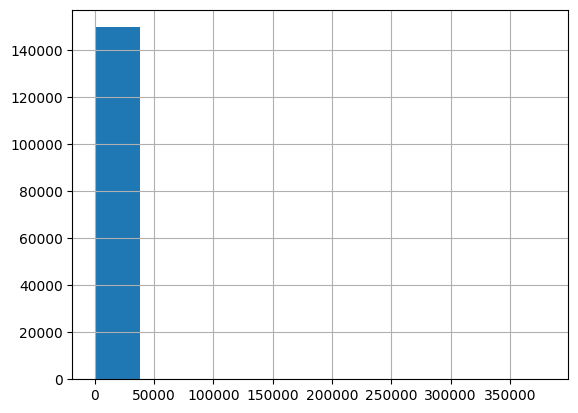
    


```python
df_seizures['psd_mean'] = np.log1p(df_seizures['psd_mean'])
df_seizures['psd_mean'].hist();
```


    
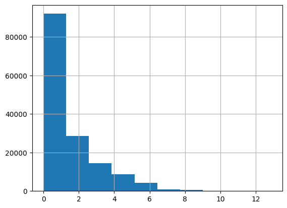
    


A little bit better now. Let's try it with the rest:


```python
df_seizures['psd_std'].hist();
```


    
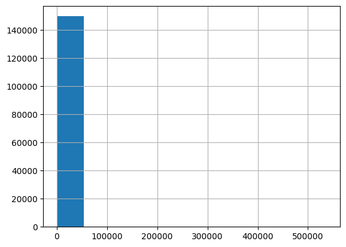
    


```python
df_seizures['psd_std'] = np.log1p(df_seizures['psd_mean'])
df_seizures['psd_std'].hist();
```


    
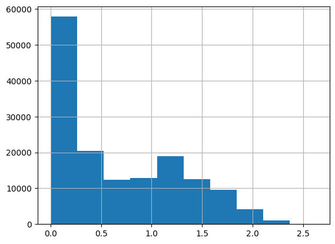
    


```python
df_seizures['psd_spectral_kurtosis'].hist();
```


    
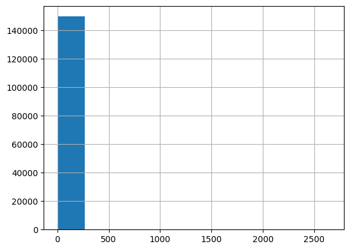
    


```python
df_seizures['psd_spectral_kurtosis'] = np.log1p(df_seizures['psd_mean'])
df_seizures['psd_spectral_kurtosis'].hist();
```


    

    


```python
df_seizures.describe(include=(np.number))
```


<div>
<style scoped>
    .dataframe tbody tr th:only-of-type {
        vertical-align: middle;
    }

    .dataframe tbody tr th {
        vertical-align: top;
    }

    .dataframe thead th {
        text-align: right;
    }
</style>
<table border="1" class="dataframe">
  <thead>
    <tr style="text-align: right;">
      <th></th>
      <th>window_idx</th>
      <th>window_start_seconds</th>
      <th>window_end_seconds</th>
      <th>applied_band_min_hz</th>
      <th>applied_band_max_hz</th>
      <th>psd_mean</th>
      <th>psd_std</th>
      <th>psd_spectral_entropy</th>
      <th>psd_spectral_flatness</th>
      <th>psd_spectral_centroid</th>
      <th>psd_spectral_spread</th>
      <th>psd_spectral_skewness</th>
      <th>psd_spectral_kurtosis</th>
      <th>psd_peak_freq</th>
      <th>psd_peak_power</th>
      <th>psd_sef50</th>
      <th>psd_sef95</th>
      <th>psd_slope</th>
      <th>psd_slope_intercept</th>
      <th>psd_slope_variability</th>
      <th>de_mean</th>
      <th>de_std</th>
    </tr>
  </thead>
  <tbody>
    <tr>
      <th>count</th>
      <td>149700.000000</td>
      <td>149700.000000</td>
      <td>149700.000000</td>
      <td>149700.000000</td>
      <td>149700.000000</td>
      <td>149700.000000</td>
      <td>149700.000000</td>
      <td>149700.000000</td>
      <td>149700.000000</td>
      <td>149700.000000</td>
      <td>149700.000000</td>
      <td>149700.000000</td>
      <td>149700.000000</td>
      <td>149700.000000</td>
      <td>149700.000000</td>
      <td>149700.000000</td>
      <td>149700.000000</td>
      <td>149700.000000</td>
      <td>149700.000000</td>
      <td>149700.000000</td>
      <td>149700.000000</td>
      <td>149700.000000</td>
    </tr>
    <tr>
      <th>mean</th>
      <td>115.112224</td>
      <td>1393.701403</td>
      <td>1398.701403</td>
      <td>20.520000</td>
      <td>40.500000</td>
      <td>1.375329</td>
      <td>0.667567</td>
      <td>0.761514</td>
      <td>0.788227</td>
      <td>22.089702</td>
      <td>6.090106</td>
      <td>1.108283</td>
      <td>0.667567</td>
      <td>25.155607</td>
      <td>-11.535936</td>
      <td>26.726474</td>
      <td>43.866939</td>
      <td>-2.202389</td>
      <td>-12.132631</td>
      <td>0.660864</td>
      <td>-11.053540</td>
      <td>0.237410</td>
    </tr>
    <tr>
      <th>std</th>
      <td>71.441285</td>
      <td>852.544732</td>
      <td>852.544732</td>
      <td>24.969697</td>
      <td>37.474116</td>
      <td>1.645535</td>
      <td>0.604277</td>
      <td>0.233642</td>
      <td>0.292734</td>
      <td>23.371912</td>
      <td>7.368453</td>
      <td>1.667076</td>
      <td>0.604277</td>
      <td>29.159401</td>
      <td>1.405609</td>
      <td>30.191200</td>
      <td>36.066035</td>
      <td>3.537712</td>
      <td>7.344393</td>
      <td>0.774711</td>
      <td>1.011778</td>
      <td>0.346993</td>
    </tr>
    <tr>
      <th>min</th>
      <td>0.000000</td>
      <td>0.000000</td>
      <td>5.000000</td>
      <td>0.100000</td>
      <td>0.500000</td>
      <td>0.002087</td>
      <td>0.002085</td>
      <td>0.129667</td>
      <td>0.001584</td>
      <td>0.493302</td>
      <td>0.221024</td>
      <td>-2.180519</td>
      <td>0.002085</td>
      <td>0.200000</td>
      <td>-14.320168</td>
      <td>0.400000</td>
      <td>0.800000</td>
      <td>-18.150102</td>
      <td>-32.706824</td>
      <td>0.000000</td>
      <td>-12.374723</td>
      <td>0.000000</td>
    </tr>
    <tr>
      <th>25%</th>
      <td>52.000000</td>
      <td>620.000000</td>
      <td>625.000000</td>
      <td>0.500000</td>
      <td>8.000000</td>
      <td>0.119835</td>
      <td>0.113182</td>
      <td>0.721790</td>
      <td>0.758595</td>
      <td>4.836157</td>
      <td>1.249987</td>
      <td>0.346418</td>
      <td>0.113182</td>
      <td>1.500000</td>
      <td>-12.431657</td>
      <td>2.800000</td>
      <td>12.500000</td>
      <td>-3.728032</td>
      <td>-12.626867</td>
      <td>0.000728</td>
      <td>-11.893382</td>
      <td>0.000159</td>
    </tr>
    <tr>
      <th>50%</th>
      <td>115.000000</td>
      <td>1245.000000</td>
      <td>1250.000000</td>
      <td>10.500000</td>
      <td>25.000000</td>
      <td>0.597245</td>
      <td>0.468280</td>
      <td>0.853055</td>
      <td>0.916714</td>
      <td>13.008343</td>
      <td>2.793480</td>
      <td>1.219791</td>
      <td>0.468280</td>
      <td>13.500000</td>
      <td>-11.593727</td>
      <td>15.000000</td>
      <td>30.000000</td>
      <td>-1.485534</td>
      <td>-10.480870</td>
      <td>0.417352</td>
      <td>-11.275913</td>
      <td>0.118629</td>
    </tr>
    <tr>
      <th>75%</th>
      <td>177.000000</td>
      <td>2168.000000</td>
      <td>2173.000000</td>
      <td>30.000000</td>
      <td>80.000000</td>
      <td>2.170382</td>
      <td>1.153852</td>
      <td>0.917540</td>
      <td>0.991265</td>
      <td>33.157734</td>
      <td>8.055493</td>
      <td>1.513947</td>
      <td>1.153852</td>
      <td>36.500000</td>
      <td>-10.489297</td>
      <td>39.000000</td>
      <td>80.000000</td>
      <td>-0.388954</td>
      <td>-8.709594</td>
      <td>0.998278</td>
      <td>-10.329255</td>
      <td>0.294759</td>
    </tr>
    <tr>
      <th>max</th>
      <td>239.000000</td>
      <td>2788.000000</td>
      <td>2793.000000</td>
      <td>80.000000</td>
      <td>100.000000</td>
      <td>12.848954</td>
      <td>2.628210</td>
      <td>0.995244</td>
      <td>1.000000</td>
      <td>92.608173</td>
      <td>35.614074</td>
      <td>45.949806</td>
      <td>2.628210</td>
      <td>98.500000</td>
      <td>-5.764813</td>
      <td>100.000000</td>
      <td>100.000000</td>
      <td>10.455062</td>
      <td>22.654121</td>
      <td>6.813346</td>
      <td>-6.938190</td>
      <td>2.703598</td>
    </tr>
  </tbody>
</table>
</div>


# 2: Training models

Now that all our data is preprocessed, we can move on to the most important (and perhaps the most fun) part of our project: actually training our models. We'll be training three types of models - Random Forests, fast.ai Tabular, and XGBoost. Then, at the end, we'll analyze the performance of all three of these models to see which one is most optimal in building our seizure classifier.

## 2.1: Setting parameters

Before we can start training, we have to identify some key parts of our model.

### 2.1.1: Finding a suitable metric

Because the problem we're aiming to solve is classification, the most common use metric for this type of dataset would be `Accuracy`, calculated via `(TP + TN) / (TP + TN + FP + FN)`, where
* `TP` indicates True Positive (correctly identified a seizure)
* `TN` indicates True Negative (correctly identified that there was no seizure)
* `FP` indicates False Positive (incorrectly identified a seizure when there wasn't one)
* `FN` indicates False Negative (incorrectly identified that there was no seizure when there was one).

Hence, the equation 1 - `Accuracy` would indicate our loss metric, or what percentage of cases we got incorrect.

We could also utilize the `Precision` metric if we are looking to minimize the number of false positives, as seen in its formula: `TP / (TP + FP)`. Here are some other metrics to consider when looking at classification problems like this:
* `Recall`: the inverse of `Precision`, where you're trying to minimize false negatives. Formula: `TP / (TP + FN)`
* `F1 Precision`: used to balance parts of `Precision` and `Recall`. Formula: `2 * (Precision * Recall) / (Precision + Recall)`
* `Specificity`: has the same purpose as `Precision`. Formula: `TN / (TN + FP)`

We'll be using `Accuracy` throughout this project, but it would also be a wise decision to use `Recall`, as false negatives are a huge deal when it comes to the medical field.

### 2.1.2: Finding learning rate

In order to find a learning rate, we will have to make a learner first. In order to achieve both of those goals, we will use the fast.ai library:


```python
from fastai.tabular.all import *
```

fast.ai's DataLoaders don't accept parquet data, so we'll be importing it straight from the Pandas DataFrame:


```python
cont_names = ['window_idx', 'window_start_seconds', 'window_end_seconds', 'applied_band_min_hz', 'applied_band_max_hz', 'psd_mean',	'psd_std', 'psd_spectral_entropy', 
              'psd_spectral_flatness',	'psd_spectral_centroid', 'psd_spectral_spread', 'psd_spectral_skewness', 'psd_spectral_kurtosis', 'psd_peak_freq', 'psd_peak_power', 
              'psd_sef50', 'psd_sef95', 'psd_slope', 'psd_slope_intercept', 'psd_slope_variability', 'de_mean', 'de_std']
cat_names = ['phase_ictal', 'phase_preictal', 'region_caudalmiddlefrontal_lh', 'region_caudalmiddlefrontal_rh', 'region_central', 'region_frontal', 'region_inferiorfrontal_lh',
             'region_inferiorfrontal_rh', 'region_inferiorparietal_lh', 'region_inferiorparietal_rh', 'region_inferiortemporal_lh', 'region_inferiortemporal_rh', 'region_middletemporal_lh',
             'region_middletemporal_rh', 'region_midline', 'region_orbitofrontal_lh', 'region_orbitofrontal_rh', 'region_paracentral', 'region_parietal', 'region_postcentral_lh',
             'region_postcentral_rh', 'region_precentral_lh', 'region_precentral_rh', 'region_rostralmiddlefrontal_lh', 'region_rostralmiddlefrontal_rh', 'region_superiorfrontal_lh',
             'region_superiorfrontal_rh', 'region_superiorparietal_lh', 'region_superiorparietal_rh', 'region_superiortemporal_lh', 'region_superiortemporal_rh', 'region_temporal', 'band_alpha',
             'band_delta', 'band_gamma', 'band_high_beta', 'band_high_gamma', 'band_infraslow', 'band_low_beta', 'band_overall', 'band_ripples', 'band_theta', 'patient_id_PN10', 'patient_id_chb02',
             'file_name_PN10-7.8.9.edf', 'file_name_chb02_02.edf', 'seizure_index_PN10_sz06', 'seizure_index_chb02_ns01']
procs = [Categorify, FillMissing, Normalize]
y_names = ['seizure_bool']
```


```python
dls = TabularDataLoaders.from_df(df_seizures, path=".", procs=procs, cat_names=cat_names, cont_names=cont_names,
                                y_names=y_names, bs=64, y_block=CategoryBlock)
```


```python
learn = tabular_learner(dls, metrics=accuracy)
```


```python
learn.lr_find(suggest_funcs=(valley, slide))
```


<style>
    progress { appearance: none; border: none; border-radius: 4px; width: 300px;
        height: 20px; vertical-align: middle; background: #e0e0e0; }

    progress::-webkit-progress-bar { background: #e0e0e0; border-radius: 4px; }
    progress::-webkit-progress-value { background: #2196F3; border-radius: 4px; }
    progress::-moz-progress-bar { background: #2196F3; border-radius: 4px; }

    progress:not([value]) {
        background: repeating-linear-gradient(45deg, #7e7e7e, #7e7e7e 10px, #5c5c5c 10px, #5c5c5c 20px); }

    progress.progress-bar-interrupted::-webkit-progress-value { background: #F44336; }
    progress.progress-bar-interrupted::-moz-progress-value { background: #F44336; }
    progress.progress-bar-interrupted::-webkit-progress-bar { background: #F44336; }
    progress.progress-bar-interrupted::-moz-progress-bar { background: #F44336; }
    progress.progress-bar-interrupted { background: #F44336; }    

    table.fastprogress { border-collapse: collapse; margin: 1em 0; font-size: 0.9em; }
    table.fastprogress th, table.fastprogress td { padding: 8px 12px; border: 1px solid #ddd; text-align: left; }
    table.fastprogress thead tr { background: #f8f9fa; font-weight: bold; }
    table.fastprogress tbody tr:nth-of-type(even) { background: #f8f9fa; }
</style>


<div></div>


    SuggestedLRs(valley=0.002511886414140463, slide=0.2089296132326126)


    
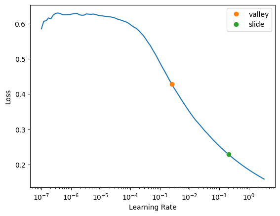
    


Just for fun, let's see how this model actually does!


```python
learn.fit_one_cycle(1)
```


<div><table class="fastprogress"><thead><tr><th>epoch</th><th>train_loss</th><th>valid_loss</th><th>accuracy</th><th>time</th></tr></thead><tbody><tr><td>0</td><td>0.000002</td><td>0.000001</td><td>1.000000</td><td>00:34</td></tr></tbody></table></div>


```python
learn.show_results()
```


<table border="1" class="dataframe">
  <thead>
    <tr style="text-align: right;">
      <th></th>
      <th>phase_ictal</th>
      <th>phase_preictal</th>
      <th>region_caudalmiddlefrontal_lh</th>
      <th>region_caudalmiddlefrontal_rh</th>
      <th>region_central</th>
      <th>region_frontal</th>
      <th>region_inferiorfrontal_lh</th>
      <th>region_inferiorfrontal_rh</th>
      <th>region_inferiorparietal_lh</th>
      <th>region_inferiorparietal_rh</th>
      <th>region_inferiortemporal_lh</th>
      <th>region_inferiortemporal_rh</th>
      <th>region_middletemporal_lh</th>
      <th>region_middletemporal_rh</th>
      <th>region_midline</th>
      <th>region_orbitofrontal_lh</th>
      <th>region_orbitofrontal_rh</th>
      <th>region_paracentral</th>
      <th>region_parietal</th>
      <th>region_postcentral_lh</th>
      <th>region_postcentral_rh</th>
      <th>region_precentral_lh</th>
      <th>region_precentral_rh</th>
      <th>region_rostralmiddlefrontal_lh</th>
      <th>region_rostralmiddlefrontal_rh</th>
      <th>region_superiorfrontal_lh</th>
      <th>region_superiorfrontal_rh</th>
      <th>region_superiorparietal_lh</th>
      <th>region_superiorparietal_rh</th>
      <th>region_superiortemporal_lh</th>
      <th>region_superiortemporal_rh</th>
      <th>region_temporal</th>
      <th>band_alpha</th>
      <th>band_delta</th>
      <th>band_gamma</th>
      <th>band_high_beta</th>
      <th>band_high_gamma</th>
      <th>band_infraslow</th>
      <th>band_low_beta</th>
      <th>band_overall</th>
      <th>band_ripples</th>
      <th>band_theta</th>
      <th>patient_id_PN10</th>
      <th>patient_id_chb02</th>
      <th>file_name_PN10-7.8.9.edf</th>
      <th>file_name_chb02_02.edf</th>
      <th>seizure_index_PN10_sz06</th>
      <th>seizure_index_chb02_ns01</th>
      <th>window_idx</th>
      <th>window_start_seconds</th>
      <th>window_end_seconds</th>
      <th>applied_band_min_hz</th>
      <th>applied_band_max_hz</th>
      <th>psd_mean</th>
      <th>psd_std</th>
      <th>psd_spectral_entropy</th>
      <th>psd_spectral_flatness</th>
      <th>psd_spectral_centroid</th>
      <th>psd_spectral_spread</th>
      <th>psd_spectral_skewness</th>
      <th>psd_spectral_kurtosis</th>
      <th>psd_peak_freq</th>
      <th>psd_peak_power</th>
      <th>psd_sef50</th>
      <th>psd_sef95</th>
      <th>psd_slope</th>
      <th>psd_slope_intercept</th>
      <th>psd_slope_variability</th>
      <th>de_mean</th>
      <th>de_std</th>
      <th>seizure_bool</th>
      <th>seizure_bool_pred</th>
    </tr>
  </thead>
  <tbody>
    <tr>
      <th>0</th>
      <td>1.0</td>
      <td>2.0</td>
      <td>1.0</td>
      <td>1.0</td>
      <td>1.0</td>
      <td>1.0</td>
      <td>1.0</td>
      <td>2.0</td>
      <td>1.0</td>
      <td>1.0</td>
      <td>1.0</td>
      <td>1.0</td>
      <td>1.0</td>
      <td>1.0</td>
      <td>1.0</td>
      <td>1.0</td>
      <td>1.0</td>
      <td>1.0</td>
      <td>1.0</td>
      <td>1.0</td>
      <td>1.0</td>
      <td>1.0</td>
      <td>1.0</td>
      <td>1.0</td>
      <td>1.0</td>
      <td>1.0</td>
      <td>1.0</td>
      <td>1.0</td>
      <td>1.0</td>
      <td>1.0</td>
      <td>1.0</td>
      <td>1.0</td>
      <td>1.0</td>
      <td>1.0</td>
      <td>1.0</td>
      <td>2.0</td>
      <td>1.0</td>
      <td>1.0</td>
      <td>1.0</td>
      <td>1.0</td>
      <td>1.0</td>
      <td>1.0</td>
      <td>2.0</td>
      <td>1.0</td>
      <td>2.0</td>
      <td>1.0</td>
      <td>2.0</td>
      <td>1.0</td>
      <td>1.286024</td>
      <td>1.395331</td>
      <td>1.395331</td>
      <td>-0.020044</td>
      <td>-0.279318</td>
      <td>-0.648602</td>
      <td>-0.660273</td>
      <td>0.376279</td>
      <td>0.668865</td>
      <td>0.026083</td>
      <td>-0.311789</td>
      <td>0.232322</td>
      <td>-0.660273</td>
      <td>0.132143</td>
      <td>-0.313579</td>
      <td>-0.023308</td>
      <td>-0.384456</td>
      <td>1.271910</td>
      <td>-0.493461</td>
      <td>-0.853198</td>
      <td>-0.599361</td>
      <td>-0.684948</td>
      <td>1.0</td>
      <td>1.0</td>
    </tr>
    <tr>
      <th>1</th>
      <td>1.0</td>
      <td>2.0</td>
      <td>1.0</td>
      <td>1.0</td>
      <td>1.0</td>
      <td>1.0</td>
      <td>1.0</td>
      <td>1.0</td>
      <td>1.0</td>
      <td>1.0</td>
      <td>1.0</td>
      <td>1.0</td>
      <td>1.0</td>
      <td>1.0</td>
      <td>1.0</td>
      <td>1.0</td>
      <td>1.0</td>
      <td>1.0</td>
      <td>1.0</td>
      <td>1.0</td>
      <td>1.0</td>
      <td>1.0</td>
      <td>1.0</td>
      <td>1.0</td>
      <td>1.0</td>
      <td>1.0</td>
      <td>1.0</td>
      <td>1.0</td>
      <td>1.0</td>
      <td>2.0</td>
      <td>1.0</td>
      <td>1.0</td>
      <td>2.0</td>
      <td>1.0</td>
      <td>1.0</td>
      <td>1.0</td>
      <td>1.0</td>
      <td>1.0</td>
      <td>1.0</td>
      <td>1.0</td>
      <td>1.0</td>
      <td>1.0</td>
      <td>1.0</td>
      <td>2.0</td>
      <td>1.0</td>
      <td>2.0</td>
      <td>1.0</td>
      <td>2.0</td>
      <td>-1.133729</td>
      <td>-1.434420</td>
      <td>-1.434419</td>
      <td>-0.500679</td>
      <td>-0.732892</td>
      <td>0.375282</td>
      <td>0.709254</td>
      <td>0.842666</td>
      <td>0.512047</td>
      <td>-0.511183</td>
      <td>-0.643749</td>
      <td>-0.398737</td>
      <td>0.709254</td>
      <td>-0.519067</td>
      <td>0.423350</td>
      <td>-0.553288</td>
      <td>-0.869327</td>
      <td>0.288537</td>
      <td>0.287262</td>
      <td>-0.334323</td>
      <td>0.381051</td>
      <td>-0.421374</td>
      <td>0.0</td>
      <td>0.0</td>
    </tr>
    <tr>
      <th>2</th>
      <td>1.0</td>
      <td>2.0</td>
      <td>1.0</td>
      <td>1.0</td>
      <td>1.0</td>
      <td>1.0</td>
      <td>1.0</td>
      <td>1.0</td>
      <td>1.0</td>
      <td>1.0</td>
      <td>1.0</td>
      <td>1.0</td>
      <td>1.0</td>
      <td>1.0</td>
      <td>1.0</td>
      <td>1.0</td>
      <td>1.0</td>
      <td>1.0</td>
      <td>1.0</td>
      <td>1.0</td>
      <td>1.0</td>
      <td>1.0</td>
      <td>1.0</td>
      <td>1.0</td>
      <td>1.0</td>
      <td>1.0</td>
      <td>1.0</td>
      <td>1.0</td>
      <td>1.0</td>
      <td>2.0</td>
      <td>1.0</td>
      <td>1.0</td>
      <td>1.0</td>
      <td>1.0</td>
      <td>1.0</td>
      <td>1.0</td>
      <td>1.0</td>
      <td>1.0</td>
      <td>2.0</td>
      <td>1.0</td>
      <td>1.0</td>
      <td>1.0</td>
      <td>2.0</td>
      <td>1.0</td>
      <td>2.0</td>
      <td>1.0</td>
      <td>2.0</td>
      <td>1.0</td>
      <td>-0.070716</td>
      <td>0.826567</td>
      <td>0.826567</td>
      <td>-0.300415</td>
      <td>-0.546126</td>
      <td>-0.682647</td>
      <td>-0.732689</td>
      <td>0.211281</td>
      <td>0.687002</td>
      <td>-0.361783</td>
      <td>-0.383389</td>
      <td>0.162156</td>
      <td>-0.732689</td>
      <td>-0.244874</td>
      <td>-0.362729</td>
      <td>-0.288298</td>
      <td>-0.661526</td>
      <td>0.892274</td>
      <td>-0.223908</td>
      <td>-0.853198</td>
      <td>-0.696658</td>
      <td>-0.684948</td>
      <td>1.0</td>
      <td>1.0</td>
    </tr>
    <tr>
      <th>3</th>
      <td>1.0</td>
      <td>2.0</td>
      <td>1.0</td>
      <td>1.0</td>
      <td>2.0</td>
      <td>1.0</td>
      <td>1.0</td>
      <td>1.0</td>
      <td>1.0</td>
      <td>1.0</td>
      <td>1.0</td>
      <td>1.0</td>
      <td>1.0</td>
      <td>1.0</td>
      <td>1.0</td>
      <td>1.0</td>
      <td>1.0</td>
      <td>1.0</td>
      <td>1.0</td>
      <td>1.0</td>
      <td>1.0</td>
      <td>1.0</td>
      <td>1.0</td>
      <td>1.0</td>
      <td>1.0</td>
      <td>1.0</td>
      <td>1.0</td>
      <td>1.0</td>
      <td>1.0</td>
      <td>1.0</td>
      <td>1.0</td>
      <td>1.0</td>
      <td>1.0</td>
      <td>1.0</td>
      <td>2.0</td>
      <td>1.0</td>
      <td>1.0</td>
      <td>1.0</td>
      <td>1.0</td>
      <td>1.0</td>
      <td>1.0</td>
      <td>1.0</td>
      <td>2.0</td>
      <td>1.0</td>
      <td>2.0</td>
      <td>1.0</td>
      <td>2.0</td>
      <td>1.0</td>
      <td>0.278960</td>
      <td>0.973155</td>
      <td>0.973155</td>
      <td>0.380485</td>
      <td>0.254300</td>
      <td>-0.735970</td>
      <td>-0.852893</td>
      <td>0.518755</td>
      <td>0.715848</td>
      <td>0.557462</td>
      <td>0.053883</td>
      <td>0.258787</td>
      <td>-0.852893</td>
      <td>0.354925</td>
      <td>-0.657443</td>
      <td>0.473548</td>
      <td>0.169682</td>
      <td>0.607308</td>
      <td>-0.079623</td>
      <td>0.278259</td>
      <td>-0.759256</td>
      <td>0.520322</td>
      <td>1.0</td>
      <td>1.0</td>
    </tr>
    <tr>
      <th>4</th>
      <td>1.0</td>
      <td>2.0</td>
      <td>1.0</td>
      <td>1.0</td>
      <td>1.0</td>
      <td>1.0</td>
      <td>1.0</td>
      <td>1.0</td>
      <td>1.0</td>
      <td>1.0</td>
      <td>1.0</td>
      <td>1.0</td>
      <td>1.0</td>
      <td>1.0</td>
      <td>1.0</td>
      <td>1.0</td>
      <td>2.0</td>
      <td>1.0</td>
      <td>1.0</td>
      <td>1.0</td>
      <td>1.0</td>
      <td>1.0</td>
      <td>1.0</td>
      <td>1.0</td>
      <td>1.0</td>
      <td>1.0</td>
      <td>1.0</td>
      <td>1.0</td>
      <td>1.0</td>
      <td>1.0</td>
      <td>1.0</td>
      <td>1.0</td>
      <td>1.0</td>
      <td>1.0</td>
      <td>1.0</td>
      <td>1.0</td>
      <td>1.0</td>
      <td>1.0</td>
      <td>1.0</td>
      <td>1.0</td>
      <td>2.0</td>
      <td>1.0</td>
      <td>1.0</td>
      <td>2.0</td>
      <td>1.0</td>
      <td>2.0</td>
      <td>1.0</td>
      <td>2.0</td>
      <td>1.216089</td>
      <td>-0.449343</td>
      <td>-0.449342</td>
      <td>2.383132</td>
      <td>1.588342</td>
      <td>-0.582255</td>
      <td>-0.527647</td>
      <td>0.637400</td>
      <td>0.640312</td>
      <td>2.654379</td>
      <td>-0.004329</td>
      <td>0.332761</td>
      <td>-0.527647</td>
      <td>2.188596</td>
      <td>-0.236182</td>
      <td>2.030364</td>
      <td>1.541174</td>
      <td>-0.969252</td>
      <td>1.464710</td>
      <td>-0.277966</td>
      <td>-0.084429</td>
      <td>-0.377123</td>
      <td>0.0</td>
      <td>0.0</td>
    </tr>
    <tr>
      <th>5</th>
      <td>1.0</td>
      <td>2.0</td>
      <td>1.0</td>
      <td>1.0</td>
      <td>1.0</td>
      <td>1.0</td>
      <td>1.0</td>
      <td>1.0</td>
      <td>1.0</td>
      <td>1.0</td>
      <td>1.0</td>
      <td>1.0</td>
      <td>1.0</td>
      <td>1.0</td>
      <td>2.0</td>
      <td>1.0</td>
      <td>1.0</td>
      <td>1.0</td>
      <td>1.0</td>
      <td>1.0</td>
      <td>1.0</td>
      <td>1.0</td>
      <td>1.0</td>
      <td>1.0</td>
      <td>1.0</td>
      <td>1.0</td>
      <td>1.0</td>
      <td>1.0</td>
      <td>1.0</td>
      <td>1.0</td>
      <td>1.0</td>
      <td>1.0</td>
      <td>1.0</td>
      <td>1.0</td>
      <td>1.0</td>
      <td>1.0</td>
      <td>1.0</td>
      <td>1.0</td>
      <td>2.0</td>
      <td>1.0</td>
      <td>1.0</td>
      <td>1.0</td>
      <td>1.0</td>
      <td>2.0</td>
      <td>1.0</td>
      <td>2.0</td>
      <td>1.0</td>
      <td>2.0</td>
      <td>0.474778</td>
      <td>-0.760111</td>
      <td>-0.760111</td>
      <td>-0.300415</td>
      <td>-0.546126</td>
      <td>-0.310204</td>
      <td>-0.073475</td>
      <td>0.532947</td>
      <td>0.471133</td>
      <td>-0.318305</td>
      <td>-0.582637</td>
      <td>0.306811</td>
      <td>-0.073475</td>
      <td>-0.381971</td>
      <td>0.028587</td>
      <td>-0.387669</td>
      <td>-0.675379</td>
      <td>-0.979192</td>
      <td>0.955757</td>
      <td>-0.593941</td>
      <td>-0.128006</td>
      <td>-0.301110</td>
      <td>0.0</td>
      <td>0.0</td>
    </tr>
    <tr>
      <th>6</th>
      <td>1.0</td>
      <td>2.0</td>
      <td>1.0</td>
      <td>1.0</td>
      <td>1.0</td>
      <td>1.0</td>
      <td>1.0</td>
      <td>1.0</td>
      <td>1.0</td>
      <td>1.0</td>
      <td>1.0</td>
      <td>1.0</td>
      <td>1.0</td>
      <td>1.0</td>
      <td>1.0</td>
      <td>1.0</td>
      <td>1.0</td>
      <td>1.0</td>
      <td>1.0</td>
      <td>1.0</td>
      <td>1.0</td>
      <td>1.0</td>
      <td>1.0</td>
      <td>1.0</td>
      <td>1.0</td>
      <td>2.0</td>
      <td>1.0</td>
      <td>1.0</td>
      <td>1.0</td>
      <td>1.0</td>
      <td>1.0</td>
      <td>1.0</td>
      <td>1.0</td>
      <td>1.0</td>
      <td>1.0</td>
      <td>1.0</td>
      <td>1.0</td>
      <td>1.0</td>
      <td>1.0</td>
      <td>1.0</td>
      <td>1.0</td>
      <td>2.0</td>
      <td>1.0</td>
      <td>2.0</td>
      <td>1.0</td>
      <td>2.0</td>
      <td>1.0</td>
      <td>2.0</td>
      <td>-1.315560</td>
      <td>-1.510646</td>
      <td>-1.510645</td>
      <td>-0.680917</td>
      <td>-0.866296</td>
      <td>0.947685</td>
      <td>1.162047</td>
      <td>0.916219</td>
      <td>0.581355</td>
      <td>-0.697454</td>
      <td>-0.643133</td>
      <td>-0.663878</td>
      <td>1.162047</td>
      <td>-0.656164</td>
      <td>0.730737</td>
      <td>-0.685783</td>
      <td>-0.994009</td>
      <td>0.687342</td>
      <td>0.164133</td>
      <td>1.935534</td>
      <td>0.911499</td>
      <td>-0.338420</td>
      <td>0.0</td>
      <td>0.0</td>
    </tr>
    <tr>
      <th>7</th>
      <td>1.0</td>
      <td>2.0</td>
      <td>1.0</td>
      <td>1.0</td>
      <td>1.0</td>
      <td>1.0</td>
      <td>1.0</td>
      <td>1.0</td>
      <td>1.0</td>
      <td>1.0</td>
      <td>1.0</td>
      <td>2.0</td>
      <td>1.0</td>
      <td>1.0</td>
      <td>1.0</td>
      <td>1.0</td>
      <td>1.0</td>
      <td>1.0</td>
      <td>1.0</td>
      <td>1.0</td>
      <td>1.0</td>
      <td>1.0</td>
      <td>1.0</td>
      <td>1.0</td>
      <td>1.0</td>
      <td>1.0</td>
      <td>1.0</td>
      <td>1.0</td>
      <td>1.0</td>
      <td>1.0</td>
      <td>1.0</td>
      <td>1.0</td>
      <td>2.0</td>
      <td>1.0</td>
      <td>1.0</td>
      <td>1.0</td>
      <td>1.0</td>
      <td>1.0</td>
      <td>1.0</td>
      <td>1.0</td>
      <td>1.0</td>
      <td>1.0</td>
      <td>2.0</td>
      <td>1.0</td>
      <td>2.0</td>
      <td>1.0</td>
      <td>2.0</td>
      <td>1.0</td>
      <td>-0.965884</td>
      <td>0.451299</td>
      <td>0.451299</td>
      <td>-0.500679</td>
      <td>-0.732892</td>
      <td>-0.601328</td>
      <td>-0.564699</td>
      <td>0.224122</td>
      <td>0.642381</td>
      <td>-0.586643</td>
      <td>-0.578838</td>
      <td>0.267201</td>
      <td>-0.564699</td>
      <td>-0.519067</td>
      <td>-0.226252</td>
      <td>-0.553288</td>
      <td>-0.855474</td>
      <td>-0.347022</td>
      <td>0.433129</td>
      <td>-0.853198</td>
      <td>-0.605200</td>
      <td>-0.684948</td>
      <td>1.0</td>
      <td>1.0</td>
    </tr>
    <tr>
      <th>8</th>
      <td>1.0</td>
      <td>2.0</td>
      <td>1.0</td>
      <td>1.0</td>
      <td>1.0</td>
      <td>1.0</td>
      <td>1.0</td>
      <td>1.0</td>
      <td>1.0</td>
      <td>1.0</td>
      <td>1.0</td>
      <td>1.0</td>
      <td>1.0</td>
      <td>1.0</td>
      <td>1.0</td>
      <td>2.0</td>
      <td>1.0</td>
      <td>1.0</td>
      <td>1.0</td>
      <td>1.0</td>
      <td>1.0</td>
      <td>1.0</td>
      <td>1.0</td>
      <td>1.0</td>
      <td>1.0</td>
      <td>1.0</td>
      <td>1.0</td>
      <td>1.0</td>
      <td>1.0</td>
      <td>1.0</td>
      <td>1.0</td>
      <td>1.0</td>
      <td>1.0</td>
      <td>1.0</td>
      <td>1.0</td>
      <td>1.0</td>
      <td>1.0</td>
      <td>1.0</td>
      <td>1.0</td>
      <td>1.0</td>
      <td>2.0</td>
      <td>1.0</td>
      <td>2.0</td>
      <td>1.0</td>
      <td>2.0</td>
      <td>1.0</td>
      <td>2.0</td>
      <td>1.0</td>
      <td>-0.937910</td>
      <td>0.463026</td>
      <td>0.463026</td>
      <td>2.383132</td>
      <td>1.588342</td>
      <td>-0.265034</td>
      <td>-0.008808</td>
      <td>0.802231</td>
      <td>0.545479</td>
      <td>2.856579</td>
      <td>-0.039762</td>
      <td>-0.391143</td>
      <td>-0.008808</td>
      <td>2.308555</td>
      <td>0.127947</td>
      <td>2.162859</td>
      <td>1.513467</td>
      <td>0.640107</td>
      <td>0.020074</td>
      <td>1.036295</td>
      <td>-0.082369</td>
      <td>1.386085</td>
      <td>1.0</td>
      <td>1.0</td>
    </tr>
  </tbody>
</table>


...That is wild. We'll come back to that later.


```python
learn.fit_one_cycle(3)
```


<div><table class="fastprogress"><thead><tr><th>epoch</th><th>train_loss</th><th>valid_loss</th><th>accuracy</th><th>time</th></tr></thead><tbody><tr><td>0</td><td>0.000000</td><td>0.000000</td><td>1.000000</td><td>00:33</td></tr><tr><td>1</td><td>0.000000</td><td>0.000000</td><td>1.000000</td><td>00:33</td></tr><tr><td>2</td><td>0.000000</td><td>0.000000</td><td>1.000000</td><td>00:33</td></tr></tbody></table></div>


```python
learn.show_results()
```


<table border="1" class="dataframe">
  <thead>
    <tr style="text-align: right;">
      <th></th>
      <th>phase_ictal</th>
      <th>phase_preictal</th>
      <th>region_caudalmiddlefrontal_lh</th>
      <th>region_caudalmiddlefrontal_rh</th>
      <th>region_central</th>
      <th>region_frontal</th>
      <th>region_inferiorfrontal_lh</th>
      <th>region_inferiorfrontal_rh</th>
      <th>region_inferiorparietal_lh</th>
      <th>region_inferiorparietal_rh</th>
      <th>region_inferiortemporal_lh</th>
      <th>region_inferiortemporal_rh</th>
      <th>region_middletemporal_lh</th>
      <th>region_middletemporal_rh</th>
      <th>region_midline</th>
      <th>region_orbitofrontal_lh</th>
      <th>region_orbitofrontal_rh</th>
      <th>region_paracentral</th>
      <th>region_parietal</th>
      <th>region_postcentral_lh</th>
      <th>region_postcentral_rh</th>
      <th>region_precentral_lh</th>
      <th>region_precentral_rh</th>
      <th>region_rostralmiddlefrontal_lh</th>
      <th>region_rostralmiddlefrontal_rh</th>
      <th>region_superiorfrontal_lh</th>
      <th>region_superiorfrontal_rh</th>
      <th>region_superiorparietal_lh</th>
      <th>region_superiorparietal_rh</th>
      <th>region_superiortemporal_lh</th>
      <th>region_superiortemporal_rh</th>
      <th>region_temporal</th>
      <th>band_alpha</th>
      <th>band_delta</th>
      <th>band_gamma</th>
      <th>band_high_beta</th>
      <th>band_high_gamma</th>
      <th>band_infraslow</th>
      <th>band_low_beta</th>
      <th>band_overall</th>
      <th>band_ripples</th>
      <th>band_theta</th>
      <th>patient_id_PN10</th>
      <th>patient_id_chb02</th>
      <th>file_name_PN10-7.8.9.edf</th>
      <th>file_name_chb02_02.edf</th>
      <th>seizure_index_PN10_sz06</th>
      <th>seizure_index_chb02_ns01</th>
      <th>window_idx</th>
      <th>window_start_seconds</th>
      <th>window_end_seconds</th>
      <th>applied_band_min_hz</th>
      <th>applied_band_max_hz</th>
      <th>psd_mean</th>
      <th>psd_std</th>
      <th>psd_spectral_entropy</th>
      <th>psd_spectral_flatness</th>
      <th>psd_spectral_centroid</th>
      <th>psd_spectral_spread</th>
      <th>psd_spectral_skewness</th>
      <th>psd_spectral_kurtosis</th>
      <th>psd_peak_freq</th>
      <th>psd_peak_power</th>
      <th>psd_sef50</th>
      <th>psd_sef95</th>
      <th>psd_slope</th>
      <th>psd_slope_intercept</th>
      <th>psd_slope_variability</th>
      <th>de_mean</th>
      <th>de_std</th>
      <th>seizure_bool</th>
      <th>seizure_bool_pred</th>
    </tr>
  </thead>
  <tbody>
    <tr>
      <th>0</th>
      <td>1.0</td>
      <td>2.0</td>
      <td>1.0</td>
      <td>1.0</td>
      <td>1.0</td>
      <td>1.0</td>
      <td>1.0</td>
      <td>1.0</td>
      <td>1.0</td>
      <td>1.0</td>
      <td>1.0</td>
      <td>1.0</td>
      <td>1.0</td>
      <td>1.0</td>
      <td>1.0</td>
      <td>1.0</td>
      <td>2.0</td>
      <td>1.0</td>
      <td>1.0</td>
      <td>1.0</td>
      <td>1.0</td>
      <td>1.0</td>
      <td>1.0</td>
      <td>1.0</td>
      <td>1.0</td>
      <td>1.0</td>
      <td>1.0</td>
      <td>1.0</td>
      <td>1.0</td>
      <td>1.0</td>
      <td>1.0</td>
      <td>1.0</td>
      <td>1.0</td>
      <td>1.0</td>
      <td>1.0</td>
      <td>1.0</td>
      <td>1.0</td>
      <td>1.0</td>
      <td>1.0</td>
      <td>2.0</td>
      <td>1.0</td>
      <td>1.0</td>
      <td>2.0</td>
      <td>1.0</td>
      <td>2.0</td>
      <td>1.0</td>
      <td>2.0</td>
      <td>1.0</td>
      <td>-0.812027</td>
      <td>0.515798</td>
      <td>0.515798</td>
      <td>-0.817097</td>
      <td>1.588342</td>
      <td>2.475653</td>
      <td>1.979712</td>
      <td>-0.232530</td>
      <td>-2.544151</td>
      <td>-0.635732</td>
      <td>0.180353</td>
      <td>0.612088</td>
      <td>1.979712</td>
      <td>-0.793261</td>
      <td>2.297979</td>
      <td>-0.771904</td>
      <td>-0.628277</td>
      <td>-0.149185</td>
      <td>0.700154</td>
      <td>-0.056399</td>
      <td>2.685213</td>
      <td>2.580086</td>
      <td>1.0</td>
      <td>1.0</td>
    </tr>
    <tr>
      <th>1</th>
      <td>1.0</td>
      <td>2.0</td>
      <td>1.0</td>
      <td>1.0</td>
      <td>1.0</td>
      <td>1.0</td>
      <td>1.0</td>
      <td>1.0</td>
      <td>1.0</td>
      <td>1.0</td>
      <td>2.0</td>
      <td>1.0</td>
      <td>1.0</td>
      <td>1.0</td>
      <td>1.0</td>
      <td>1.0</td>
      <td>1.0</td>
      <td>1.0</td>
      <td>1.0</td>
      <td>1.0</td>
      <td>1.0</td>
      <td>1.0</td>
      <td>1.0</td>
      <td>1.0</td>
      <td>1.0</td>
      <td>1.0</td>
      <td>1.0</td>
      <td>1.0</td>
      <td>1.0</td>
      <td>1.0</td>
      <td>1.0</td>
      <td>1.0</td>
      <td>2.0</td>
      <td>1.0</td>
      <td>1.0</td>
      <td>1.0</td>
      <td>1.0</td>
      <td>1.0</td>
      <td>1.0</td>
      <td>1.0</td>
      <td>1.0</td>
      <td>1.0</td>
      <td>2.0</td>
      <td>1.0</td>
      <td>2.0</td>
      <td>1.0</td>
      <td>2.0</td>
      <td>1.0</td>
      <td>-1.231638</td>
      <td>0.339892</td>
      <td>0.339892</td>
      <td>-0.500679</td>
      <td>-0.732892</td>
      <td>-0.543302</td>
      <td>-0.454464</td>
      <td>0.525160</td>
      <td>0.675886</td>
      <td>-0.552787</td>
      <td>-0.565439</td>
      <td>0.196941</td>
      <td>-0.454464</td>
      <td>-0.484793</td>
      <td>-0.338444</td>
      <td>-0.520164</td>
      <td>-0.855474</td>
      <td>0.584096</td>
      <td>0.002968</td>
      <td>-0.853198</td>
      <td>-0.546594</td>
      <td>-0.684948</td>
      <td>1.0</td>
      <td>1.0</td>
    </tr>
    <tr>
      <th>2</th>
      <td>1.0</td>
      <td>2.0</td>
      <td>1.0</td>
      <td>1.0</td>
      <td>1.0</td>
      <td>1.0</td>
      <td>1.0</td>
      <td>1.0</td>
      <td>1.0</td>
      <td>1.0</td>
      <td>1.0</td>
      <td>1.0</td>
      <td>1.0</td>
      <td>1.0</td>
      <td>1.0</td>
      <td>1.0</td>
      <td>1.0</td>
      <td>1.0</td>
      <td>1.0</td>
      <td>1.0</td>
      <td>1.0</td>
      <td>1.0</td>
      <td>1.0</td>
      <td>2.0</td>
      <td>1.0</td>
      <td>1.0</td>
      <td>1.0</td>
      <td>1.0</td>
      <td>1.0</td>
      <td>1.0</td>
      <td>1.0</td>
      <td>1.0</td>
      <td>1.0</td>
      <td>1.0</td>
      <td>1.0</td>
      <td>1.0</td>
      <td>1.0</td>
      <td>1.0</td>
      <td>1.0</td>
      <td>1.0</td>
      <td>1.0</td>
      <td>2.0</td>
      <td>1.0</td>
      <td>2.0</td>
      <td>1.0</td>
      <td>2.0</td>
      <td>1.0</td>
      <td>2.0</td>
      <td>1.537791</td>
      <td>-0.314481</td>
      <td>-0.314481</td>
      <td>-0.680917</td>
      <td>-0.866296</td>
      <td>1.296133</td>
      <td>1.387167</td>
      <td>0.833005</td>
      <td>0.403063</td>
      <td>-0.708698</td>
      <td>-0.638517</td>
      <td>-0.566229</td>
      <td>1.387167</td>
      <td>-0.724713</td>
      <td>0.925677</td>
      <td>-0.702344</td>
      <td>-1.007862</td>
      <td>0.427997</td>
      <td>0.289106</td>
      <td>0.598471</td>
      <td>1.206110</td>
      <td>-0.462188</td>
      <td>0.0</td>
      <td>0.0</td>
    </tr>
    <tr>
      <th>3</th>
      <td>1.0</td>
      <td>2.0</td>
      <td>1.0</td>
      <td>1.0</td>
      <td>1.0</td>
      <td>1.0</td>
      <td>1.0</td>
      <td>1.0</td>
      <td>1.0</td>
      <td>2.0</td>
      <td>1.0</td>
      <td>1.0</td>
      <td>1.0</td>
      <td>1.0</td>
      <td>1.0</td>
      <td>1.0</td>
      <td>1.0</td>
      <td>1.0</td>
      <td>1.0</td>
      <td>1.0</td>
      <td>1.0</td>
      <td>1.0</td>
      <td>1.0</td>
      <td>1.0</td>
      <td>1.0</td>
      <td>1.0</td>
      <td>1.0</td>
      <td>1.0</td>
      <td>1.0</td>
      <td>1.0</td>
      <td>1.0</td>
      <td>1.0</td>
      <td>1.0</td>
      <td>1.0</td>
      <td>1.0</td>
      <td>1.0</td>
      <td>1.0</td>
      <td>1.0</td>
      <td>1.0</td>
      <td>2.0</td>
      <td>1.0</td>
      <td>1.0</td>
      <td>1.0</td>
      <td>2.0</td>
      <td>1.0</td>
      <td>2.0</td>
      <td>1.0</td>
      <td>2.0</td>
      <td>1.523803</td>
      <td>-0.320344</td>
      <td>-0.320344</td>
      <td>-0.817097</td>
      <td>1.588342</td>
      <td>0.575489</td>
      <td>0.882063</td>
      <td>-0.717909</td>
      <td>-2.069875</td>
      <td>-0.796274</td>
      <td>-0.119072</td>
      <td>3.995222</td>
      <td>0.882063</td>
      <td>-0.827535</td>
      <td>1.442206</td>
      <td>-0.824902</td>
      <td>-0.944136</td>
      <td>-0.133686</td>
      <td>0.461311</td>
      <td>-0.777483</td>
      <td>2.058838</td>
      <td>-0.650237</td>
      <td>0.0</td>
      <td>0.0</td>
    </tr>
    <tr>
      <th>4</th>
      <td>1.0</td>
      <td>2.0</td>
      <td>1.0</td>
      <td>1.0</td>
      <td>1.0</td>
      <td>1.0</td>
      <td>1.0</td>
      <td>1.0</td>
      <td>1.0</td>
      <td>1.0</td>
      <td>1.0</td>
      <td>1.0</td>
      <td>1.0</td>
      <td>1.0</td>
      <td>1.0</td>
      <td>1.0</td>
      <td>1.0</td>
      <td>1.0</td>
      <td>1.0</td>
      <td>1.0</td>
      <td>1.0</td>
      <td>1.0</td>
      <td>1.0</td>
      <td>1.0</td>
      <td>1.0</td>
      <td>1.0</td>
      <td>1.0</td>
      <td>1.0</td>
      <td>2.0</td>
      <td>1.0</td>
      <td>1.0</td>
      <td>1.0</td>
      <td>1.0</td>
      <td>1.0</td>
      <td>1.0</td>
      <td>1.0</td>
      <td>1.0</td>
      <td>1.0</td>
      <td>2.0</td>
      <td>1.0</td>
      <td>1.0</td>
      <td>1.0</td>
      <td>1.0</td>
      <td>2.0</td>
      <td>1.0</td>
      <td>2.0</td>
      <td>1.0</td>
      <td>2.0</td>
      <td>-1.091767</td>
      <td>-1.416829</td>
      <td>-1.416829</td>
      <td>-0.300415</td>
      <td>-0.546126</td>
      <td>-0.132069</td>
      <td>0.168081</td>
      <td>0.508775</td>
      <td>0.316379</td>
      <td>-0.304821</td>
      <td>-0.586683</td>
      <td>0.180372</td>
      <td>0.168081</td>
      <td>-0.381971</td>
      <td>0.242784</td>
      <td>-0.387669</td>
      <td>-0.675379</td>
      <td>-0.596892</td>
      <td>0.760367</td>
      <td>2.817487</td>
      <td>0.090456</td>
      <td>-0.437779</td>
      <td>0.0</td>
      <td>0.0</td>
    </tr>
    <tr>
      <th>5</th>
      <td>1.0</td>
      <td>2.0</td>
      <td>1.0</td>
      <td>1.0</td>
      <td>1.0</td>
      <td>1.0</td>
      <td>1.0</td>
      <td>1.0</td>
      <td>1.0</td>
      <td>1.0</td>
      <td>1.0</td>
      <td>1.0</td>
      <td>1.0</td>
      <td>1.0</td>
      <td>1.0</td>
      <td>1.0</td>
      <td>1.0</td>
      <td>1.0</td>
      <td>1.0</td>
      <td>1.0</td>
      <td>1.0</td>
      <td>1.0</td>
      <td>1.0</td>
      <td>1.0</td>
      <td>2.0</td>
      <td>1.0</td>
      <td>1.0</td>
      <td>1.0</td>
      <td>1.0</td>
      <td>1.0</td>
      <td>1.0</td>
      <td>1.0</td>
      <td>1.0</td>
      <td>1.0</td>
      <td>1.0</td>
      <td>1.0</td>
      <td>1.0</td>
      <td>1.0</td>
      <td>1.0</td>
      <td>2.0</td>
      <td>1.0</td>
      <td>1.0</td>
      <td>2.0</td>
      <td>1.0</td>
      <td>2.0</td>
      <td>1.0</td>
      <td>2.0</td>
      <td>1.0</td>
      <td>-1.049806</td>
      <td>0.416118</td>
      <td>0.416118</td>
      <td>-0.817097</td>
      <td>1.588342</td>
      <td>2.500730</td>
      <td>1.990268</td>
      <td>-0.153890</td>
      <td>-2.516416</td>
      <td>-0.604714</td>
      <td>0.252829</td>
      <td>0.499135</td>
      <td>1.990268</td>
      <td>-0.834390</td>
      <td>2.274710</td>
      <td>-0.758655</td>
      <td>-0.583946</td>
      <td>-0.138355</td>
      <td>0.712351</td>
      <td>-0.196329</td>
      <td>2.221893</td>
      <td>3.823242</td>
      <td>1.0</td>
      <td>1.0</td>
    </tr>
    <tr>
      <th>6</th>
      <td>1.0</td>
      <td>2.0</td>
      <td>1.0</td>
      <td>1.0</td>
      <td>1.0</td>
      <td>1.0</td>
      <td>1.0</td>
      <td>1.0</td>
      <td>1.0</td>
      <td>1.0</td>
      <td>1.0</td>
      <td>1.0</td>
      <td>1.0</td>
      <td>1.0</td>
      <td>1.0</td>
      <td>1.0</td>
      <td>1.0</td>
      <td>1.0</td>
      <td>1.0</td>
      <td>1.0</td>
      <td>1.0</td>
      <td>1.0</td>
      <td>1.0</td>
      <td>1.0</td>
      <td>2.0</td>
      <td>1.0</td>
      <td>1.0</td>
      <td>1.0</td>
      <td>1.0</td>
      <td>1.0</td>
      <td>1.0</td>
      <td>1.0</td>
      <td>1.0</td>
      <td>2.0</td>
      <td>1.0</td>
      <td>1.0</td>
      <td>1.0</td>
      <td>1.0</td>
      <td>1.0</td>
      <td>1.0</td>
      <td>1.0</td>
      <td>1.0</td>
      <td>1.0</td>
      <td>2.0</td>
      <td>1.0</td>
      <td>2.0</td>
      <td>1.0</td>
      <td>2.0</td>
      <td>0.572687</td>
      <td>-0.719066</td>
      <td>-0.719066</td>
      <td>-0.801076</td>
      <td>-0.986360</td>
      <td>1.484829</td>
      <td>1.497396</td>
      <td>0.634515</td>
      <td>0.058811</td>
      <td>-0.878490</td>
      <td>-0.718295</td>
      <td>-0.341205</td>
      <td>1.497396</td>
      <td>-0.827535</td>
      <td>1.053340</td>
      <td>-0.834839</td>
      <td>-1.132543</td>
      <td>0.380839</td>
      <td>0.257252</td>
      <td>-0.518800</td>
      <td>1.745550</td>
      <td>-0.013432</td>
      <td>0.0</td>
      <td>0.0</td>
    </tr>
    <tr>
      <th>7</th>
      <td>1.0</td>
      <td>2.0</td>
      <td>1.0</td>
      <td>1.0</td>
      <td>1.0</td>
      <td>1.0</td>
      <td>1.0</td>
      <td>1.0</td>
      <td>1.0</td>
      <td>1.0</td>
      <td>1.0</td>
      <td>1.0</td>
      <td>1.0</td>
      <td>1.0</td>
      <td>1.0</td>
      <td>1.0</td>
      <td>1.0</td>
      <td>1.0</td>
      <td>1.0</td>
      <td>1.0</td>
      <td>1.0</td>
      <td>1.0</td>
      <td>1.0</td>
      <td>1.0</td>
      <td>2.0</td>
      <td>1.0</td>
      <td>1.0</td>
      <td>1.0</td>
      <td>1.0</td>
      <td>1.0</td>
      <td>1.0</td>
      <td>1.0</td>
      <td>2.0</td>
      <td>1.0</td>
      <td>1.0</td>
      <td>1.0</td>
      <td>1.0</td>
      <td>1.0</td>
      <td>1.0</td>
      <td>1.0</td>
      <td>1.0</td>
      <td>1.0</td>
      <td>1.0</td>
      <td>2.0</td>
      <td>1.0</td>
      <td>2.0</td>
      <td>1.0</td>
      <td>2.0</td>
      <td>1.034258</td>
      <td>-0.525569</td>
      <td>-0.525569</td>
      <td>-0.500679</td>
      <td>-0.732892</td>
      <td>0.583694</td>
      <td>0.888775</td>
      <td>0.736761</td>
      <td>0.325614</td>
      <td>-0.526869</td>
      <td>-0.614290</td>
      <td>-0.298514</td>
      <td>0.888775</td>
      <td>-0.570479</td>
      <td>0.616347</td>
      <td>-0.569850</td>
      <td>-0.869327</td>
      <td>-0.190405</td>
      <td>0.540552</td>
      <td>2.563690</td>
      <td>0.621870</td>
      <td>-0.074350</td>
      <td>0.0</td>
      <td>0.0</td>
    </tr>
    <tr>
      <th>8</th>
      <td>1.0</td>
      <td>2.0</td>
      <td>1.0</td>
      <td>1.0</td>
      <td>1.0</td>
      <td>1.0</td>
      <td>1.0</td>
      <td>1.0</td>
      <td>1.0</td>
      <td>1.0</td>
      <td>1.0</td>
      <td>2.0</td>
      <td>1.0</td>
      <td>1.0</td>
      <td>1.0</td>
      <td>1.0</td>
      <td>1.0</td>
      <td>1.0</td>
      <td>1.0</td>
      <td>1.0</td>
      <td>1.0</td>
      <td>1.0</td>
      <td>1.0</td>
      <td>1.0</td>
      <td>1.0</td>
      <td>1.0</td>
      <td>1.0</td>
      <td>1.0</td>
      <td>1.0</td>
      <td>1.0</td>
      <td>1.0</td>
      <td>1.0</td>
      <td>1.0</td>
      <td>2.0</td>
      <td>1.0</td>
      <td>1.0</td>
      <td>1.0</td>
      <td>1.0</td>
      <td>1.0</td>
      <td>1.0</td>
      <td>1.0</td>
      <td>1.0</td>
      <td>1.0</td>
      <td>2.0</td>
      <td>1.0</td>
      <td>2.0</td>
      <td>1.0</td>
      <td>2.0</td>
      <td>-0.434378</td>
      <td>-1.141242</td>
      <td>-1.141242</td>
      <td>-0.801076</td>
      <td>-0.986360</td>
      <td>1.747880</td>
      <td>1.639753</td>
      <td>0.826555</td>
      <td>0.421399</td>
      <td>-0.869155</td>
      <td>-0.708256</td>
      <td>-0.438757</td>
      <td>1.639753</td>
      <td>-0.827535</td>
      <td>1.156494</td>
      <td>-0.834839</td>
      <td>-1.118690</td>
      <td>0.536001</td>
      <td>0.274346</td>
      <td>-0.795631</td>
      <td>1.371656</td>
      <td>-0.446297</td>
      <td>0.0</td>
      <td>0.0</td>
    </tr>
  </tbody>
</table>


I'm boggled. This is definitely too good to be true. I am definitely overfitting it.

## 2.2: Random forest seizure classifier

This is the best place to start off when training a classifier. And, it could possibly help us discover exactly why we're getting these glamorous metrics!

### 2.2.1: Decision tree classifier

First, we make a train-test split:


```python
from numpy import random
from sklearn.model_selection import train_test_split

random.seed(42)
trn_df, val_df = train_test_split(df_seizures, test_size=0.25)
```


```python
def xs_y(df):
    xs = df.copy()
    return xs.drop(columns='seizure_bool'), df['seizure_bool'] if 'seizure_bool' in df else None

trn_xs, trn_y = xs_y(trn_df)
val_xs, val_y = xs_y(val_df)
```

For our Decision Tree, we will be using ScikitLearn:


```python
from sklearn.tree import DecisionTreeClassifier, export_graphviz

m = DecisionTreeClassifier(max_leaf_nodes=4).fit(trn_xs, trn_y);
```


```python
import graphviz

def draw_tree(t, df, size=10, ratio=0.6, precision=2, **kwargs):
    s=export_graphviz(t, out_file=None, feature_names=df.columns, filled=True, rounded=True,
                      special_characters=True, rotate=False, precision=precision, **kwargs)
    return graphviz.Source(re.sub('Tree {', f'Tree {{ size={size}; ratio={ratio}', s))
```


```python
draw_tree(m, trn_xs, size=10)
```


    
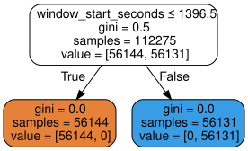
    


Aha! So that's why I have been getting mysteriously good results. Let's remove that specific column from our dataset and see how everything changes:


```python
df_seizures_dropped = df_seizures.drop(columns='file_name_PN10-7.8.9.edf')
df_seizures_dropped
```


<div>
<style scoped>
    .dataframe tbody tr th:only-of-type {
        vertical-align: middle;
    }

    .dataframe tbody tr th {
        vertical-align: top;
    }

    .dataframe thead th {
        text-align: right;
    }
</style>
<table border="1" class="dataframe">
  <thead>
    <tr style="text-align: right;">
      <th></th>
      <th>window_idx</th>
      <th>window_start_seconds</th>
      <th>window_end_seconds</th>
      <th>applied_band_min_hz</th>
      <th>applied_band_max_hz</th>
      <th>psd_mean</th>
      <th>psd_std</th>
      <th>psd_spectral_entropy</th>
      <th>psd_spectral_flatness</th>
      <th>psd_spectral_centroid</th>
      <th>psd_spectral_spread</th>
      <th>psd_spectral_skewness</th>
      <th>psd_spectral_kurtosis</th>
      <th>psd_peak_freq</th>
      <th>psd_peak_power</th>
      <th>psd_sef50</th>
      <th>psd_sef95</th>
      <th>psd_slope</th>
      <th>psd_slope_intercept</th>
      <th>psd_slope_variability</th>
      <th>de_mean</th>
      <th>de_std</th>
      <th>seizure_bool</th>
      <th>phase_ictal</th>
      <th>phase_preictal</th>
      <th>region_caudalmiddlefrontal_lh</th>
      <th>region_caudalmiddlefrontal_rh</th>
      <th>region_central</th>
      <th>region_frontal</th>
      <th>region_inferiorfrontal_lh</th>
      <th>region_inferiorfrontal_rh</th>
      <th>region_inferiorparietal_lh</th>
      <th>region_inferiorparietal_rh</th>
      <th>region_inferiortemporal_lh</th>
      <th>region_inferiortemporal_rh</th>
      <th>region_middletemporal_lh</th>
      <th>region_middletemporal_rh</th>
      <th>region_midline</th>
      <th>region_orbitofrontal_lh</th>
      <th>region_orbitofrontal_rh</th>
      <th>region_paracentral</th>
      <th>region_parietal</th>
      <th>region_postcentral_lh</th>
      <th>region_postcentral_rh</th>
      <th>region_precentral_lh</th>
      <th>region_precentral_rh</th>
      <th>region_rostralmiddlefrontal_lh</th>
      <th>region_rostralmiddlefrontal_rh</th>
      <th>region_superiorfrontal_lh</th>
      <th>region_superiorfrontal_rh</th>
      <th>region_superiorparietal_lh</th>
      <th>region_superiorparietal_rh</th>
      <th>region_superiortemporal_lh</th>
      <th>region_superiortemporal_rh</th>
      <th>region_temporal</th>
      <th>band_alpha</th>
      <th>band_delta</th>
      <th>band_gamma</th>
      <th>band_high_beta</th>
      <th>band_high_gamma</th>
      <th>band_infraslow</th>
      <th>band_low_beta</th>
      <th>band_overall</th>
      <th>band_ripples</th>
      <th>band_theta</th>
      <th>patient_id_PN10</th>
      <th>patient_id_chb02</th>
      <th>file_name_chb02_02.edf</th>
      <th>seizure_index_PN10_sz06</th>
      <th>seizure_index_chb02_ns01</th>
    </tr>
  </thead>
  <tbody>
    <tr>
      <th>0</th>
      <td>0</td>
      <td>1548.0</td>
      <td>1553.0</td>
      <td>0.1</td>
      <td>100.0</td>
      <td>1.980385</td>
      <td>1.092052</td>
      <td>0.601885</td>
      <td>0.382753</td>
      <td>11.965167</td>
      <td>23.562856</td>
      <td>2.115598</td>
      <td>1.092052</td>
      <td>0.2</td>
      <td>-9.271067</td>
      <td>0.8</td>
      <td>67.6</td>
      <td>-0.764140</td>
      <td>-10.626160</td>
      <td>0.371352</td>
      <td>-9.582690</td>
      <td>0.825371</td>
      <td>True</td>
      <td>False</td>
      <td>True</td>
      <td>False</td>
      <td>False</td>
      <td>False</td>
      <td>False</td>
      <td>False</td>
      <td>False</td>
      <td>False</td>
      <td>False</td>
      <td>False</td>
      <td>False</td>
      <td>False</td>
      <td>False</td>
      <td>False</td>
      <td>False</td>
      <td>False</td>
      <td>False</td>
      <td>False</td>
      <td>False</td>
      <td>False</td>
      <td>False</td>
      <td>False</td>
      <td>False</td>
      <td>False</td>
      <td>True</td>
      <td>False</td>
      <td>False</td>
      <td>False</td>
      <td>False</td>
      <td>False</td>
      <td>False</td>
      <td>False</td>
      <td>False</td>
      <td>False</td>
      <td>False</td>
      <td>False</td>
      <td>False</td>
      <td>False</td>
      <td>True</td>
      <td>False</td>
      <td>False</td>
      <td>True</td>
      <td>False</td>
      <td>False</td>
      <td>True</td>
      <td>False</td>
    </tr>
    <tr>
      <th>1</th>
      <td>0</td>
      <td>1548.0</td>
      <td>1553.0</td>
      <td>0.1</td>
      <td>100.0</td>
      <td>5.005401</td>
      <td>1.792659</td>
      <td>0.702004</td>
      <td>0.058410</td>
      <td>7.013093</td>
      <td>7.739901</td>
      <td>2.671272</td>
      <td>1.792659</td>
      <td>1.8</td>
      <td>-8.360845</td>
      <td>3.4</td>
      <td>21.4</td>
      <td>-2.522581</td>
      <td>-7.350974</td>
      <td>0.557579</td>
      <td>-9.391463</td>
      <td>1.487750</td>
      <td>True</td>
      <td>False</td>
      <td>True</td>
      <td>False</td>
      <td>False</td>
      <td>False</td>
      <td>False</td>
      <td>False</td>
      <td>False</td>
      <td>False</td>
      <td>False</td>
      <td>False</td>
      <td>False</td>
      <td>False</td>
      <td>False</td>
      <td>False</td>
      <td>False</td>
      <td>False</td>
      <td>False</td>
      <td>False</td>
      <td>False</td>
      <td>False</td>
      <td>False</td>
      <td>False</td>
      <td>False</td>
      <td>False</td>
      <td>False</td>
      <td>True</td>
      <td>False</td>
      <td>False</td>
      <td>False</td>
      <td>False</td>
      <td>False</td>
      <td>False</td>
      <td>False</td>
      <td>False</td>
      <td>False</td>
      <td>False</td>
      <td>False</td>
      <td>False</td>
      <td>True</td>
      <td>False</td>
      <td>False</td>
      <td>True</td>
      <td>False</td>
      <td>False</td>
      <td>True</td>
      <td>False</td>
    </tr>
    <tr>
      <th>2</th>
      <td>0</td>
      <td>1548.0</td>
      <td>1553.0</td>
      <td>0.1</td>
      <td>100.0</td>
      <td>2.224784</td>
      <td>1.170866</td>
      <td>0.601113</td>
      <td>0.354497</td>
      <td>12.008193</td>
      <td>23.626420</td>
      <td>2.107655</td>
      <td>1.170866</td>
      <td>0.2</td>
      <td>-9.148368</td>
      <td>0.8</td>
      <td>67.6</td>
      <td>-0.757331</td>
      <td>-10.516720</td>
      <td>0.399723</td>
      <td>-9.171948</td>
      <td>0.483198</td>
      <td>True</td>
      <td>False</td>
      <td>True</td>
      <td>False</td>
      <td>False</td>
      <td>False</td>
      <td>False</td>
      <td>False</td>
      <td>False</td>
      <td>False</td>
      <td>False</td>
      <td>False</td>
      <td>False</td>
      <td>False</td>
      <td>False</td>
      <td>False</td>
      <td>False</td>
      <td>False</td>
      <td>False</td>
      <td>False</td>
      <td>False</td>
      <td>False</td>
      <td>False</td>
      <td>False</td>
      <td>True</td>
      <td>False</td>
      <td>False</td>
      <td>False</td>
      <td>False</td>
      <td>False</td>
      <td>False</td>
      <td>False</td>
      <td>False</td>
      <td>False</td>
      <td>False</td>
      <td>False</td>
      <td>False</td>
      <td>False</td>
      <td>False</td>
      <td>False</td>
      <td>True</td>
      <td>False</td>
      <td>False</td>
      <td>True</td>
      <td>False</td>
      <td>False</td>
      <td>True</td>
      <td>False</td>
    </tr>
    <tr>
      <th>3</th>
      <td>0</td>
      <td>1548.0</td>
      <td>1553.0</td>
      <td>0.1</td>
      <td>100.0</td>
      <td>5.291024</td>
      <td>1.839124</td>
      <td>0.701981</td>
      <td>0.052824</td>
      <td>7.012972</td>
      <td>7.736117</td>
      <td>2.667725</td>
      <td>1.839124</td>
      <td>1.8</td>
      <td>-8.235985</td>
      <td>3.4</td>
      <td>21.4</td>
      <td>-2.524496</td>
      <td>-7.225052</td>
      <td>0.632722</td>
      <td>-8.916978</td>
      <td>1.432013</td>
      <td>True</td>
      <td>False</td>
      <td>True</td>
      <td>False</td>
      <td>False</td>
      <td>False</td>
      <td>False</td>
      <td>False</td>
      <td>False</td>
      <td>False</td>
      <td>False</td>
      <td>False</td>
      <td>False</td>
      <td>False</td>
      <td>False</td>
      <td>False</td>
      <td>False</td>
      <td>False</td>
      <td>False</td>
      <td>False</td>
      <td>False</td>
      <td>False</td>
      <td>False</td>
      <td>False</td>
      <td>False</td>
      <td>True</td>
      <td>False</td>
      <td>False</td>
      <td>False</td>
      <td>False</td>
      <td>False</td>
      <td>False</td>
      <td>False</td>
      <td>False</td>
      <td>False</td>
      <td>False</td>
      <td>False</td>
      <td>False</td>
      <td>False</td>
      <td>False</td>
      <td>True</td>
      <td>False</td>
      <td>False</td>
      <td>True</td>
      <td>False</td>
      <td>False</td>
      <td>True</td>
      <td>False</td>
    </tr>
    <tr>
      <th>4</th>
      <td>0</td>
      <td>1548.0</td>
      <td>1553.0</td>
      <td>0.1</td>
      <td>100.0</td>
      <td>0.915864</td>
      <td>0.650169</td>
      <td>0.432009</td>
      <td>0.486951</td>
      <td>2.304154</td>
      <td>8.154332</td>
      <td>7.590447</td>
      <td>0.650169</td>
      <td>0.2</td>
      <td>-9.783745</td>
      <td>0.6</td>
      <td>8.2</td>
      <td>-1.493723</td>
      <td>-10.860553</td>
      <td>0.000000</td>
      <td>-9.855293</td>
      <td>0.000000</td>
      <td>True</td>
      <td>False</td>
      <td>True</td>
      <td>True</td>
      <td>False</td>
      <td>False</td>
      <td>False</td>
      <td>False</td>
      <td>False</td>
      <td>False</td>
      <td>False</td>
      <td>False</td>
      <td>False</td>
      <td>False</td>
      <td>False</td>
      <td>False</td>
      <td>False</td>
      <td>False</td>
      <td>False</td>
      <td>False</td>
      <td>False</td>
      <td>False</td>
      <td>False</td>
      <td>False</td>
      <td>False</td>
      <td>False</td>
      <td>False</td>
      <td>False</td>
      <td>False</td>
      <td>False</td>
      <td>False</td>
      <td>False</td>
      <td>False</td>
      <td>False</td>
      <td>False</td>
      <td>False</td>
      <td>False</td>
      <td>False</td>
      <td>False</td>
      <td>False</td>
      <td>True</td>
      <td>False</td>
      <td>False</td>
      <td>True</td>
      <td>False</td>
      <td>False</td>
      <td>True</td>
      <td>False</td>
    </tr>
    <tr>
      <th>...</th>
      <td>...</td>
      <td>...</td>
      <td>...</td>
      <td>...</td>
      <td>...</td>
      <td>...</td>
      <td>...</td>
      <td>...</td>
      <td>...</td>
      <td>...</td>
      <td>...</td>
      <td>...</td>
      <td>...</td>
      <td>...</td>
      <td>...</td>
      <td>...</td>
      <td>...</td>
      <td>...</td>
      <td>...</td>
      <td>...</td>
      <td>...</td>
      <td>...</td>
      <td>...</td>
      <td>...</td>
      <td>...</td>
      <td>...</td>
      <td>...</td>
      <td>...</td>
      <td>...</td>
      <td>...</td>
      <td>...</td>
      <td>...</td>
      <td>...</td>
      <td>...</td>
      <td>...</td>
      <td>...</td>
      <td>...</td>
      <td>...</td>
      <td>...</td>
      <td>...</td>
      <td>...</td>
      <td>...</td>
      <td>...</td>
      <td>...</td>
      <td>...</td>
      <td>...</td>
      <td>...</td>
      <td>...</td>
      <td>...</td>
      <td>...</td>
      <td>...</td>
      <td>...</td>
      <td>...</td>
      <td>...</td>
      <td>...</td>
      <td>...</td>
      <td>...</td>
      <td>...</td>
      <td>...</td>
      <td>...</td>
      <td>...</td>
      <td>...</td>
      <td>...</td>
      <td>...</td>
      <td>...</td>
      <td>...</td>
      <td>...</td>
      <td>...</td>
      <td>...</td>
      <td>...</td>
    </tr>
    <tr>
      <th>74995</th>
      <td>9</td>
      <td>1245.0</td>
      <td>1250.0</td>
      <td>80.0</td>
      <td>100.0</td>
      <td>0.492974</td>
      <td>0.400770</td>
      <td>0.934146</td>
      <td>0.978492</td>
      <td>84.353440</td>
      <td>5.805196</td>
      <td>1.683796</td>
      <td>0.400770</td>
      <td>87.0</td>
      <td>-11.817562</td>
      <td>87.0</td>
      <td>99.0</td>
      <td>-7.485458</td>
      <td>2.351064</td>
      <td>1.971003</td>
      <td>-11.256206</td>
      <td>0.549175</td>
      <td>False</td>
      <td>True</td>
      <td>False</td>
      <td>False</td>
      <td>False</td>
      <td>False</td>
      <td>True</td>
      <td>False</td>
      <td>False</td>
      <td>False</td>
      <td>False</td>
      <td>False</td>
      <td>False</td>
      <td>False</td>
      <td>False</td>
      <td>False</td>
      <td>False</td>
      <td>False</td>
      <td>False</td>
      <td>False</td>
      <td>False</td>
      <td>False</td>
      <td>False</td>
      <td>False</td>
      <td>False</td>
      <td>False</td>
      <td>False</td>
      <td>False</td>
      <td>False</td>
      <td>False</td>
      <td>False</td>
      <td>False</td>
      <td>False</td>
      <td>False</td>
      <td>False</td>
      <td>False</td>
      <td>False</td>
      <td>False</td>
      <td>False</td>
      <td>False</td>
      <td>False</td>
      <td>True</td>
      <td>False</td>
      <td>False</td>
      <td>True</td>
      <td>True</td>
      <td>False</td>
      <td>True</td>
    </tr>
    <tr>
      <th>74996</th>
      <td>9</td>
      <td>1245.0</td>
      <td>1250.0</td>
      <td>80.0</td>
      <td>100.0</td>
      <td>0.807072</td>
      <td>0.591708</td>
      <td>0.935685</td>
      <td>0.945667</td>
      <td>85.784444</td>
      <td>5.198218</td>
      <td>1.403823</td>
      <td>0.591708</td>
      <td>84.0</td>
      <td>-11.428585</td>
      <td>86.5</td>
      <td>98.0</td>
      <td>-7.842376</td>
      <td>3.322573</td>
      <td>0.411297</td>
      <td>-10.736394</td>
      <td>0.135807</td>
      <td>False</td>
      <td>True</td>
      <td>False</td>
      <td>False</td>
      <td>False</td>
      <td>False</td>
      <td>False</td>
      <td>False</td>
      <td>False</td>
      <td>False</td>
      <td>False</td>
      <td>False</td>
      <td>False</td>
      <td>False</td>
      <td>False</td>
      <td>False</td>
      <td>False</td>
      <td>False</td>
      <td>False</td>
      <td>False</td>
      <td>False</td>
      <td>False</td>
      <td>False</td>
      <td>False</td>
      <td>False</td>
      <td>False</td>
      <td>False</td>
      <td>False</td>
      <td>False</td>
      <td>False</td>
      <td>False</td>
      <td>False</td>
      <td>True</td>
      <td>False</td>
      <td>False</td>
      <td>False</td>
      <td>False</td>
      <td>False</td>
      <td>False</td>
      <td>False</td>
      <td>False</td>
      <td>True</td>
      <td>False</td>
      <td>False</td>
      <td>True</td>
      <td>True</td>
      <td>False</td>
      <td>True</td>
    </tr>
    <tr>
      <th>74997</th>
      <td>9</td>
      <td>1245.0</td>
      <td>1250.0</td>
      <td>80.0</td>
      <td>100.0</td>
      <td>0.441107</td>
      <td>0.365411</td>
      <td>0.933797</td>
      <td>0.983463</td>
      <td>84.289315</td>
      <td>6.171141</td>
      <td>1.597051</td>
      <td>0.365411</td>
      <td>84.0</td>
      <td>-11.876453</td>
      <td>87.0</td>
      <td>99.5</td>
      <td>-6.473078</td>
      <td>0.319747</td>
      <td>2.942580</td>
      <td>-11.482079</td>
      <td>0.627644</td>
      <td>False</td>
      <td>True</td>
      <td>False</td>
      <td>False</td>
      <td>False</td>
      <td>False</td>
      <td>False</td>
      <td>False</td>
      <td>False</td>
      <td>False</td>
      <td>False</td>
      <td>False</td>
      <td>False</td>
      <td>False</td>
      <td>False</td>
      <td>False</td>
      <td>False</td>
      <td>False</td>
      <td>False</td>
      <td>True</td>
      <td>False</td>
      <td>False</td>
      <td>False</td>
      <td>False</td>
      <td>False</td>
      <td>False</td>
      <td>False</td>
      <td>False</td>
      <td>False</td>
      <td>False</td>
      <td>False</td>
      <td>False</td>
      <td>False</td>
      <td>False</td>
      <td>False</td>
      <td>False</td>
      <td>False</td>
      <td>False</td>
      <td>False</td>
      <td>False</td>
      <td>False</td>
      <td>True</td>
      <td>False</td>
      <td>False</td>
      <td>True</td>
      <td>True</td>
      <td>False</td>
      <td>True</td>
    </tr>
    <tr>
      <th>74998</th>
      <td>9</td>
      <td>1245.0</td>
      <td>1250.0</td>
      <td>80.0</td>
      <td>100.0</td>
      <td>0.045635</td>
      <td>0.044625</td>
      <td>0.709126</td>
      <td>0.999783</td>
      <td>58.344080</td>
      <td>25.021019</td>
      <td>1.280452</td>
      <td>0.044625</td>
      <td>84.0</td>
      <td>-13.012597</td>
      <td>93.0</td>
      <td>100.0</td>
      <td>-5.053187</td>
      <td>-3.534391</td>
      <td>2.556500</td>
      <td>-12.109820</td>
      <td>0.210896</td>
      <td>False</td>
      <td>True</td>
      <td>False</td>
      <td>False</td>
      <td>False</td>
      <td>True</td>
      <td>False</td>
      <td>False</td>
      <td>False</td>
      <td>False</td>
      <td>False</td>
      <td>False</td>
      <td>False</td>
      <td>False</td>
      <td>False</td>
      <td>False</td>
      <td>False</td>
      <td>False</td>
      <td>False</td>
      <td>False</td>
      <td>False</td>
      <td>False</td>
      <td>False</td>
      <td>False</td>
      <td>False</td>
      <td>False</td>
      <td>False</td>
      <td>False</td>
      <td>False</td>
      <td>False</td>
      <td>False</td>
      <td>False</td>
      <td>False</td>
      <td>False</td>
      <td>False</td>
      <td>False</td>
      <td>False</td>
      <td>False</td>
      <td>False</td>
      <td>False</td>
      <td>False</td>
      <td>True</td>
      <td>False</td>
      <td>False</td>
      <td>True</td>
      <td>True</td>
      <td>False</td>
      <td>True</td>
    </tr>
    <tr>
      <th>74999</th>
      <td>9</td>
      <td>1245.0</td>
      <td>1250.0</td>
      <td>80.0</td>
      <td>100.0</td>
      <td>0.008513</td>
      <td>0.008477</td>
      <td>0.340242</td>
      <td>0.999984</td>
      <td>22.889705</td>
      <td>33.360667</td>
      <td>1.979413</td>
      <td>0.008477</td>
      <td>84.0</td>
      <td>-13.592702</td>
      <td>100.0</td>
      <td>100.0</td>
      <td>-6.127764</td>
      <td>-2.189169</td>
      <td>2.056020</td>
      <td>-12.311095</td>
      <td>0.013672</td>
      <td>False</td>
      <td>True</td>
      <td>False</td>
      <td>False</td>
      <td>False</td>
      <td>False</td>
      <td>False</td>
      <td>False</td>
      <td>False</td>
      <td>False</td>
      <td>False</td>
      <td>False</td>
      <td>False</td>
      <td>False</td>
      <td>False</td>
      <td>True</td>
      <td>False</td>
      <td>False</td>
      <td>False</td>
      <td>False</td>
      <td>False</td>
      <td>False</td>
      <td>False</td>
      <td>False</td>
      <td>False</td>
      <td>False</td>
      <td>False</td>
      <td>False</td>
      <td>False</td>
      <td>False</td>
      <td>False</td>
      <td>False</td>
      <td>False</td>
      <td>False</td>
      <td>False</td>
      <td>False</td>
      <td>False</td>
      <td>False</td>
      <td>False</td>
      <td>False</td>
      <td>False</td>
      <td>True</td>
      <td>False</td>
      <td>False</td>
      <td>True</td>
      <td>True</td>
      <td>False</td>
      <td>True</td>
    </tr>
  </tbody>
</table>
<p>149700 rows × 70 columns</p>
</div>


And now we'll try again:


```python
trn_df, val_df = train_test_split(df_seizures_dropped, test_size=0.25)
trn_xs, trn_y = xs_y(trn_df)
val_xs, val_y = xs_y(val_df)
```


```python
m = DecisionTreeClassifier(max_leaf_nodes=4).fit(trn_xs, trn_y);
draw_tree(m, trn_xs, size=10)
```


    
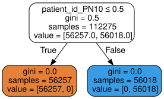
    


It looks like there is more than one column providing our model with seizure giveaways... time to preprocess again?


```python
def drop(df, col):
    df = df.drop(columns= f'{col}')
    trn_df, val_df = train_test_split(df_seizures, test_size=0.25)
    trn_xs, trn_y = xs_y(trn_df)
    val_xs, val_y = xs_y(val_df)
```


```python
def tree(df, col, trn_xs=trn_xs, trn_y=trn_y):
    drop(df, f'{col}')
    m = DecisionTreeClassifier(max_leaf_nodes=4).fit(trn_xs, trn_y);
    y = draw_tree(m, trn_xs, size=10)
    return y
```


```python
tree(df_seizures_dropped, 'seizure_index_chb02_ns01')
```


    

    


```python
tree(df_seizures_dropped, 'seizure_index_PN10_sz06')
```


    
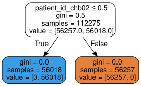
    


```python
tree(df_seizures_dropped, 'patient_id_chb02')
```


    
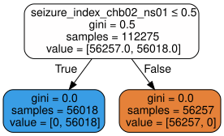
    


I'm noticing that a lot of these giveaway columns are categorical. If we train on a dataset of only continuous variables, would that perhaps help us?


```python
df_seizures_conts = df_seizures.drop(columns=cat_names)
df_seizures_conts
```


<div>
<style scoped>
    .dataframe tbody tr th:only-of-type {
        vertical-align: middle;
    }

    .dataframe tbody tr th {
        vertical-align: top;
    }

    .dataframe thead th {
        text-align: right;
    }
</style>
<table border="1" class="dataframe">
  <thead>
    <tr style="text-align: right;">
      <th></th>
      <th>window_idx</th>
      <th>window_start_seconds</th>
      <th>window_end_seconds</th>
      <th>applied_band_min_hz</th>
      <th>applied_band_max_hz</th>
      <th>psd_mean</th>
      <th>psd_std</th>
      <th>psd_spectral_entropy</th>
      <th>psd_spectral_flatness</th>
      <th>psd_spectral_centroid</th>
      <th>psd_spectral_spread</th>
      <th>psd_spectral_skewness</th>
      <th>psd_spectral_kurtosis</th>
      <th>psd_peak_freq</th>
      <th>psd_peak_power</th>
      <th>psd_sef50</th>
      <th>psd_sef95</th>
      <th>psd_slope</th>
      <th>psd_slope_intercept</th>
      <th>psd_slope_variability</th>
      <th>de_mean</th>
      <th>de_std</th>
      <th>seizure_bool</th>
    </tr>
  </thead>
  <tbody>
    <tr>
      <th>0</th>
      <td>0</td>
      <td>1548.0</td>
      <td>1553.0</td>
      <td>0.1</td>
      <td>100.0</td>
      <td>1.980385</td>
      <td>1.092052</td>
      <td>0.601885</td>
      <td>0.382753</td>
      <td>11.965167</td>
      <td>23.562856</td>
      <td>2.115598</td>
      <td>1.092052</td>
      <td>0.2</td>
      <td>-9.271067</td>
      <td>0.8</td>
      <td>67.6</td>
      <td>-0.764140</td>
      <td>-10.626160</td>
      <td>0.371352</td>
      <td>-9.582690</td>
      <td>0.825371</td>
      <td>True</td>
    </tr>
    <tr>
      <th>1</th>
      <td>0</td>
      <td>1548.0</td>
      <td>1553.0</td>
      <td>0.1</td>
      <td>100.0</td>
      <td>5.005401</td>
      <td>1.792659</td>
      <td>0.702004</td>
      <td>0.058410</td>
      <td>7.013093</td>
      <td>7.739901</td>
      <td>2.671272</td>
      <td>1.792659</td>
      <td>1.8</td>
      <td>-8.360845</td>
      <td>3.4</td>
      <td>21.4</td>
      <td>-2.522581</td>
      <td>-7.350974</td>
      <td>0.557579</td>
      <td>-9.391463</td>
      <td>1.487750</td>
      <td>True</td>
    </tr>
    <tr>
      <th>2</th>
      <td>0</td>
      <td>1548.0</td>
      <td>1553.0</td>
      <td>0.1</td>
      <td>100.0</td>
      <td>2.224784</td>
      <td>1.170866</td>
      <td>0.601113</td>
      <td>0.354497</td>
      <td>12.008193</td>
      <td>23.626420</td>
      <td>2.107655</td>
      <td>1.170866</td>
      <td>0.2</td>
      <td>-9.148368</td>
      <td>0.8</td>
      <td>67.6</td>
      <td>-0.757331</td>
      <td>-10.516720</td>
      <td>0.399723</td>
      <td>-9.171948</td>
      <td>0.483198</td>
      <td>True</td>
    </tr>
    <tr>
      <th>3</th>
      <td>0</td>
      <td>1548.0</td>
      <td>1553.0</td>
      <td>0.1</td>
      <td>100.0</td>
      <td>5.291024</td>
      <td>1.839124</td>
      <td>0.701981</td>
      <td>0.052824</td>
      <td>7.012972</td>
      <td>7.736117</td>
      <td>2.667725</td>
      <td>1.839124</td>
      <td>1.8</td>
      <td>-8.235985</td>
      <td>3.4</td>
      <td>21.4</td>
      <td>-2.524496</td>
      <td>-7.225052</td>
      <td>0.632722</td>
      <td>-8.916978</td>
      <td>1.432013</td>
      <td>True</td>
    </tr>
    <tr>
      <th>4</th>
      <td>0</td>
      <td>1548.0</td>
      <td>1553.0</td>
      <td>0.1</td>
      <td>100.0</td>
      <td>0.915864</td>
      <td>0.650169</td>
      <td>0.432009</td>
      <td>0.486951</td>
      <td>2.304154</td>
      <td>8.154332</td>
      <td>7.590447</td>
      <td>0.650169</td>
      <td>0.2</td>
      <td>-9.783745</td>
      <td>0.6</td>
      <td>8.2</td>
      <td>-1.493723</td>
      <td>-10.860553</td>
      <td>0.000000</td>
      <td>-9.855293</td>
      <td>0.000000</td>
      <td>True</td>
    </tr>
    <tr>
      <th>...</th>
      <td>...</td>
      <td>...</td>
      <td>...</td>
      <td>...</td>
      <td>...</td>
      <td>...</td>
      <td>...</td>
      <td>...</td>
      <td>...</td>
      <td>...</td>
      <td>...</td>
      <td>...</td>
      <td>...</td>
      <td>...</td>
      <td>...</td>
      <td>...</td>
      <td>...</td>
      <td>...</td>
      <td>...</td>
      <td>...</td>
      <td>...</td>
      <td>...</td>
      <td>...</td>
    </tr>
    <tr>
      <th>74995</th>
      <td>9</td>
      <td>1245.0</td>
      <td>1250.0</td>
      <td>80.0</td>
      <td>100.0</td>
      <td>0.492974</td>
      <td>0.400770</td>
      <td>0.934146</td>
      <td>0.978492</td>
      <td>84.353440</td>
      <td>5.805196</td>
      <td>1.683796</td>
      <td>0.400770</td>
      <td>87.0</td>
      <td>-11.817562</td>
      <td>87.0</td>
      <td>99.0</td>
      <td>-7.485458</td>
      <td>2.351064</td>
      <td>1.971003</td>
      <td>-11.256206</td>
      <td>0.549175</td>
      <td>False</td>
    </tr>
    <tr>
      <th>74996</th>
      <td>9</td>
      <td>1245.0</td>
      <td>1250.0</td>
      <td>80.0</td>
      <td>100.0</td>
      <td>0.807072</td>
      <td>0.591708</td>
      <td>0.935685</td>
      <td>0.945667</td>
      <td>85.784444</td>
      <td>5.198218</td>
      <td>1.403823</td>
      <td>0.591708</td>
      <td>84.0</td>
      <td>-11.428585</td>
      <td>86.5</td>
      <td>98.0</td>
      <td>-7.842376</td>
      <td>3.322573</td>
      <td>0.411297</td>
      <td>-10.736394</td>
      <td>0.135807</td>
      <td>False</td>
    </tr>
    <tr>
      <th>74997</th>
      <td>9</td>
      <td>1245.0</td>
      <td>1250.0</td>
      <td>80.0</td>
      <td>100.0</td>
      <td>0.441107</td>
      <td>0.365411</td>
      <td>0.933797</td>
      <td>0.983463</td>
      <td>84.289315</td>
      <td>6.171141</td>
      <td>1.597051</td>
      <td>0.365411</td>
      <td>84.0</td>
      <td>-11.876453</td>
      <td>87.0</td>
      <td>99.5</td>
      <td>-6.473078</td>
      <td>0.319747</td>
      <td>2.942580</td>
      <td>-11.482079</td>
      <td>0.627644</td>
      <td>False</td>
    </tr>
    <tr>
      <th>74998</th>
      <td>9</td>
      <td>1245.0</td>
      <td>1250.0</td>
      <td>80.0</td>
      <td>100.0</td>
      <td>0.045635</td>
      <td>0.044625</td>
      <td>0.709126</td>
      <td>0.999783</td>
      <td>58.344080</td>
      <td>25.021019</td>
      <td>1.280452</td>
      <td>0.044625</td>
      <td>84.0</td>
      <td>-13.012597</td>
      <td>93.0</td>
      <td>100.0</td>
      <td>-5.053187</td>
      <td>-3.534391</td>
      <td>2.556500</td>
      <td>-12.109820</td>
      <td>0.210896</td>
      <td>False</td>
    </tr>
    <tr>
      <th>74999</th>
      <td>9</td>
      <td>1245.0</td>
      <td>1250.0</td>
      <td>80.0</td>
      <td>100.0</td>
      <td>0.008513</td>
      <td>0.008477</td>
      <td>0.340242</td>
      <td>0.999984</td>
      <td>22.889705</td>
      <td>33.360667</td>
      <td>1.979413</td>
      <td>0.008477</td>
      <td>84.0</td>
      <td>-13.592702</td>
      <td>100.0</td>
      <td>100.0</td>
      <td>-6.127764</td>
      <td>-2.189169</td>
      <td>2.056020</td>
      <td>-12.311095</td>
      <td>0.013672</td>
      <td>False</td>
    </tr>
  </tbody>
</table>
<p>149700 rows × 23 columns</p>
</div>


```python
trn_df, val_df = train_test_split(df_seizures_conts, test_size=0.25)
trn_xs, trn_y = xs_y(trn_df)
val_xs, val_y = xs_y(val_df)
```


```python
m = DecisionTreeClassifier(max_leaf_nodes=4).fit(trn_xs, trn_y);
draw_tree(m, trn_xs, size=10)
```


    
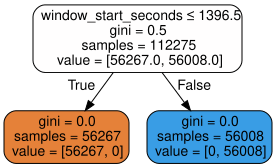
    


```python
df_seizures_conts = df_seizures_conts.drop(columns=['window_start_seconds', 'window_end_seconds'])
```


```python
trn_df, val_df = train_test_split(df_seizures_conts, test_size=0.25)
trn_xs, trn_y = xs_y(trn_df)
val_xs, val_y = xs_y(val_df)
m = DecisionTreeClassifier(max_leaf_nodes=4).fit(trn_xs, trn_y);
draw_tree(m, trn_xs, size=10)
```


    
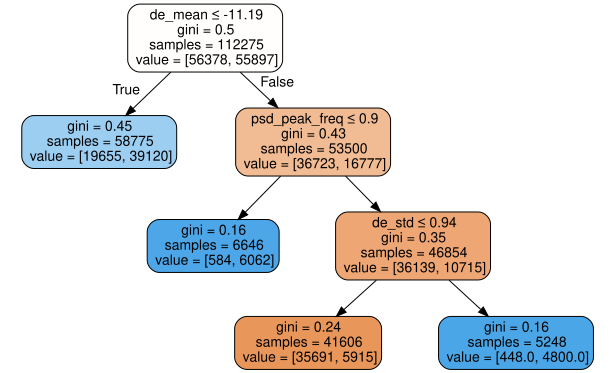
    


There we go - we finally have a tree! A manual analysis of the categorical variables shows us that all of them were giveaways, so in the spirit of model-training, we have removed them. Again, we'll still experiment with adding the postictal data back at the end. For now, let's try making a bigger tree:


```python
m = DecisionTreeClassifier(max_leaf_nodes=10).fit(trn_xs, trn_y);
draw_tree(m, trn_xs, size=10)
```


    
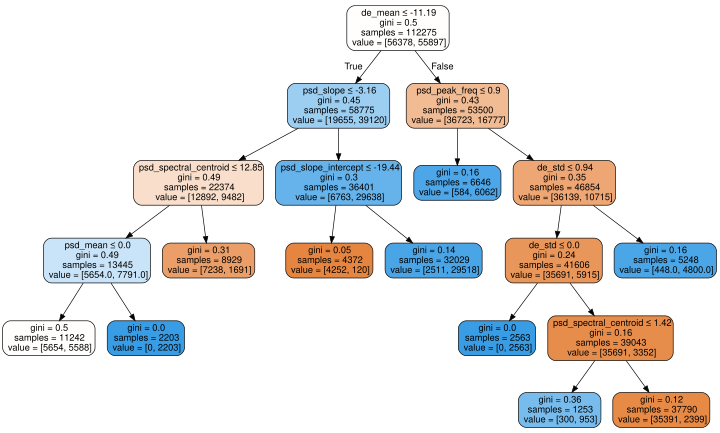
    


This seems to give us good insights that we will need to create an actual random forest. As a final remark, let's just train the model using a classical fast.ai `Learner` again, just to ensure that all giveaways are gone.


```python
df_seizures_dropagain = df_seizures_conts.copy()
df_seizures_dropagain
```


<div>
<style scoped>
    .dataframe tbody tr th:only-of-type {
        vertical-align: middle;
    }

    .dataframe tbody tr th {
        vertical-align: top;
    }

    .dataframe thead th {
        text-align: right;
    }
</style>
<table border="1" class="dataframe">
  <thead>
    <tr style="text-align: right;">
      <th></th>
      <th>window_idx</th>
      <th>applied_band_min_hz</th>
      <th>applied_band_max_hz</th>
      <th>psd_mean</th>
      <th>psd_std</th>
      <th>psd_spectral_entropy</th>
      <th>psd_spectral_flatness</th>
      <th>psd_spectral_centroid</th>
      <th>psd_spectral_spread</th>
      <th>psd_spectral_skewness</th>
      <th>psd_spectral_kurtosis</th>
      <th>psd_peak_freq</th>
      <th>psd_peak_power</th>
      <th>psd_sef50</th>
      <th>psd_sef95</th>
      <th>psd_slope</th>
      <th>psd_slope_intercept</th>
      <th>psd_slope_variability</th>
      <th>de_mean</th>
      <th>de_std</th>
      <th>seizure_bool</th>
    </tr>
  </thead>
  <tbody>
    <tr>
      <th>0</th>
      <td>0</td>
      <td>0.1</td>
      <td>100.0</td>
      <td>1.980385</td>
      <td>1.092052</td>
      <td>0.601885</td>
      <td>0.382753</td>
      <td>11.965167</td>
      <td>23.562856</td>
      <td>2.115598</td>
      <td>1.092052</td>
      <td>0.2</td>
      <td>-9.271067</td>
      <td>0.8</td>
      <td>67.6</td>
      <td>-0.764140</td>
      <td>-10.626160</td>
      <td>0.371352</td>
      <td>-9.582690</td>
      <td>0.825371</td>
      <td>True</td>
    </tr>
    <tr>
      <th>1</th>
      <td>0</td>
      <td>0.1</td>
      <td>100.0</td>
      <td>5.005401</td>
      <td>1.792659</td>
      <td>0.702004</td>
      <td>0.058410</td>
      <td>7.013093</td>
      <td>7.739901</td>
      <td>2.671272</td>
      <td>1.792659</td>
      <td>1.8</td>
      <td>-8.360845</td>
      <td>3.4</td>
      <td>21.4</td>
      <td>-2.522581</td>
      <td>-7.350974</td>
      <td>0.557579</td>
      <td>-9.391463</td>
      <td>1.487750</td>
      <td>True</td>
    </tr>
    <tr>
      <th>2</th>
      <td>0</td>
      <td>0.1</td>
      <td>100.0</td>
      <td>2.224784</td>
      <td>1.170866</td>
      <td>0.601113</td>
      <td>0.354497</td>
      <td>12.008193</td>
      <td>23.626420</td>
      <td>2.107655</td>
      <td>1.170866</td>
      <td>0.2</td>
      <td>-9.148368</td>
      <td>0.8</td>
      <td>67.6</td>
      <td>-0.757331</td>
      <td>-10.516720</td>
      <td>0.399723</td>
      <td>-9.171948</td>
      <td>0.483198</td>
      <td>True</td>
    </tr>
    <tr>
      <th>3</th>
      <td>0</td>
      <td>0.1</td>
      <td>100.0</td>
      <td>5.291024</td>
      <td>1.839124</td>
      <td>0.701981</td>
      <td>0.052824</td>
      <td>7.012972</td>
      <td>7.736117</td>
      <td>2.667725</td>
      <td>1.839124</td>
      <td>1.8</td>
      <td>-8.235985</td>
      <td>3.4</td>
      <td>21.4</td>
      <td>-2.524496</td>
      <td>-7.225052</td>
      <td>0.632722</td>
      <td>-8.916978</td>
      <td>1.432013</td>
      <td>True</td>
    </tr>
    <tr>
      <th>4</th>
      <td>0</td>
      <td>0.1</td>
      <td>100.0</td>
      <td>0.915864</td>
      <td>0.650169</td>
      <td>0.432009</td>
      <td>0.486951</td>
      <td>2.304154</td>
      <td>8.154332</td>
      <td>7.590447</td>
      <td>0.650169</td>
      <td>0.2</td>
      <td>-9.783745</td>
      <td>0.6</td>
      <td>8.2</td>
      <td>-1.493723</td>
      <td>-10.860553</td>
      <td>0.000000</td>
      <td>-9.855293</td>
      <td>0.000000</td>
      <td>True</td>
    </tr>
    <tr>
      <th>...</th>
      <td>...</td>
      <td>...</td>
      <td>...</td>
      <td>...</td>
      <td>...</td>
      <td>...</td>
      <td>...</td>
      <td>...</td>
      <td>...</td>
      <td>...</td>
      <td>...</td>
      <td>...</td>
      <td>...</td>
      <td>...</td>
      <td>...</td>
      <td>...</td>
      <td>...</td>
      <td>...</td>
      <td>...</td>
      <td>...</td>
      <td>...</td>
    </tr>
    <tr>
      <th>74995</th>
      <td>9</td>
      <td>80.0</td>
      <td>100.0</td>
      <td>0.492974</td>
      <td>0.400770</td>
      <td>0.934146</td>
      <td>0.978492</td>
      <td>84.353440</td>
      <td>5.805196</td>
      <td>1.683796</td>
      <td>0.400770</td>
      <td>87.0</td>
      <td>-11.817562</td>
      <td>87.0</td>
      <td>99.0</td>
      <td>-7.485458</td>
      <td>2.351064</td>
      <td>1.971003</td>
      <td>-11.256206</td>
      <td>0.549175</td>
      <td>False</td>
    </tr>
    <tr>
      <th>74996</th>
      <td>9</td>
      <td>80.0</td>
      <td>100.0</td>
      <td>0.807072</td>
      <td>0.591708</td>
      <td>0.935685</td>
      <td>0.945667</td>
      <td>85.784444</td>
      <td>5.198218</td>
      <td>1.403823</td>
      <td>0.591708</td>
      <td>84.0</td>
      <td>-11.428585</td>
      <td>86.5</td>
      <td>98.0</td>
      <td>-7.842376</td>
      <td>3.322573</td>
      <td>0.411297</td>
      <td>-10.736394</td>
      <td>0.135807</td>
      <td>False</td>
    </tr>
    <tr>
      <th>74997</th>
      <td>9</td>
      <td>80.0</td>
      <td>100.0</td>
      <td>0.441107</td>
      <td>0.365411</td>
      <td>0.933797</td>
      <td>0.983463</td>
      <td>84.289315</td>
      <td>6.171141</td>
      <td>1.597051</td>
      <td>0.365411</td>
      <td>84.0</td>
      <td>-11.876453</td>
      <td>87.0</td>
      <td>99.5</td>
      <td>-6.473078</td>
      <td>0.319747</td>
      <td>2.942580</td>
      <td>-11.482079</td>
      <td>0.627644</td>
      <td>False</td>
    </tr>
    <tr>
      <th>74998</th>
      <td>9</td>
      <td>80.0</td>
      <td>100.0</td>
      <td>0.045635</td>
      <td>0.044625</td>
      <td>0.709126</td>
      <td>0.999783</td>
      <td>58.344080</td>
      <td>25.021019</td>
      <td>1.280452</td>
      <td>0.044625</td>
      <td>84.0</td>
      <td>-13.012597</td>
      <td>93.0</td>
      <td>100.0</td>
      <td>-5.053187</td>
      <td>-3.534391</td>
      <td>2.556500</td>
      <td>-12.109820</td>
      <td>0.210896</td>
      <td>False</td>
    </tr>
    <tr>
      <th>74999</th>
      <td>9</td>
      <td>80.0</td>
      <td>100.0</td>
      <td>0.008513</td>
      <td>0.008477</td>
      <td>0.340242</td>
      <td>0.999984</td>
      <td>22.889705</td>
      <td>33.360667</td>
      <td>1.979413</td>
      <td>0.008477</td>
      <td>84.0</td>
      <td>-13.592702</td>
      <td>100.0</td>
      <td>100.0</td>
      <td>-6.127764</td>
      <td>-2.189169</td>
      <td>2.056020</td>
      <td>-12.311095</td>
      <td>0.013672</td>
      <td>False</td>
    </tr>
  </tbody>
</table>
<p>149700 rows × 21 columns</p>
</div>


```python
cont_names_2 = ['window_idx', 'applied_band_min_hz', 'applied_band_max_hz', 'psd_mean',	'psd_std', 'psd_spectral_entropy', 
              'psd_spectral_flatness',	'psd_spectral_centroid', 'psd_spectral_spread', 'psd_spectral_skewness', 'psd_spectral_kurtosis', 'psd_peak_freq', 'psd_peak_power', 
              'psd_sef50', 'psd_sef95', 'psd_slope', 'psd_slope_intercept', 'psd_slope_variability', 'de_mean', 'de_std']
```


```python
dls = TabularDataLoaders.from_df(df_seizures_conts, path=".", procs=procs, cont_names=cont_names_2,
                                y_names=y_names, bs=64, y_block=CategoryBlock)
```


```python
learn = tabular_learner(dls, metrics=accuracy)
```


```python
learn.lr_find(suggest_funcs=(valley, slide))
```


<div></div>


    SuggestedLRs(valley=0.0020892962347716093, slide=0.019054606556892395)


    
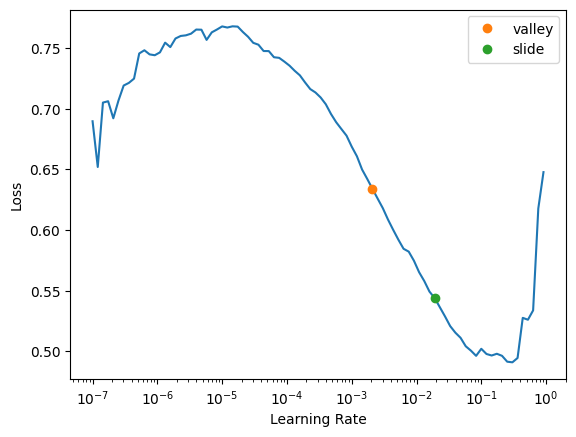
    


If you compare this learning rate chart to the one we saw earlier, there are already improvements - you can see the loss increase in this graph once the learning rate increases. Compare that to the one we did before investigating our graph with a decision tree, and we can see that the former one just asymptoted to zero, which was exactly what happened during training too. 


```python
learn.fit_one_cycle(1)
```


<div><table class="fastprogress"><thead><tr><th>epoch</th><th>train_loss</th><th>valid_loss</th><th>accuracy</th><th>time</th></tr></thead><tbody><tr><td>0</td><td>0.137124</td><td>0.116987</td><td>0.935204</td><td>00:13</td></tr></tbody></table></div>


And then let's see what happens if we test the accuracy of our decision tree as-is:


```python
from sklearn.metrics import accuracy_score
```


```python
m = DecisionTreeClassifier(max_leaf_nodes=10, random_state=42).fit(trn_xs, trn_y);
accuracy_score(val_y, m.predict(val_xs))
```


    0.876125584502338


88% accuracy is not that bad for one decision tree. Time for random forests!

### 2.2.2: Decision tree to random forests

Now that we used ScikitLearn's decision tree to successfully diagnose our data, modeling a Random Forest will be a breeze. Once again, we will use ScikitLearn's library:


```python
from sklearn.ensemble import RandomForestClassifier, RandomForestRegressor
```


```python
rf = RandomForestClassifier(100, min_samples_leaf=5)
rf.fit(trn_xs, trn_y);
```

Let's see what's inside a Random Forest prediction for this dataset:


```python
rf.predict(trn_xs)
```


    array([False,  True, False, ..., False,  True,  True], shape=(112275,))


I mean, it looks about right. Finally, for the moment of truth:


```python
accuracy_score(val_y, rf.predict(val_xs))
```


    0.9307147628590514


That's not bad! With some [hyperparameter optimization](https://towardsdatascience.com/hyperparameter-tuning-the-random-forest-in-python-using-scikit-learn-28d2aa77dd74/) we could maybe get a better accuracy score, however. Let's first start by implementing ScikitLearn's `RandomizedSearchCV`:


```python
from sklearn.model_selection import RandomizedSearchCV
```

We'll define the parameters of our random grid that we will pass into `RandomizedSearchCV` as variables:


```python
n_estimators = [int(x) for x in np.linspace(start = 100, stop = 2000, num = 10)]
max_features = ['auto', 'sqrt']
max_depth = [int(x) for x in np.linspace(10, 110, num = 11)]
max_depth.append(None)
min_samples_split = [2, 5, 10]
min_samples_leaf = [1, 2, 4]
bootstrap = [True, False]
```


```python
from pprint import pprint
random_grid = {'n_estimators': n_estimators,
               'max_features': max_features,
               'max_depth': max_depth,
               'min_samples_split': min_samples_split,
               'min_samples_leaf': min_samples_leaf,
               'bootstrap': bootstrap}
pprint(random_grid)
```

    {'bootstrap': [True, False],
     'max_depth': [10, 20, 30, 40, 50, 60, 70, 80, 90, 100, 110, None],
     'max_features': ['auto', 'sqrt'],
     'min_samples_leaf': [1, 2, 4],
     'min_samples_split': [2, 5, 10],
     'n_estimators': [100, 311, 522, 733, 944, 1155, 1366, 1577, 1788, 2000]}
    


```python

```

And now, we'll use K-Fold Cross Validation to test out all of these hyperparameter combinations:


```python
rf = RandomForestClassifier(random_state=42)
rf_random = RandomizedSearchCV(estimator=rf, param_distributions=random_grid,
                              n_iter = 25, scoring='accuracy', cv = 3, 
                              verbose=2, # does one progress bar per epoch
                              random_state=42, n_jobs=-1,
                              return_train_score=True)
```


```python
# rf_random.fit(trn_xs, trn_y);
```

I will leave the following as a comment because man does it take a long time to fully run through (for me, it took around 90 minutes!). I will save you the hassle and tell you that based on this fitting, the optimal number of: 
* `n_estimators` (number of trees in each forest) is 733,
* `min_samples_split` (minimum number of samples required to split a node) is 2,
* `min_samples_leaf` (minimum number of samples required at each leaf node) is 1,
* `max_features` (number of features to consider at every split) is `sqrt`,
* `max_depth` (maximum number of levels in tree) is 20, and
* `bootstrap` (method of selecting samples for training each tree) is `False`.


```python
# rf_random.best_params_
```

Now, let's implement those new settings and check our results!


```python
rf = RandomForestClassifier(n_estimators=733, min_samples_split=2, min_samples_leaf=1, max_features='sqrt', max_depth=20, bootstrap=False)
rf.fit(trn_xs, trn_y);
```


```python
accuracy_score(val_y, rf.predict(val_xs))
```


    0.9358450233800936


Yeah... a very trivial adjustment of 0.5%. Let's continue tuning our hyperparameters. We'll be trying out `GridSearchCV`, something that is structurally very similar to `RandomizedSearchCV`. The only difference is that it tries out all the combinations of parameters that we define rather than randomly select them. Again, this will also be time-consuming.


```python
from sklearn.model_selection import GridSearchCV

param_grid = {
    'bootstrap': [True],
    'max_depth': [90, 110],
    'max_features': [2, 3],
    'min_samples_leaf': [3, 4, 5],
    'min_samples_split': [8, 10],
    'n_estimators': [200, 1000]
}

rf = RandomForestClassifier(random_state = 42)

grid_search = GridSearchCV(estimator = rf, param_grid = param_grid, cv = 2, n_jobs = -1, verbose = 2, return_train_score=True)
```


```python
# grid_search.fit(trn_xs, trn_y);
```


```python
# grid_search.best_params_
```

As per usual, the above will have to stay as a comment because again, it takes a long time to fully run through. However, for this fitting, the optimal number of:

* `n_estimators` is 1000,
* `min_samples_split` is 8,
* `min_samples_leaf` is 3,
* `max_features` is 3,
* `max_depth` is 90, and
* `bootstrap` is `True`.

Now, let's try again!


```python
rf = RandomForestClassifier(n_estimators=1000, min_samples_split=8, min_samples_leaf=3, max_features=3, max_depth=90, bootstrap=False)
rf.fit(trn_xs, trn_y);
```


```python
accuracy_score(val_y, rf.predict(val_xs))
```


    0.9319171676686707


That is not better than 93.5%, but it is still a solid score! We'll come back to the humble Random Forest in Section 2.4.

## 2.3: Using fast.ai to make a seizure classifier

fast.ai is a Machine Learning library that primarily utilizes the `Learner` in training its models - that's exactly what we'll use too. Because we're working with a tabular dataset, we use `tabular_learner`. Before we get to that, let's try making our own model!

### 2.3.1: From-scratch fast.ai model

This section is partly based on [Lesson 5 from Jeremy Howard's Practical Deep Learning for Coders Course](https://www.youtube.com/watch?v=_rXzeWq4C6w), as well as the [companion notebook](https://www.kaggle.com/code/jhoward/linear-model-and-neural-net-from-scratch) that he made. Using this, we will transition to actually using the fast.ai library!

To start off, let's turn all of our categorial columns into a tensor:


```python
t_indep = tensor(df_seizures_conts[cont_names_2].values, dtype=torch.float)
t_indep[:1]
```


    tensor([[  0.0000,   0.1000, 100.0000,   1.9804,   1.0921,   0.6019,   0.3828,
              11.9652,  23.5629,   2.1156,   1.0921,   0.2000,  -9.2711,   0.8000,
              67.6000,  -0.7641, -10.6262,   0.3714,  -9.5827,   0.8254]])


```python
t_indep.shape
```


    torch.Size([149700, 20])


Looking at this, we should divide every single value in each tensor by the maximum value in that tensor to make sure that no one column overpowers everything:


```python
vals,indices = t_indep.max(dim=0)
t_indep = t_indep / vals
t_indep[:1]
```


    tensor([[ 0.0000e+00,  1.2500e-03,  1.0000e+00,  1.5413e-01,  4.1551e-01,
              6.0476e-01,  3.8275e-01,  1.2920e-01,  6.6162e-01,  4.6041e-02,
              4.1551e-01,  2.0305e-03,  1.6082e+00,  8.0000e-03,  6.7600e-01,
             -7.3088e-02, -4.6906e-01,  5.4504e-02,  1.3812e+00,  3.0529e-01]])


Now, let's make random parameters to set up our linear model. Because we're using a function that outputs random values, we'll set a random seed to ensure consistent results:


```python
n_coeff = t_indep.shape[1]
n_coeff
```


    20


```python
torch.manual_seed(442)

coeffs = torch.rand(n_coeff)-0.5
coeffs
```


    tensor([-0.4629,  0.1386,  0.2409, -0.2262, -0.2632, -0.3147,  0.4876,  0.3136,
             0.2799, -0.4392,  0.2103,  0.3625,  0.1722,  0.2324, -0.3575, -0.0010,
            -0.1833, -0.2411,  0.0489,  0.0866])


We'll be using the concept of broadcasting to apply our `coeffs` to our indepdendent tensors. The idea is that if we add up all the contents of each tensor and it turns out to be negative, then the seizure classification will be negative; conversely, vice versa is true.


```python
t_indep*coeffs
```


    tensor([[-0.0000e+00,  1.7322e-04,  2.4090e-01,  ..., -1.3141e-02,
              6.7542e-02,  2.6442e-02],
            [-0.0000e+00,  1.7322e-04,  2.4090e-01,  ..., -1.9730e-02,
              6.6194e-02,  4.7662e-02],
            [-0.0000e+00,  1.7322e-04,  2.4090e-01,  ..., -1.4144e-02,
              6.4647e-02,  1.5480e-02],
            ...,
            [-1.7431e-02,  1.3858e-01,  2.4090e-01,  ..., -1.0413e-01,
              8.0930e-02,  2.0107e-02],
            [-1.7431e-02,  1.3858e-01,  2.4090e-01,  ..., -9.0464e-02,
              8.5354e-02,  6.7563e-03],
            [-1.7431e-02,  1.3858e-01,  2.4090e-01,  ..., -7.2754e-02,
              8.6773e-02,  4.3800e-04]])


So, addition is exactly what we'll do!


```python
preds = (t_indep*coeffs).sum(axis=1)
```

Some predictions:


```python
preds[:50]
```


    tensor([0.5907, 0.3239, 0.5526, 0.3027, 0.7345, 0.7409, 0.5016, 0.5123, 0.4927,
            0.2940, 0.8915, 0.9202, 0.8247, 0.9401, 0.7800, 0.5391, 0.7651, 0.4163,
            0.7603, 0.9068, 0.5697, 0.8081, 0.6190, 0.7521, 0.6071, 0.3597, 0.8573,
            0.5971, 0.6862, 0.8439, 0.4128, 0.2989, 0.3930, 0.2871, 0.5508, 0.8006,
            0.4330, 0.5554, 0.3831, 0.2746, 0.7856, 0.8605, 0.8132, 0.8670, 0.7756,
            0.6766, 0.8474, 0.5534, 0.8086, 0.6923])


For now, our loss function will be `Accuracy`:


```python
df_seizures_conts[y_names] = df_seizures_conts[y_names].astype('category')
df_seizures_conts[y_names].apply(lambda x: x.cat.codes)
```


<div>
<style scoped>
    .dataframe tbody tr th:only-of-type {
        vertical-align: middle;
    }

    .dataframe tbody tr th {
        vertical-align: top;
    }

    .dataframe thead th {
        text-align: right;
    }
</style>
<table border="1" class="dataframe">
  <thead>
    <tr style="text-align: right;">
      <th></th>
      <th>seizure_bool</th>
    </tr>
  </thead>
  <tbody>
    <tr>
      <th>0</th>
      <td>1</td>
    </tr>
    <tr>
      <th>1</th>
      <td>1</td>
    </tr>
    <tr>
      <th>2</th>
      <td>1</td>
    </tr>
    <tr>
      <th>3</th>
      <td>1</td>
    </tr>
    <tr>
      <th>4</th>
      <td>1</td>
    </tr>
    <tr>
      <th>...</th>
      <td>...</td>
    </tr>
    <tr>
      <th>74995</th>
      <td>0</td>
    </tr>
    <tr>
      <th>74996</th>
      <td>0</td>
    </tr>
    <tr>
      <th>74997</th>
      <td>0</td>
    </tr>
    <tr>
      <th>74998</th>
      <td>0</td>
    </tr>
    <tr>
      <th>74999</th>
      <td>0</td>
    </tr>
  </tbody>
</table>
<p>149700 rows × 1 columns</p>
</div>


```python
preds = [1 if pred > 0 else 0 for pred in preds]
accuracy_score(df_seizures_conts[y_names], preds)
```


    0.4950567802271209


```python
def calc_accuracy(preds):
    df_seizures_conts[y_names] = df_seizures_conts[y_names].astype('category')
    df_seizures_conts[y_names].apply(lambda x: x.cat.codes)
    preds = [1 if pred > 0 else 0 for pred in preds]
    return accuracy_score(df_seizures_conts[y_names], preds)

calc_accuracy(preds)
```


    0.4950567802271209


That is obviously horrible, but now we have a baseline to do gradient descent off of.


```python
coeffs.requires_grad_()
```


    tensor([-0.4629,  0.1386,  0.2409, -0.2262, -0.2632, -0.3147,  0.4876,  0.3136,
             0.2799, -0.4392,  0.2103,  0.3625,  0.1722,  0.2324, -0.3575, -0.0010,
            -0.1833, -0.2411,  0.0489,  0.0866], requires_grad=True)


Unfortunately, the `accuracy_score` provided to us by ScikitLearn doesn't have gradient descent implemented in its system. Therefore, we will have to rework the entire accuracy metric from scratch using PyTorch, the library we will be using for our gradient descent:


```python
df_seizures_conts[y_names] = df_seizures_conts[y_names].astype('category')
df_seizures_conts[y_names] = df_seizures_conts[y_names].apply(lambda x: x.cat.codes)
actual = df_seizures_conts[y_names].values.tolist()
```


```python
from itertools import chain
actual = list(chain.from_iterable(actual))
```


```python
correct = sum(a == b for a, b in zip(preds, actual))
correct
```


    74110


```python
df_seizures_conts[y_names].size
```


    149700


```python
accuracy = correct / df_seizures_conts[y_names].size
accuracy
```


    0.4950567802271209


We'll redo our original function now:


```python
def calc_preds(coeffs, indeps):
    preds = (indeps*coeffs).sum(axis=1)
    return [1 if pred > 0 else 0 for pred in preds]

def calc_accuracy(coeffs, indeps, requires_grad=True):
    df_seizures_conts[y_names] = df_seizures_conts[y_names].astype('category')
    df_seizures_conts[y_names] = df_seizures_conts[y_names].apply(lambda x: x.cat.codes)
    actual = df_seizures_conts[y_names].values.tolist()
    return torch.abs(tensor(sum(a == b for a, b in zip(calc_preds(coeffs, indeps), list(chain.from_iterable(actual)))) 
                            / df_seizures_conts[y_names].size))
```


```python
coeffs.requires_grad_()
```


    tensor([-0.4629,  0.1386,  0.2409, -0.2262, -0.2632, -0.3147,  0.4876,  0.3136,
             0.2799, -0.4392,  0.2103,  0.3625,  0.1722,  0.2324, -0.3575, -0.0010,
            -0.1833, -0.2411,  0.0489,  0.0866], requires_grad=True)


```python
loss = calc_accuracy(coeffs, t_indep)
loss
```


    tensor(0.4951)


However, with this modiication `Accuracy` still doesn't want to return back a gradient for us to call our `backward()` function on. This is because `Accuracy` is a "flat" metric--it simply isn't differentiable, the one thing that we need a metric to be for gradient descent. Therefore, we must switch to a loss function rather than a metric; `MAE` (mean absolute error) will suffice here--it's labeled in PyTorch as `l1_loss`.


```python
loss = F.l1_loss(torch.tensor(preds, dtype=torch.float32), torch.tensor(actual, dtype=torch.float32))
loss
```


    tensor(0.5049)


Now, let's integrate these back into functions that we can use for later:


```python
def calc_preds(coeffs, indeps): return (indeps*coeffs).sum(axis=1)
def calc_loss(coeffs, indeps, deps): return F.l1_loss(calc_preds(coeffs, indeps), torch.tensor(deps, dtype=torch.float32))
```

And now we can try again:


```python
coeffs.requires_grad_()
```


    tensor([-0.4629,  0.1386,  0.2409, -0.2262, -0.2632, -0.3147,  0.4876,  0.3136,
             0.2799, -0.4392,  0.2103,  0.3625,  0.1722,  0.2324, -0.3575, -0.0010,
            -0.1833, -0.2411,  0.0489,  0.0866], requires_grad=True)


```python
loss = calc_loss(coeffs, t_indep, actual)
loss
```


    tensor(0.5317, grad_fn=<MeanBackward0>)


```python
loss.backward()
```


```python
coeffs.grad
```


    tensor([ 7.0885e-02,  1.6386e-01,  1.8193e-01,  2.2650e-02,  6.4878e-02,
             1.8319e-01,  1.9030e-01,  1.3842e-01,  7.3845e-02,  2.1199e-03,
             6.4878e-02,  1.6042e-01,  3.9684e-01,  1.6486e-01,  1.6483e-01,
            -1.9127e-02, -7.4313e-02,  3.3268e-02,  2.9742e-01, -3.9645e-04])


With our gradients in hand, we are now able to subtract a fraction of it from our original parameters. This is where `lr_finder` really comes in handy! We'll go right above our prescribed coefficient and use 0.1.


```python
loss = calc_loss(coeffs, t_indep, actual)
loss.backward()
with torch.no_grad():
    coeffs.sub_(coeffs.grad * 0.1)
    coeffs.grad.zero_()
    print(calc_loss(coeffs, t_indep, actual))
```

    tensor(0.5274)
    

Despite the rate of it changing being extremely minimal, our loss is still decreasing! Now, we'll get training and validation sets ready and prepare ourselves for a training loop:


```python
from fastai.data.transforms import RandomSplitter
trn_split,val_split=RandomSplitter(seed=42)(df_seizures_conts)
```


```python
t_indep = torch.tensor(t_indep, dtype=torch.float32)
actual = torch.tensor(actual, dtype=torch.float32)
```

    /tmp/ipykernel_23/4105530623.py:1: UserWarning: To copy construct from a tensor, it is recommended to use sourceTensor.detach().clone() or sourceTensor.detach().clone().requires_grad_(True), rather than torch.tensor(sourceTensor).
      t_indep = torch.tensor(t_indep, dtype=torch.float32)
    


```python
trn_indep,val_indep = t_indep[trn_split],t_indep[val_split]
trn_dep,val_dep = actual[trn_split],actual[val_split]
len(trn_indep),len(val_indep)
```


    (119760, 29940)


```python
def update_coeffs(coeffs, lr):
    coeffs.sub_(coeffs.grad * lr)
    coeffs.grad.zero_()
```


```python
def one_epoch(coeffs, lr):
    loss = calc_loss(coeffs, trn_indep, trn_dep)
    loss.backward()
    with torch.no_grad(): update_coeffs(coeffs, lr)
    print(f"{loss:.3f}", end="; ")
```


```python
def init_coeffs(): return (torch.rand(n_coeff)-0.5).requires_grad_()
```

And now, our training loop:


```python
def train_model(epochs=30, lr=0.1):
    torch.manual_seed(671)
    coeffs = init_coeffs()
    for i in range(epochs): one_epoch(coeffs, lr=lr)
    return coeffs
```


```python
coeffs = train_model(18, lr=0.1)
```

    1.767; 0.876; 0.508; 0.502; 0.498; 0.495; 0.492; 0.490; 0.488; 0.486; 0.484; 0.483; 0.481; 0.480; 0.479; 0.477; 0.476; 0.475; 

    /tmp/ipykernel_23/290438461.py:2: UserWarning: To copy construct from a tensor, it is recommended to use sourceTensor.detach().clone() or sourceTensor.detach().clone().requires_grad_(True), rather than torch.tensor(sourceTensor).
      def calc_loss(coeffs, indeps, deps): return F.l1_loss(calc_preds(coeffs, indeps), torch.tensor(deps, dtype=torch.float32))
    

Let's bring back our `Accuracy` metric to see how this from-scratch model compares with everything else:


```python
preds = (trn_indep*coeffs).sum(axis=1)
preds = [1 if pred > 0 else 0 for pred in preds]
accuracy_score(trn_dep, preds)
```


    0.4941967267869071


Yeah... a 0.1% improvement on simply having random coefficients. Let's see if the fast.ai library is any better with this.

### 2.3.2: Integrating fast.ai library

You may have already seen this library being implemented at the end of Sections 2.1 and 2.2. We'll be redoing that entire thing now!

For instance, this is what our code from Section 2.2 looked like:


```python
dls = TabularDataLoaders.from_df(df_seizures_conts, path=".", procs=procs, cont_names=cont_names_2,
                                y_names=y_names, bs=64, y_block=CategoryBlock)
```


```python
from fastai.metrics import accuracy
learn = tabular_learner(dls, metrics=accuracy)
```


```python
learn.fit_one_cycle(3)
```


<div><table class="fastprogress"><thead><tr><th>epoch</th><th>train_loss</th><th>valid_loss</th><th>accuracy</th><th>time</th></tr></thead><tbody><tr><td>0</td><td>0.147014</td><td>0.129093</td><td>0.930561</td><td>00:13</td></tr><tr><td>1</td><td>0.142537</td><td>0.119706</td><td>0.934536</td><td>00:13</td></tr><tr><td>2</td><td>0.111667</td><td>0.109302</td><td>0.935772</td><td>00:13</td></tr></tbody></table></div>


93.5% is already a great score to have on seizure classification. However, I feel like we can do much better with some Deep Learning techniques to get the accuracy up more and the loss to decrease. First, let's transport all of our `DataLoaders` onto our own function:


```python
def train(accum=1, epochs=3, lr=0.1):
    dls = TabularDataLoaders.from_df(df_seizures_conts, path=".", procs=procs, cont_names=cont_names_2,
                                    y_names=y_names, bs=64//accum, y_block=CategoryBlock)
    cbs = GradientAccumulation(64) if accum else []
    learn = tabular_learner(dls, cbs=cbs, metrics=accuracy).to_fp16()
    learn.fit_one_cycle(epochs, lr)
```

Note the `cbs` variable we added--you may recognize that as gradient accumulation. Now, let's train the model again!


```python
train(accum=2, epochs=3)
```


<div><table class="fastprogress"><thead><tr><th>epoch</th><th>train_loss</th><th>valid_loss</th><th>accuracy</th><th>time</th></tr></thead><tbody><tr><td>0</td><td>0.257755</td><td>0.174751</td><td>0.924415</td><td>00:28</td></tr><tr><td>1</td><td>0.194019</td><td>0.158309</td><td>0.923614</td><td>00:27</td></tr><tr><td>2</td><td>0.162660</td><td>0.137507</td><td>0.930728</td><td>00:29</td></tr></tbody></table></div>


Not much of an improvement (especially in the validation set loss--are we overfitting?), but there's always room for experimentation.


```python
train(accum=16, epochs=1)
```


<div><table class="fastprogress"><thead><tr><th>epoch</th><th>train_loss</th><th>valid_loss</th><th>accuracy</th><th>time</th></tr></thead><tbody><tr><td>0</td><td>0.500700</td><td>nan</td><td>0.841283</td><td>03:26</td></tr></tbody></table></div>


From our `train` function, we can also add a option to `fine_tune` (which is slower than `fit_one_cycle`) once we're done optimizing and messing around with our hyperparameters. We'll also bring in an option to add a model in during training, but we'll catch up on that when we get to it.


```python
def train(arch, accum=1, epochs=3, lr=0.1, finetune=True):
    dls = TabularDataLoaders.from_df(df_seizures_conts, path=".", procs=procs, cont_names=cont_names_2,
                                    y_names=y_names, bs=64//accum, y_block=CategoryBlock)
    cbs = GradientAccumulation(64) if accum else []
    learn = tabular_learner(dls, cbs=cbs, metrics=accuracy).to_fp16()
    if finetune:
        learn.fine_tune(epochs, lr)
    else:
        learn.unfreeze()
        learn.fit_one_cycle(epochs, lr)
```

Just as a reminder, `lr` is 0.1 because we already used fast.ai's `lr_finder` in order to derive that value. If that's not clicking, revisit Section 2.1.

Another thing: there are virtually no pre-trained models for us to use in the realm of tabular machine learning--all of them pertain to image classification or generation! Despite that not being what we're looking for, it's worth noting that we can actually use an image model to train our tabular data... so here goes nothing:


```python
!pip install timm
```

    Requirement already satisfied: timm in /usr/local/lib/python3.12/dist-packages (1.0.26)

    Requirement already satisfied: torch in /usr/local/lib/python3.12/dist-packages (from timm) (2.10.0+cu128)

    Requirement already satisfied: torchvision in /usr/local/lib/python3.12/dist-packages (from timm) (0.25.0+cu128)

    Requirement already satisfied: pyyaml in /usr/local/lib/python3.12/dist-packages (from timm) (6.0.3)

    Requirement already satisfied: huggingface_hub in /usr/local/lib/python3.12/dist-packages (from timm) (1.10.1)

    Requirement already satisfied: safetensors in /usr/local/lib/python3.12/dist-packages (from timm) (0.7.0)

    Requirement already satisfied: filelock>=3.10.0 in /usr/local/lib/python3.12/dist-packages (from huggingface_hub->timm) (3.25.2)

    Requirement already satisfied: fsspec>=2023.5.0 in /usr/local/lib/python3.12/dist-packages (from huggingface_hub->timm) (2025.3.0)

    Requirement already satisfied: hf-xet<2.0.0,>=1.4.3 in /usr/local/lib/python3.12/dist-packages (from huggingface_hub->timm) (1.4.3)

    Requirement already satisfied: httpx<1,>=0.23.0 in /usr/local/lib/python3.12/dist-packages (from huggingface_hub->timm) (0.28.1)

    Requirement already satisfied: packaging>=20.9 in /usr/local/lib/python3.12/dist-packages (from huggingface_hub->timm) (26.2)

    Requirement already satisfied: tqdm>=4.42.1 in /usr/local/lib/python3.12/dist-packages (from huggingface_hub->timm) (4.67.3)

    Requirement already satisfied: typer in /usr/local/lib/python3.12/dist-packages (from huggingface_hub->timm) (0.24.1)

    Requirement already satisfied: typing-extensions>=4.1.0 in /usr/local/lib/python3.12/dist-packages (from huggingface_hub->timm) (4.15.0)

    Requirement already satisfied: setuptools in /usr/local/lib/python3.12/dist-packages (from torch->timm) (75.2.0)

    Requirement already satisfied: sympy>=1.13.3 in /usr/local/lib/python3.12/dist-packages (from torch->timm) (1.14.0)

    Requirement already satisfied: networkx>=2.5.1 in /usr/local/lib/python3.12/dist-packages (from torch->timm) (3.6.1)

    Requirement already satisfied: jinja2 in /usr/local/lib/python3.12/dist-packages (from torch->timm) (3.1.6)

    Collecting cuda-bindings==12.9.4 (from torch->timm)

      Downloading cuda_bindings-12.9.4-cp312-cp312-manylinux_2_24_x86_64.manylinux_2_28_x86_64.whl.metadata (2.6 kB)

    Requirement already satisfied: nvidia-cuda-nvrtc-cu12==12.8.93 in /usr/local/lib/python3.12/dist-packages (from torch->timm) (12.8.93)

    Requirement already satisfied: nvidia-cuda-runtime-cu12==12.8.90 in /usr/local/lib/python3.12/dist-packages (from torch->timm) (12.8.90)

    Requirement already satisfied: nvidia-cuda-cupti-cu12==12.8.90 in /usr/local/lib/python3.12/dist-packages (from torch->timm) (12.8.90)

    Requirement already satisfied: nvidia-cudnn-cu12==9.10.2.21 in /usr/local/lib/python3.12/dist-packages (from torch->timm) (9.10.2.21)

    Requirement already satisfied: nvidia-cublas-cu12==12.8.4.1 in /usr/local/lib/python3.12/dist-packages (from torch->timm) (12.8.4.1)

    Requirement already satisfied: nvidia-cufft-cu12==11.3.3.83 in /usr/local/lib/python3.12/dist-packages (from torch->timm) (11.3.3.83)

    Requirement already satisfied: nvidia-curand-cu12==10.3.9.90 in /usr/local/lib/python3.12/dist-packages (from torch->timm) (10.3.9.90)

    Requirement already satisfied: nvidia-cusolver-cu12==11.7.3.90 in /usr/local/lib/python3.12/dist-packages (from torch->timm) (11.7.3.90)

    Requirement already satisfied: nvidia-cusparse-cu12==12.5.8.93 in /usr/local/lib/python3.12/dist-packages (from torch->timm) (12.5.8.93)

    Requirement already satisfied: nvidia-cusparselt-cu12==0.7.1 in /usr/local/lib/python3.12/dist-packages (from torch->timm) (0.7.1)

    Requirement already satisfied: nvidia-nccl-cu12==2.27.5 in /usr/local/lib/python3.12/dist-packages (from torch->timm) (2.27.5)

    Requirement already satisfied: nvidia-nvshmem-cu12==3.4.5 in /usr/local/lib/python3.12/dist-packages (from torch->timm) (3.4.5)

    Requirement already satisfied: nvidia-nvtx-cu12==12.8.90 in /usr/local/lib/python3.12/dist-packages (from torch->timm) (12.8.90)

    Requirement already satisfied: nvidia-nvjitlink-cu12==12.8.93 in /usr/local/lib/python3.12/dist-packages (from torch->timm) (12.8.93)

    Requirement already satisfied: nvidia-cufile-cu12==1.13.1.3 in /usr/local/lib/python3.12/dist-packages (from torch->timm) (1.13.1.3)

    Requirement already satisfied: triton==3.6.0 in /usr/local/lib/python3.12/dist-packages (from torch->timm) (3.6.0)

    Requirement already satisfied: cuda-pathfinder~=1.1 in /usr/local/lib/python3.12/dist-packages (from cuda-bindings==12.9.4->torch->timm) (1.5.4)

    Requirement already satisfied: numpy in /usr/local/lib/python3.12/dist-packages (from torchvision->timm) (2.4.6)

    Requirement already satisfied: pillow!=8.3.*,>=5.3.0 in /usr/local/lib/python3.12/dist-packages (from torchvision->timm) (11.3.0)

    Requirement already satisfied: anyio in /usr/local/lib/python3.12/dist-packages (from httpx<1,>=0.23.0->huggingface_hub->timm) (4.13.0)

    Requirement already satisfied: certifi in /usr/local/lib/python3.12/dist-packages (from httpx<1,>=0.23.0->huggingface_hub->timm) (2026.2.25)

    Requirement already satisfied: httpcore==1.* in /usr/local/lib/python3.12/dist-packages (from httpx<1,>=0.23.0->huggingface_hub->timm) (1.0.9)

    Requirement already satisfied: idna in /usr/local/lib/python3.12/dist-packages (from httpx<1,>=0.23.0->huggingface_hub->timm) (3.11)

    Requirement already satisfied: h11>=0.16 in /usr/local/lib/python3.12/dist-packages (from httpcore==1.*->httpx<1,>=0.23.0->huggingface_hub->timm) (0.16.0)

    Requirement already satisfied: mpmath<1.4,>=1.1.0 in /usr/local/lib/python3.12/dist-packages (from sympy>=1.13.3->torch->timm) (1.3.0)

    Requirement already satisfied: MarkupSafe>=2.0 in /usr/local/lib/python3.12/dist-packages (from jinja2->torch->timm) (3.0.3)

    Requirement already satisfied: click>=8.2.1 in /usr/local/lib/python3.12/dist-packages (from typer->huggingface_hub->timm) (8.3.2)

    Requirement already satisfied: shellingham>=1.3.0 in /usr/local/lib/python3.12/dist-packages (from typer->huggingface_hub->timm) (1.5.4)

    Requirement already satisfied: rich>=12.3.0 in /usr/local/lib/python3.12/dist-packages (from typer->huggingface_hub->timm) (13.9.4)

    Requirement already satisfied: annotated-doc>=0.0.2 in /usr/local/lib/python3.12/dist-packages (from typer->huggingface_hub->timm) (0.0.4)

    Requirement already satisfied: markdown-it-py>=2.2.0 in /usr/local/lib/python3.12/dist-packages (from rich>=12.3.0->typer->huggingface_hub->timm) (4.0.0)

    Requirement already satisfied: pygments<3.0.0,>=2.13.0 in /usr/local/lib/python3.12/dist-packages (from rich>=12.3.0->typer->huggingface_hub->timm) (2.20.0)

    Requirement already satisfied: mdurl~=0.1 in /usr/local/lib/python3.12/dist-packages (from markdown-it-py>=2.2.0->rich>=12.3.0->typer->huggingface_hub->timm) (0.1.2)

    Downloading cuda_bindings-12.9.4-cp312-cp312-manylinux_2_24_x86_64.manylinux_2_28_x86_64.whl (12.2 MB)

       ━━━━━━━━━━━━━━━━━━━━━━━━━━━━━━━━━━━━━━━━ 12.2/12.2 MB 69.6 MB/s eta 0:00:00

    [?25hInstalling collected packages: cuda-bindings

      Attempting uninstall: cuda-bindings

        Found existing installation: cuda-bindings 13.2.0

        Uninstalling cuda-bindings-13.2.0:

          Successfully uninstalled cuda-bindings-13.2.0

    ERROR: pip's dependency resolver does not currently take into account all the packages that are installed. This behaviour is the source of the following dependency conflicts.

    dask-cuda 26.2.0 requires cuda-core==0.3.*, but you have cuda-core 1.0.1 which is incompatible.

    dask-cuda 26.2.0 requires numba-cuda<0.23.0,>=0.22.1, but you have numba-cuda 0.30.2 which is incompatible.

    distributed-ucxx-cu12 0.48.0 requires numba-cuda[cu12]<0.23.0,>=0.22.1, but you have numba-cuda 0.30.2 which is incompatible.

    cuml-cu12 26.2.0 requires numba<0.62.0,>=0.60.0, but you have numba 0.65.1 which is incompatible.

    cuml-cu12 26.2.0 requires numba-cuda[cu12]<0.23.0,>=0.22.1, but you have numba-cuda 0.30.2 which is incompatible.

    ucxx-cu12 0.48.0 requires numba-cuda[cu12]<0.23.0,>=0.22.1, but you have numba-cuda 0.30.2 which is incompatible.

    cudf-cu12 26.2.1 requires numba<0.62.0,>=0.60.0, but you have numba 0.65.1 which is incompatible.

    cudf-cu12 26.2.1 requires numba-cuda[cu12]<0.23.0,>=0.22.2, but you have numba-cuda 0.30.2 which is incompatible.

    Successfully installed cuda-bindings-12.9.4


`timm` is just short for the PyTorch Image Model library. We'll use [this Kaggle notebook](http://www.kaggle.com/code/jhoward/which-image-models-are-best) (again made by Jeremy Howard) to select our image model; note that we're looking for a model that is fast in training for now so that we can optimize as rapidly as possible.


```python
train('convnext_small_in22k', accum=2, epochs=3, finetune=False)
```


<div><table class="fastprogress"><thead><tr><th>epoch</th><th>train_loss</th><th>valid_loss</th><th>accuracy</th><th>time</th></tr></thead><tbody><tr><td>0</td><td>0.220038</td><td>0.152736</td><td>0.922912</td><td>00:28</td></tr><tr><td>1</td><td>0.206274</td><td>0.146614</td><td>0.923747</td><td>00:28</td></tr><tr><td>2</td><td>0.156670</td><td>nan</td><td>0.927522</td><td>00:28</td></tr></tbody></table></div>


Still not an increase in performance. We'll use a couple more models to see if they're any good:


```python
train('vit_large_patch16_224', accum=2, epochs=3, finetune=False)
```


<div><table class="fastprogress"><thead><tr><th>epoch</th><th>train_loss</th><th>valid_loss</th><th>accuracy</th><th>time</th></tr></thead><tbody><tr><td>0</td><td>0.220057</td><td>0.177426</td><td>0.915898</td><td>00:28</td></tr><tr><td>1</td><td>0.194072</td><td>nan</td><td>0.919305</td><td>00:29</td></tr><tr><td>2</td><td>0.154882</td><td>0.124831</td><td>0.929626</td><td>00:28</td></tr></tbody></table></div>


```python
train('resnet_50', accum=2, epochs=3, finetune=False)
```


<div><table class="fastprogress"><thead><tr><th>epoch</th><th>train_loss</th><th>valid_loss</th><th>accuracy</th><th>time</th></tr></thead><tbody><tr><td>0</td><td>0.241528</td><td>0.281043</td><td>0.882265</td><td>00:29</td></tr><tr><td>1</td><td>0.185183</td><td>0.166775</td><td>0.918637</td><td>00:29</td></tr><tr><td>2</td><td>0.146531</td><td>0.132576</td><td>0.926486</td><td>00:28</td></tr></tbody></table></div>


From these three models, it seems like the `convnext_small_in22k` was the most effective. So, let's try fine-tuning it and looking at the results of that:


```python
train('convnext_small_in22k', accum=8, epochs=8, finetune=True)
```


<div><table class="fastprogress"><thead><tr><th>epoch</th><th>train_loss</th><th>valid_loss</th><th>accuracy</th><th>time</th></tr></thead><tbody><tr><td>0</td><td>0.367070</td><td>0.480314</td><td>0.898697</td><td>01:44</td></tr></tbody></table></div>


<div><table class="fastprogress"><thead><tr><th>epoch</th><th>train_loss</th><th>valid_loss</th><th>accuracy</th><th>time</th></tr></thead><tbody><tr><td>0</td><td>0.318196</td><td>0.462457</td><td>0.922579</td><td>01:45</td></tr><tr><td>1</td><td>0.356532</td><td>nan</td><td>0.910554</td><td>01:48</td></tr><tr><td>2</td><td>0.365472</td><td>nan</td><td>0.904542</td><td>01:46</td></tr><tr><td>3</td><td>0.387343</td><td>nan</td><td>0.914228</td><td>01:46</td></tr><tr><td>4</td><td>0.314830</td><td>nan</td><td>0.918537</td><td>01:44</td></tr><tr><td>5</td><td>0.248276</td><td>nan</td><td>0.920441</td><td>01:41</td></tr><tr><td>6</td><td>0.267801</td><td>nan</td><td>0.922779</td><td>01:45</td></tr><tr><td>7</td><td>0.260982</td><td>nan</td><td>0.920875</td><td>01:44</td></tr></tbody></table></div>


Still not as good as our control group without hyperparameter training. However, 93.5% matches the best result we had with Random Forests--so we move on.

## 2.4: XGBoost as a seizure classifier

Funny enough, we can already work XGBoost on our `train` function!


```python
train('XGBoost', accum=2, epochs=3, finetune=False)
```


<div><table class="fastprogress"><thead><tr><th>epoch</th><th>train_loss</th><th>valid_loss</th><th>accuracy</th><th>time</th></tr></thead><tbody><tr><td>0</td><td>0.245684</td><td>0.194294</td><td>0.907916</td><td>00:26</td></tr><tr><td>1</td><td>0.173334</td><td>0.169811</td><td>0.919105</td><td>00:27</td></tr><tr><td>2</td><td>0.136792</td><td>0.133585</td><td>0.931396</td><td>00:28</td></tr></tbody></table></div>


That yields about the same results as fast.ai and Random Forests. What's also interesting is that `xgboost` also has its own documentation for one of its machines; so, let's try that one too:


```python
from xgboost import XGBClassifier
```


```python
xg = XGBClassifier()
xg.fit(trn_xs, trn_y);
```


```python
accuracy_score(val_y, xg.predict(val_xs))
```


    0.9392919171676687


93.9% is by far the best result we've had thus far! Now, we can tune the model to our liking as per usual and see how that bodes with our accuracy. Let's first start off with `n_estimators` and `early_stopping_rounds`:


```python
xg = XGBClassifier(n_estimators=1000, early_stopping_rounds=10)
xg.fit(trn_xs, trn_y, eval_set=[(val_xs, val_y)], verbose=False);
accuracy_score(val_y, xg.predict(val_xs))
```


    0.9386506346025384


What a trivial adjustment in our accuracy. Our `lr_find` model already found that ~0.05 is the "slide" boundary for our learning rate. We'll go a little bit farther than that and use 0.1 for our learning rate. While we're at it, it seems better if we automate this entire process by turning it into a function:


```python
def xgboost(n_estimators=1000, early_stopping_rounds=10, learning_rate=0.1):
    xg = XGBClassifier(n_estimators=n_estimators, early_stopping_rounds=early_stopping_rounds, learning_rate=learning_rate)
    xg.fit(trn_xs, trn_y, eval_set=[(val_xs, val_y)], verbose=False);
    return accuracy_score(val_y, xg.predict(val_xs))
```


```python
xgboost()
```


    0.9376619906479626


Our accuracy went down again. Maybe it's the learning rate?


```python
xgboost(learning_rate=0.05)
```


    0.937314629258517


```python
xgboost(learning_rate=1)
```


    0.938997995991984


That is just boggling. Let's also try this on our `train` function with the same settings:


```python
train('XGBoost', lr=0.05, epochs=3, finetune=False)
```


<div><table class="fastprogress"><thead><tr><th>epoch</th><th>train_loss</th><th>valid_loss</th><th>accuracy</th><th>time</th></tr></thead><tbody><tr><td>0</td><td>0.177844</td><td>0.159589</td><td>0.919973</td><td>00:16</td></tr><tr><td>1</td><td>0.146329</td><td>0.126830</td><td>0.930895</td><td>00:17</td></tr><tr><td>2</td><td>0.128111</td><td>0.111308</td><td>0.937475</td><td>00:16</td></tr></tbody></table></div>


This yields about the same results. What's also interesting to note here is that the gradient accumulation was turned off, and yet this iteration provided better results than the three epochs that did have gradient accumulation.

As another perspective to look towards, `ScikitLearn`, the library that helped us with the Decision Trees and Random Forests, has a `GradientBoostingClassifier` that uses the same mechanisms that was implemented in our XGBoost. Let's try that out!


```python
from sklearn.ensemble import GradientBoostingClassifier
```


```python
gb = GradientBoostingClassifier(n_estimators=1000, learning_rate=0.1)
gb.fit(trn_xs, trn_y)
```


<style>#sk-container-id-1 {
  /* Definition of color scheme common for light and dark mode */
  --sklearn-color-text: #000;
  --sklearn-color-text-muted: #666;
  --sklearn-color-line: gray;
  /* Definition of color scheme for unfitted estimators */
  --sklearn-color-unfitted-level-0: #fff5e6;
  --sklearn-color-unfitted-level-1: #f6e4d2;
  --sklearn-color-unfitted-level-2: #ffe0b3;
  --sklearn-color-unfitted-level-3: chocolate;
  /* Definition of color scheme for fitted estimators */
  --sklearn-color-fitted-level-0: #f0f8ff;
  --sklearn-color-fitted-level-1: #d4ebff;
  --sklearn-color-fitted-level-2: #b3dbfd;
  --sklearn-color-fitted-level-3: cornflowerblue;

  /* Specific color for light theme */
  --sklearn-color-text-on-default-background: var(--sg-text-color, var(--theme-code-foreground, var(--jp-content-font-color1, black)));
  --sklearn-color-background: var(--sg-background-color, var(--theme-background, var(--jp-layout-color0, white)));
  --sklearn-color-border-box: var(--sg-text-color, var(--theme-code-foreground, var(--jp-content-font-color1, black)));
  --sklearn-color-icon: #696969;

  @media (prefers-color-scheme: dark) {
    /* Redefinition of color scheme for dark theme */
    --sklearn-color-text-on-default-background: var(--sg-text-color, var(--theme-code-foreground, var(--jp-content-font-color1, white)));
    --sklearn-color-background: var(--sg-background-color, var(--theme-background, var(--jp-layout-color0, #111)));
    --sklearn-color-border-box: var(--sg-text-color, var(--theme-code-foreground, var(--jp-content-font-color1, white)));
    --sklearn-color-icon: #878787;
  }
}

#sk-container-id-1 {
  color: var(--sklearn-color-text);
}

#sk-container-id-1 pre {
  padding: 0;
}

#sk-container-id-1 input.sk-hidden--visually {
  border: 0;
  clip: rect(1px 1px 1px 1px);
  clip: rect(1px, 1px, 1px, 1px);
  height: 1px;
  margin: -1px;
  overflow: hidden;
  padding: 0;
  position: absolute;
  width: 1px;
}

#sk-container-id-1 div.sk-dashed-wrapped {
  border: 1px dashed var(--sklearn-color-line);
  margin: 0 0.4em 0.5em 0.4em;
  box-sizing: border-box;
  padding-bottom: 0.4em;
  background-color: var(--sklearn-color-background);
}

#sk-container-id-1 div.sk-container {
  /* jupyter's `normalize.less` sets `[hidden] { display: none; }`
     but bootstrap.min.css set `[hidden] { display: none !important; }`
     so we also need the `!important` here to be able to override the
     default hidden behavior on the sphinx rendered scikit-learn.org.
     See: https://github.com/scikit-learn/scikit-learn/issues/21755 */
  display: inline-block !important;
  position: relative;
}

#sk-container-id-1 div.sk-text-repr-fallback {
  display: none;
}

div.sk-parallel-item,
div.sk-serial,
div.sk-item {
  /* draw centered vertical line to link estimators */
  background-image: linear-gradient(var(--sklearn-color-text-on-default-background), var(--sklearn-color-text-on-default-background));
  background-size: 2px 100%;
  background-repeat: no-repeat;
  background-position: center center;
}

/* Parallel-specific style estimator block */

#sk-container-id-1 div.sk-parallel-item::after {
  content: "";
  width: 100%;
  border-bottom: 2px solid var(--sklearn-color-text-on-default-background);
  flex-grow: 1;
}

#sk-container-id-1 div.sk-parallel {
  display: flex;
  align-items: stretch;
  justify-content: center;
  background-color: var(--sklearn-color-background);
  position: relative;
}

#sk-container-id-1 div.sk-parallel-item {
  display: flex;
  flex-direction: column;
}

#sk-container-id-1 div.sk-parallel-item:first-child::after {
  align-self: flex-end;
  width: 50%;
}

#sk-container-id-1 div.sk-parallel-item:last-child::after {
  align-self: flex-start;
  width: 50%;
}

#sk-container-id-1 div.sk-parallel-item:only-child::after {
  width: 0;
}

/* Serial-specific style estimator block */

#sk-container-id-1 div.sk-serial {
  display: flex;
  flex-direction: column;
  align-items: center;
  background-color: var(--sklearn-color-background);
  padding-right: 1em;
  padding-left: 1em;
}


/* Toggleable style: style used for estimator/Pipeline/ColumnTransformer box that is
clickable and can be expanded/collapsed.
- Pipeline and ColumnTransformer use this feature and define the default style
- Estimators will overwrite some part of the style using the `sk-estimator` class
*/

/* Pipeline and ColumnTransformer style (default) */

#sk-container-id-1 div.sk-toggleable {
  /* Default theme specific background. It is overwritten whether we have a
  specific estimator or a Pipeline/ColumnTransformer */
  background-color: var(--sklearn-color-background);
}

/* Toggleable label */
#sk-container-id-1 label.sk-toggleable__label {
  cursor: pointer;
  display: flex;
  width: 100%;
  margin-bottom: 0;
  padding: 0.5em;
  box-sizing: border-box;
  text-align: center;
  align-items: start;
  justify-content: space-between;
  gap: 0.5em;
}

#sk-container-id-1 label.sk-toggleable__label .caption {
  font-size: 0.6rem;
  font-weight: lighter;
  color: var(--sklearn-color-text-muted);
}

#sk-container-id-1 label.sk-toggleable__label-arrow:before {
  /* Arrow on the left of the label */
  content: "▸";
  float: left;
  margin-right: 0.25em;
  color: var(--sklearn-color-icon);
}

#sk-container-id-1 label.sk-toggleable__label-arrow:hover:before {
  color: var(--sklearn-color-text);
}

/* Toggleable content - dropdown */

#sk-container-id-1 div.sk-toggleable__content {
  max-height: 0;
  max-width: 0;
  overflow: hidden;
  text-align: left;
  /* unfitted */
  background-color: var(--sklearn-color-unfitted-level-0);
}

#sk-container-id-1 div.sk-toggleable__content.fitted {
  /* fitted */
  background-color: var(--sklearn-color-fitted-level-0);
}

#sk-container-id-1 div.sk-toggleable__content pre {
  margin: 0.2em;
  border-radius: 0.25em;
  color: var(--sklearn-color-text);
  /* unfitted */
  background-color: var(--sklearn-color-unfitted-level-0);
}

#sk-container-id-1 div.sk-toggleable__content.fitted pre {
  /* unfitted */
  background-color: var(--sklearn-color-fitted-level-0);
}

#sk-container-id-1 input.sk-toggleable__control:checked~div.sk-toggleable__content {
  /* Expand drop-down */
  max-height: 200px;
  max-width: 100%;
  overflow: auto;
}

#sk-container-id-1 input.sk-toggleable__control:checked~label.sk-toggleable__label-arrow:before {
  content: "▾";
}

/* Pipeline/ColumnTransformer-specific style */

#sk-container-id-1 div.sk-label input.sk-toggleable__control:checked~label.sk-toggleable__label {
  color: var(--sklearn-color-text);
  background-color: var(--sklearn-color-unfitted-level-2);
}

#sk-container-id-1 div.sk-label.fitted input.sk-toggleable__control:checked~label.sk-toggleable__label {
  background-color: var(--sklearn-color-fitted-level-2);
}

/* Estimator-specific style */

/* Colorize estimator box */
#sk-container-id-1 div.sk-estimator input.sk-toggleable__control:checked~label.sk-toggleable__label {
  /* unfitted */
  background-color: var(--sklearn-color-unfitted-level-2);
}

#sk-container-id-1 div.sk-estimator.fitted input.sk-toggleable__control:checked~label.sk-toggleable__label {
  /* fitted */
  background-color: var(--sklearn-color-fitted-level-2);
}

#sk-container-id-1 div.sk-label label.sk-toggleable__label,
#sk-container-id-1 div.sk-label label {
  /* The background is the default theme color */
  color: var(--sklearn-color-text-on-default-background);
}

/* On hover, darken the color of the background */
#sk-container-id-1 div.sk-label:hover label.sk-toggleable__label {
  color: var(--sklearn-color-text);
  background-color: var(--sklearn-color-unfitted-level-2);
}

/* Label box, darken color on hover, fitted */
#sk-container-id-1 div.sk-label.fitted:hover label.sk-toggleable__label.fitted {
  color: var(--sklearn-color-text);
  background-color: var(--sklearn-color-fitted-level-2);
}

/* Estimator label */

#sk-container-id-1 div.sk-label label {
  font-family: monospace;
  font-weight: bold;
  display: inline-block;
  line-height: 1.2em;
}

#sk-container-id-1 div.sk-label-container {
  text-align: center;
}

/* Estimator-specific */
#sk-container-id-1 div.sk-estimator {
  font-family: monospace;
  border: 1px dotted var(--sklearn-color-border-box);
  border-radius: 0.25em;
  box-sizing: border-box;
  margin-bottom: 0.5em;
  /* unfitted */
  background-color: var(--sklearn-color-unfitted-level-0);
}

#sk-container-id-1 div.sk-estimator.fitted {
  /* fitted */
  background-color: var(--sklearn-color-fitted-level-0);
}

/* on hover */
#sk-container-id-1 div.sk-estimator:hover {
  /* unfitted */
  background-color: var(--sklearn-color-unfitted-level-2);
}

#sk-container-id-1 div.sk-estimator.fitted:hover {
  /* fitted */
  background-color: var(--sklearn-color-fitted-level-2);
}

/* Specification for estimator info (e.g. "i" and "?") */

/* Common style for "i" and "?" */

.sk-estimator-doc-link,
a:link.sk-estimator-doc-link,
a:visited.sk-estimator-doc-link {
  float: right;
  font-size: smaller;
  line-height: 1em;
  font-family: monospace;
  background-color: var(--sklearn-color-background);
  border-radius: 1em;
  height: 1em;
  width: 1em;
  text-decoration: none !important;
  margin-left: 0.5em;
  text-align: center;
  /* unfitted */
  border: var(--sklearn-color-unfitted-level-1) 1pt solid;
  color: var(--sklearn-color-unfitted-level-1);
}

.sk-estimator-doc-link.fitted,
a:link.sk-estimator-doc-link.fitted,
a:visited.sk-estimator-doc-link.fitted {
  /* fitted */
  border: var(--sklearn-color-fitted-level-1) 1pt solid;
  color: var(--sklearn-color-fitted-level-1);
}

/* On hover */
div.sk-estimator:hover .sk-estimator-doc-link:hover,
.sk-estimator-doc-link:hover,
div.sk-label-container:hover .sk-estimator-doc-link:hover,
.sk-estimator-doc-link:hover {
  /* unfitted */
  background-color: var(--sklearn-color-unfitted-level-3);
  color: var(--sklearn-color-background);
  text-decoration: none;
}

div.sk-estimator.fitted:hover .sk-estimator-doc-link.fitted:hover,
.sk-estimator-doc-link.fitted:hover,
div.sk-label-container:hover .sk-estimator-doc-link.fitted:hover,
.sk-estimator-doc-link.fitted:hover {
  /* fitted */
  background-color: var(--sklearn-color-fitted-level-3);
  color: var(--sklearn-color-background);
  text-decoration: none;
}

/* Span, style for the box shown on hovering the info icon */
.sk-estimator-doc-link span {
  display: none;
  z-index: 9999;
  position: relative;
  font-weight: normal;
  right: .2ex;
  padding: .5ex;
  margin: .5ex;
  width: min-content;
  min-width: 20ex;
  max-width: 50ex;
  color: var(--sklearn-color-text);
  box-shadow: 2pt 2pt 4pt #999;
  /* unfitted */
  background: var(--sklearn-color-unfitted-level-0);
  border: .5pt solid var(--sklearn-color-unfitted-level-3);
}

.sk-estimator-doc-link.fitted span {
  /* fitted */
  background: var(--sklearn-color-fitted-level-0);
  border: var(--sklearn-color-fitted-level-3);
}

.sk-estimator-doc-link:hover span {
  display: block;
}

/* "?"-specific style due to the `<a>` HTML tag */

#sk-container-id-1 a.estimator_doc_link {
  float: right;
  font-size: 1rem;
  line-height: 1em;
  font-family: monospace;
  background-color: var(--sklearn-color-background);
  border-radius: 1rem;
  height: 1rem;
  width: 1rem;
  text-decoration: none;
  /* unfitted */
  color: var(--sklearn-color-unfitted-level-1);
  border: var(--sklearn-color-unfitted-level-1) 1pt solid;
}

#sk-container-id-1 a.estimator_doc_link.fitted {
  /* fitted */
  border: var(--sklearn-color-fitted-level-1) 1pt solid;
  color: var(--sklearn-color-fitted-level-1);
}

/* On hover */
#sk-container-id-1 a.estimator_doc_link:hover {
  /* unfitted */
  background-color: var(--sklearn-color-unfitted-level-3);
  color: var(--sklearn-color-background);
  text-decoration: none;
}

#sk-container-id-1 a.estimator_doc_link.fitted:hover {
  /* fitted */
  background-color: var(--sklearn-color-fitted-level-3);
}
</style><div id="sk-container-id-1" class="sk-top-container"><div class="sk-text-repr-fallback"><pre>GradientBoostingClassifier(n_estimators=1000)</pre><b>In a Jupyter environment, please rerun this cell to show the HTML representation or trust the notebook. <br />On GitHub, the HTML representation is unable to render, please try loading this page with nbviewer.org.</b></div><div class="sk-container" hidden><div class="sk-item"><div class="sk-estimator fitted sk-toggleable"><input class="sk-toggleable__control sk-hidden--visually" id="sk-estimator-id-1" type="checkbox" checked><label for="sk-estimator-id-1" class="sk-toggleable__label fitted sk-toggleable__label-arrow"><div><div>GradientBoostingClassifier</div></div><div><a class="sk-estimator-doc-link fitted" rel="noreferrer" target="_blank" href="https://scikit-learn.org/1.6/modules/generated/sklearn.ensemble.GradientBoostingClassifier.html">?<span>Documentation for GradientBoostingClassifier</span></a><span class="sk-estimator-doc-link fitted">i<span>Fitted</span></span></div></label><div class="sk-toggleable__content fitted"><pre>GradientBoostingClassifier(n_estimators=1000)</pre></div> </div></div></div></div>


```python
accuracy_score(val_y, gb.predict(val_xs))
```


    0.9357648630594523


That yields about the same results as our hyperparameter-optimized Random Forest, which--as a final nod to this very short section--we will attempt on our XGBoost Classifier now! You may have recalled that both search methods were incredibly time-costly on Random Forests; however, XGBoost is far faster than Random Forests, so we should have no trouble trying both.


```python
n_estimators = [int(x) for x in np.linspace(start = 100, stop = 2000, num = 10)]
max_features = ['auto', 'sqrt']
max_depth = [int(x) for x in np.linspace(10, 110, num = 11)]
max_depth.append(None)
min_samples_split = [2, 5, 10]
min_samples_leaf = [1, 2, 4]
bootstrap = [True, False]
```


```python
from pprint import pprint
random_grid = {'n_estimators': n_estimators,
               'max_features': max_features,
               'max_depth': max_depth,
               'min_samples_split': min_samples_split,
               'min_samples_leaf': min_samples_leaf,
               'bootstrap': bootstrap}
pprint(random_grid)
```

    {'bootstrap': [True, False],
     'max_depth': [10, 20, 30, 40, 50, 60, 70, 80, 90, 100, 110, None],
     'max_features': ['auto', 'sqrt'],
     'min_samples_leaf': [1, 2, 4],
     'min_samples_split': [2, 5, 10],
     'n_estimators': [100, 311, 522, 733, 944, 1155, 1366, 1577, 1788, 2000]}
    

Now that our random grid is achieved, we can start searching:


```python
xgb = XGBClassifier(random_state=42)
xgb_random = RandomizedSearchCV(estimator=xgb, param_distributions=random_grid,
                                n_iter = 25, scoring='accuracy', cv = 3, 
                                verbose=2, # does one progress bar per epoch
                                random_state=42, n_jobs=-1,
                                return_train_score=True)
```


```python
xgb_random.fit(trn_xs, trn_y);
```

    Fitting 3 folds for each of 25 candidates, totalling 75 fits
    

    /usr/local/lib/python3.12/dist-packages/xgboost/training.py:200: UserWarning: [21:12:19] WARNING: /__w/xgboost/xgboost/src/learner.cc:782: 
    Parameters: { "bootstrap", "max_features", "min_samples_leaf", "min_samples_split" } are not used.
    
      bst.update(dtrain, iteration=i, fobj=obj)
    /usr/local/lib/python3.12/dist-packages/xgboost/training.py:200: UserWarning: [21:12:19] WARNING: /__w/xgboost/xgboost/src/learner.cc:782: 
    Parameters: { "bootstrap", "max_features", "min_samples_leaf", "min_samples_split" } are not used.
    
      bst.update(dtrain, iteration=i, fobj=obj)
    /usr/local/lib/python3.12/dist-packages/xgboost/training.py:200: UserWarning: [21:12:19] WARNING: /__w/xgboost/xgboost/src/learner.cc:782: 
    Parameters: { "bootstrap", "max_features", "min_samples_leaf", "min_samples_split" } are not used.
    
      bst.update(dtrain, iteration=i, fobj=obj)
    /usr/local/lib/python3.12/dist-packages/xgboost/training.py:200: UserWarning: [21:12:19] WARNING: /__w/xgboost/xgboost/src/learner.cc:782: 
    Parameters: { "bootstrap", "max_features", "min_samples_leaf", "min_samples_split" } are not used.
    
      bst.update(dtrain, iteration=i, fobj=obj)
    /usr/local/lib/python3.12/dist-packages/xgboost/training.py:200: UserWarning: [21:12:25] WARNING: /__w/xgboost/xgboost/src/learner.cc:782: 
    Parameters: { "bootstrap", "max_features", "min_samples_leaf", "min_samples_split" } are not used.
    
      bst.update(dtrain, iteration=i, fobj=obj)
    /usr/local/lib/python3.12/dist-packages/xgboost/training.py:200: UserWarning: [21:12:26] WARNING: /__w/xgboost/xgboost/src/learner.cc:782: 
    Parameters: { "bootstrap", "max_features", "min_samples_leaf", "min_samples_split" } are not used.
    
      bst.update(dtrain, iteration=i, fobj=obj)
    /usr/local/lib/python3.12/dist-packages/xgboost/training.py:200: UserWarning: [21:12:26] WARNING: /__w/xgboost/xgboost/src/learner.cc:782: 
    Parameters: { "bootstrap", "max_features", "min_samples_leaf", "min_samples_split" } are not used.
    
      bst.update(dtrain, iteration=i, fobj=obj)
    /usr/local/lib/python3.12/dist-packages/xgboost/training.py:200: UserWarning: [21:12:39] WARNING: /__w/xgboost/xgboost/src/learner.cc:782: 
    Parameters: { "bootstrap", "max_features", "min_samples_leaf", "min_samples_split" } are not used.
    
      bst.update(dtrain, iteration=i, fobj=obj)
    /usr/local/lib/python3.12/dist-packages/xgboost/training.py:200: UserWarning: [21:12:45] WARNING: /__w/xgboost/xgboost/src/learner.cc:782: 
    Parameters: { "bootstrap", "max_features", "min_samples_leaf", "min_samples_split" } are not used.
    
      bst.update(dtrain, iteration=i, fobj=obj)
    /usr/local/lib/python3.12/dist-packages/xgboost/training.py:200: UserWarning: [21:12:45] WARNING: /__w/xgboost/xgboost/src/learner.cc:782: 
    Parameters: { "bootstrap", "max_features", "min_samples_leaf", "min_samples_split" } are not used.
    
      bst.update(dtrain, iteration=i, fobj=obj)
    /usr/local/lib/python3.12/dist-packages/xgboost/training.py:200: UserWarning: [21:12:45] WARNING: /__w/xgboost/xgboost/src/learner.cc:782: 
    Parameters: { "bootstrap", "max_features", "min_samples_leaf", "min_samples_split" } are not used.
    
      bst.update(dtrain, iteration=i, fobj=obj)
    /usr/local/lib/python3.12/dist-packages/xgboost/training.py:200: UserWarning: [21:12:58] WARNING: /__w/xgboost/xgboost/src/learner.cc:782: 
    Parameters: { "bootstrap", "max_features", "min_samples_leaf", "min_samples_split" } are not used.
    
      bst.update(dtrain, iteration=i, fobj=obj)
    /usr/local/lib/python3.12/dist-packages/xgboost/training.py:200: UserWarning: [21:13:04] WARNING: /__w/xgboost/xgboost/src/learner.cc:782: 
    Parameters: { "bootstrap", "max_features", "min_samples_leaf", "min_samples_split" } are not used.
    
      bst.update(dtrain, iteration=i, fobj=obj)
    /usr/local/lib/python3.12/dist-packages/xgboost/training.py:200: UserWarning: [21:13:26] WARNING: /__w/xgboost/xgboost/src/learner.cc:782: 
    Parameters: { "bootstrap", "max_features", "min_samples_leaf", "min_samples_split" } are not used.
    
      bst.update(dtrain, iteration=i, fobj=obj)
    /usr/local/lib/python3.12/dist-packages/xgboost/training.py:200: UserWarning: [21:13:27] WARNING: /__w/xgboost/xgboost/src/learner.cc:782: 
    Parameters: { "bootstrap", "max_features", "min_samples_leaf", "min_samples_split" } are not used.
    
      bst.update(dtrain, iteration=i, fobj=obj)
    /usr/local/lib/python3.12/dist-packages/xgboost/training.py:200: UserWarning: [21:13:34] WARNING: /__w/xgboost/xgboost/src/learner.cc:782: 
    Parameters: { "bootstrap", "max_features", "min_samples_leaf", "min_samples_split" } are not used.
    
      bst.update(dtrain, iteration=i, fobj=obj)
    /usr/local/lib/python3.12/dist-packages/xgboost/training.py:200: UserWarning: [21:13:38] WARNING: /__w/xgboost/xgboost/src/learner.cc:782: 
    Parameters: { "bootstrap", "max_features", "min_samples_leaf", "min_samples_split" } are not used.
    
      bst.update(dtrain, iteration=i, fobj=obj)
    /usr/local/lib/python3.12/dist-packages/xgboost/training.py:200: UserWarning: [21:13:47] WARNING: /__w/xgboost/xgboost/src/learner.cc:782: 
    Parameters: { "bootstrap", "max_features", "min_samples_leaf", "min_samples_split" } are not used.
    
      bst.update(dtrain, iteration=i, fobj=obj)
    /usr/local/lib/python3.12/dist-packages/xgboost/training.py:200: UserWarning: [21:13:51] WARNING: /__w/xgboost/xgboost/src/learner.cc:782: 
    Parameters: { "bootstrap", "max_features", "min_samples_leaf", "min_samples_split" } are not used.
    
      bst.update(dtrain, iteration=i, fobj=obj)
    /usr/local/lib/python3.12/dist-packages/xgboost/training.py:200: UserWarning: [21:13:55] WARNING: /__w/xgboost/xgboost/src/learner.cc:782: 
    Parameters: { "bootstrap", "max_features", "min_samples_leaf", "min_samples_split" } are not used.
    
      bst.update(dtrain, iteration=i, fobj=obj)
    /usr/local/lib/python3.12/dist-packages/xgboost/training.py:200: UserWarning: [21:13:56] WARNING: /__w/xgboost/xgboost/src/learner.cc:782: 
    Parameters: { "bootstrap", "max_features", "min_samples_leaf", "min_samples_split" } are not used.
    
      bst.update(dtrain, iteration=i, fobj=obj)
    /usr/local/lib/python3.12/dist-packages/xgboost/training.py:200: UserWarning: [21:13:59] WARNING: /__w/xgboost/xgboost/src/learner.cc:782: 
    Parameters: { "bootstrap", "max_features", "min_samples_leaf", "min_samples_split" } are not used.
    
      bst.update(dtrain, iteration=i, fobj=obj)
    /usr/local/lib/python3.12/dist-packages/xgboost/training.py:200: UserWarning: [21:14:03] WARNING: /__w/xgboost/xgboost/src/learner.cc:782: 
    Parameters: { "bootstrap", "max_features", "min_samples_leaf", "min_samples_split" } are not used.
    
      bst.update(dtrain, iteration=i, fobj=obj)
    /usr/local/lib/python3.12/dist-packages/xgboost/training.py:200: UserWarning: [21:14:06] WARNING: /__w/xgboost/xgboost/src/learner.cc:782: 
    Parameters: { "bootstrap", "max_features", "min_samples_leaf", "min_samples_split" } are not used.
    
      bst.update(dtrain, iteration=i, fobj=obj)
    /usr/local/lib/python3.12/dist-packages/xgboost/training.py:200: UserWarning: [21:14:10] WARNING: /__w/xgboost/xgboost/src/learner.cc:782: 
    Parameters: { "bootstrap", "max_features", "min_samples_leaf", "min_samples_split" } are not used.
    
      bst.update(dtrain, iteration=i, fobj=obj)
    /usr/local/lib/python3.12/dist-packages/xgboost/training.py:200: UserWarning: [21:14:45] WARNING: /__w/xgboost/xgboost/src/learner.cc:782: 
    Parameters: { "bootstrap", "max_features", "min_samples_leaf", "min_samples_split" } are not used.
    
      bst.update(dtrain, iteration=i, fobj=obj)
    /usr/local/lib/python3.12/dist-packages/xgboost/training.py:200: UserWarning: [21:14:45] WARNING: /__w/xgboost/xgboost/src/learner.cc:782: 
    Parameters: { "bootstrap", "max_features", "min_samples_leaf", "min_samples_split" } are not used.
    
      bst.update(dtrain, iteration=i, fobj=obj)
    /usr/local/lib/python3.12/dist-packages/xgboost/training.py:200: UserWarning: [21:14:49] WARNING: /__w/xgboost/xgboost/src/learner.cc:782: 
    Parameters: { "bootstrap", "max_features", "min_samples_leaf", "min_samples_split" } are not used.
    
      bst.update(dtrain, iteration=i, fobj=obj)
    /usr/local/lib/python3.12/dist-packages/xgboost/training.py:200: UserWarning: [21:14:50] WARNING: /__w/xgboost/xgboost/src/learner.cc:782: 
    Parameters: { "bootstrap", "max_features", "min_samples_leaf", "min_samples_split" } are not used.
    
      bst.update(dtrain, iteration=i, fobj=obj)
    /usr/local/lib/python3.12/dist-packages/xgboost/training.py:200: UserWarning: [21:15:20] WARNING: /__w/xgboost/xgboost/src/learner.cc:782: 
    Parameters: { "bootstrap", "max_features", "min_samples_leaf", "min_samples_split" } are not used.
    
      bst.update(dtrain, iteration=i, fobj=obj)
    /usr/local/lib/python3.12/dist-packages/xgboost/training.py:200: UserWarning: [21:15:20] WARNING: /__w/xgboost/xgboost/src/learner.cc:782: 
    Parameters: { "bootstrap", "max_features", "min_samples_leaf", "min_samples_split" } are not used.
    
      bst.update(dtrain, iteration=i, fobj=obj)
    /usr/local/lib/python3.12/dist-packages/xgboost/training.py:200: UserWarning: [21:15:31] WARNING: /__w/xgboost/xgboost/src/learner.cc:782: 
    Parameters: { "bootstrap", "max_features", "min_samples_leaf", "min_samples_split" } are not used.
    
      bst.update(dtrain, iteration=i, fobj=obj)
    /usr/local/lib/python3.12/dist-packages/xgboost/training.py:200: UserWarning: [21:15:42] WARNING: /__w/xgboost/xgboost/src/learner.cc:782: 
    Parameters: { "bootstrap", "max_features", "min_samples_leaf", "min_samples_split" } are not used.
    
      bst.update(dtrain, iteration=i, fobj=obj)
    /usr/local/lib/python3.12/dist-packages/xgboost/training.py:200: UserWarning: [21:15:42] WARNING: /__w/xgboost/xgboost/src/learner.cc:782: 
    Parameters: { "bootstrap", "max_features", "min_samples_leaf", "min_samples_split" } are not used.
    
      bst.update(dtrain, iteration=i, fobj=obj)
    /usr/local/lib/python3.12/dist-packages/xgboost/training.py:200: UserWarning: [21:15:43] WARNING: /__w/xgboost/xgboost/src/learner.cc:782: 
    Parameters: { "bootstrap", "max_features", "min_samples_leaf", "min_samples_split" } are not used.
    
      bst.update(dtrain, iteration=i, fobj=obj)
    /usr/local/lib/python3.12/dist-packages/xgboost/training.py:200: UserWarning: [21:15:54] WARNING: /__w/xgboost/xgboost/src/learner.cc:782: 
    Parameters: { "bootstrap", "max_features", "min_samples_leaf", "min_samples_split" } are not used.
    
      bst.update(dtrain, iteration=i, fobj=obj)
    /usr/local/lib/python3.12/dist-packages/xgboost/training.py:200: UserWarning: [21:16:05] WARNING: /__w/xgboost/xgboost/src/learner.cc:782: 
    Parameters: { "bootstrap", "max_features", "min_samples_leaf", "min_samples_split" } are not used.
    
      bst.update(dtrain, iteration=i, fobj=obj)
    /usr/local/lib/python3.12/dist-packages/xgboost/training.py:200: UserWarning: [21:16:06] WARNING: /__w/xgboost/xgboost/src/learner.cc:782: 
    Parameters: { "bootstrap", "max_features", "min_samples_leaf", "min_samples_split" } are not used.
    
      bst.update(dtrain, iteration=i, fobj=obj)
    /usr/local/lib/python3.12/dist-packages/xgboost/training.py:200: UserWarning: [21:16:14] WARNING: /__w/xgboost/xgboost/src/learner.cc:782: 
    Parameters: { "bootstrap", "max_features", "min_samples_leaf", "min_samples_split" } are not used.
    
      bst.update(dtrain, iteration=i, fobj=obj)
    /usr/local/lib/python3.12/dist-packages/xgboost/training.py:200: UserWarning: [21:16:17] WARNING: /__w/xgboost/xgboost/src/learner.cc:782: 
    Parameters: { "bootstrap", "max_features", "min_samples_leaf", "min_samples_split" } are not used.
    
      bst.update(dtrain, iteration=i, fobj=obj)
    /usr/local/lib/python3.12/dist-packages/xgboost/training.py:200: UserWarning: [21:16:36] WARNING: /__w/xgboost/xgboost/src/learner.cc:782: 
    Parameters: { "bootstrap", "max_features", "min_samples_leaf", "min_samples_split" } are not used.
    
      bst.update(dtrain, iteration=i, fobj=obj)
    /usr/local/lib/python3.12/dist-packages/xgboost/training.py:200: UserWarning: [21:16:37] WARNING: /__w/xgboost/xgboost/src/learner.cc:782: 
    Parameters: { "bootstrap", "max_features", "min_samples_leaf", "min_samples_split" } are not used.
    
      bst.update(dtrain, iteration=i, fobj=obj)
    /usr/local/lib/python3.12/dist-packages/xgboost/training.py:200: UserWarning: [21:16:44] WARNING: /__w/xgboost/xgboost/src/learner.cc:782: 
    Parameters: { "bootstrap", "max_features", "min_samples_leaf", "min_samples_split" } are not used.
    
      bst.update(dtrain, iteration=i, fobj=obj)
    /usr/local/lib/python3.12/dist-packages/xgboost/training.py:200: UserWarning: [21:16:53] WARNING: /__w/xgboost/xgboost/src/learner.cc:782: 
    Parameters: { "bootstrap", "max_features", "min_samples_leaf", "min_samples_split" } are not used.
    
      bst.update(dtrain, iteration=i, fobj=obj)
    /usr/local/lib/python3.12/dist-packages/xgboost/training.py:200: UserWarning: [21:17:12] WARNING: /__w/xgboost/xgboost/src/learner.cc:782: 
    Parameters: { "bootstrap", "max_features", "min_samples_leaf", "min_samples_split" } are not used.
    
      bst.update(dtrain, iteration=i, fobj=obj)
    /usr/local/lib/python3.12/dist-packages/xgboost/training.py:200: UserWarning: [21:17:13] WARNING: /__w/xgboost/xgboost/src/learner.cc:782: 
    Parameters: { "bootstrap", "max_features", "min_samples_leaf", "min_samples_split" } are not used.
    
      bst.update(dtrain, iteration=i, fobj=obj)
    /usr/local/lib/python3.12/dist-packages/xgboost/training.py:200: UserWarning: [21:17:30] WARNING: /__w/xgboost/xgboost/src/learner.cc:782: 
    Parameters: { "bootstrap", "max_features", "min_samples_leaf", "min_samples_split" } are not used.
    
      bst.update(dtrain, iteration=i, fobj=obj)
    /usr/local/lib/python3.12/dist-packages/xgboost/training.py:200: UserWarning: [21:17:40] WARNING: /__w/xgboost/xgboost/src/learner.cc:782: 
    Parameters: { "bootstrap", "max_features", "min_samples_leaf", "min_samples_split" } are not used.
    
      bst.update(dtrain, iteration=i, fobj=obj)
    /usr/local/lib/python3.12/dist-packages/xgboost/training.py:200: UserWarning: [21:17:43] WARNING: /__w/xgboost/xgboost/src/learner.cc:782: 
    Parameters: { "bootstrap", "max_features", "min_samples_leaf", "min_samples_split" } are not used.
    
      bst.update(dtrain, iteration=i, fobj=obj)
    /usr/local/lib/python3.12/dist-packages/xgboost/training.py:200: UserWarning: [21:17:58] WARNING: /__w/xgboost/xgboost/src/learner.cc:782: 
    Parameters: { "bootstrap", "max_features", "min_samples_leaf", "min_samples_split" } are not used.
    
      bst.update(dtrain, iteration=i, fobj=obj)
    /usr/local/lib/python3.12/dist-packages/xgboost/training.py:200: UserWarning: [21:18:01] WARNING: /__w/xgboost/xgboost/src/learner.cc:782: 
    Parameters: { "bootstrap", "max_features", "min_samples_leaf", "min_samples_split" } are not used.
    
      bst.update(dtrain, iteration=i, fobj=obj)
    /usr/local/lib/python3.12/dist-packages/xgboost/training.py:200: UserWarning: [21:18:10] WARNING: /__w/xgboost/xgboost/src/learner.cc:782: 
    Parameters: { "bootstrap", "max_features", "min_samples_leaf", "min_samples_split" } are not used.
    
      bst.update(dtrain, iteration=i, fobj=obj)
    /usr/local/lib/python3.12/dist-packages/xgboost/training.py:200: UserWarning: [21:18:14] WARNING: /__w/xgboost/xgboost/src/learner.cc:782: 
    Parameters: { "bootstrap", "max_features", "min_samples_leaf", "min_samples_split" } are not used.
    
      bst.update(dtrain, iteration=i, fobj=obj)
    /usr/local/lib/python3.12/dist-packages/xgboost/training.py:200: UserWarning: [21:18:28] WARNING: /__w/xgboost/xgboost/src/learner.cc:782: 
    Parameters: { "bootstrap", "max_features", "min_samples_leaf", "min_samples_split" } are not used.
    
      bst.update(dtrain, iteration=i, fobj=obj)
    /usr/local/lib/python3.12/dist-packages/xgboost/training.py:200: UserWarning: [21:18:30] WARNING: /__w/xgboost/xgboost/src/learner.cc:782: 
    Parameters: { "bootstrap", "max_features", "min_samples_leaf", "min_samples_split" } are not used.
    
      bst.update(dtrain, iteration=i, fobj=obj)
    /usr/local/lib/python3.12/dist-packages/xgboost/training.py:200: UserWarning: [21:18:32] WARNING: /__w/xgboost/xgboost/src/learner.cc:782: 
    Parameters: { "bootstrap", "max_features", "min_samples_leaf", "min_samples_split" } are not used.
    
      bst.update(dtrain, iteration=i, fobj=obj)
    /usr/local/lib/python3.12/dist-packages/xgboost/training.py:200: UserWarning: [21:18:33] WARNING: /__w/xgboost/xgboost/src/learner.cc:782: 
    Parameters: { "bootstrap", "max_features", "min_samples_leaf", "min_samples_split" } are not used.
    
      bst.update(dtrain, iteration=i, fobj=obj)
    /usr/local/lib/python3.12/dist-packages/xgboost/training.py:200: UserWarning: [21:18:48] WARNING: /__w/xgboost/xgboost/src/learner.cc:782: 
    Parameters: { "bootstrap", "max_features", "min_samples_leaf", "min_samples_split" } are not used.
    
      bst.update(dtrain, iteration=i, fobj=obj)
    /usr/local/lib/python3.12/dist-packages/xgboost/training.py:200: UserWarning: [21:19:17] WARNING: /__w/xgboost/xgboost/src/learner.cc:782: 
    Parameters: { "bootstrap", "max_features", "min_samples_leaf", "min_samples_split" } are not used.
    
      bst.update(dtrain, iteration=i, fobj=obj)
    /usr/local/lib/python3.12/dist-packages/xgboost/training.py:200: UserWarning: [21:19:20] WARNING: /__w/xgboost/xgboost/src/learner.cc:782: 
    Parameters: { "bootstrap", "max_features", "min_samples_leaf", "min_samples_split" } are not used.
    
      bst.update(dtrain, iteration=i, fobj=obj)
    /usr/local/lib/python3.12/dist-packages/xgboost/training.py:200: UserWarning: [21:19:22] WARNING: /__w/xgboost/xgboost/src/learner.cc:782: 
    Parameters: { "bootstrap", "max_features", "min_samples_leaf", "min_samples_split" } are not used.
    
      bst.update(dtrain, iteration=i, fobj=obj)
    /usr/local/lib/python3.12/dist-packages/xgboost/training.py:200: UserWarning: [21:19:24] WARNING: /__w/xgboost/xgboost/src/learner.cc:782: 
    Parameters: { "bootstrap", "max_features", "min_samples_leaf", "min_samples_split" } are not used.
    
      bst.update(dtrain, iteration=i, fobj=obj)
    /usr/local/lib/python3.12/dist-packages/xgboost/training.py:200: UserWarning: [21:19:46] WARNING: /__w/xgboost/xgboost/src/learner.cc:782: 
    Parameters: { "bootstrap", "max_features", "min_samples_leaf", "min_samples_split" } are not used.
    
      bst.update(dtrain, iteration=i, fobj=obj)
    /usr/local/lib/python3.12/dist-packages/xgboost/training.py:200: UserWarning: [21:19:49] WARNING: /__w/xgboost/xgboost/src/learner.cc:782: 
    Parameters: { "bootstrap", "max_features", "min_samples_leaf", "min_samples_split" } are not used.
    
      bst.update(dtrain, iteration=i, fobj=obj)
    /usr/local/lib/python3.12/dist-packages/xgboost/training.py:200: UserWarning: [21:20:07] WARNING: /__w/xgboost/xgboost/src/learner.cc:782: 
    Parameters: { "bootstrap", "max_features", "min_samples_leaf", "min_samples_split" } are not used.
    
      bst.update(dtrain, iteration=i, fobj=obj)
    /usr/local/lib/python3.12/dist-packages/xgboost/training.py:200: UserWarning: [21:20:09] WARNING: /__w/xgboost/xgboost/src/learner.cc:782: 
    Parameters: { "bootstrap", "max_features", "min_samples_leaf", "min_samples_split" } are not used.
    
      bst.update(dtrain, iteration=i, fobj=obj)
    /usr/local/lib/python3.12/dist-packages/xgboost/training.py:200: UserWarning: [21:20:24] WARNING: /__w/xgboost/xgboost/src/learner.cc:782: 
    Parameters: { "bootstrap", "max_features", "min_samples_leaf", "min_samples_split" } are not used.
    
      bst.update(dtrain, iteration=i, fobj=obj)
    /usr/local/lib/python3.12/dist-packages/xgboost/training.py:200: UserWarning: [21:20:30] WARNING: /__w/xgboost/xgboost/src/learner.cc:782: 
    Parameters: { "bootstrap", "max_features", "min_samples_leaf", "min_samples_split" } are not used.
    
      bst.update(dtrain, iteration=i, fobj=obj)
    /usr/local/lib/python3.12/dist-packages/xgboost/training.py:200: UserWarning: [21:20:43] WARNING: /__w/xgboost/xgboost/src/learner.cc:782: 
    Parameters: { "bootstrap", "max_features", "min_samples_leaf", "min_samples_split" } are not used.
    
      bst.update(dtrain, iteration=i, fobj=obj)
    /usr/local/lib/python3.12/dist-packages/xgboost/training.py:200: UserWarning: [21:20:44] WARNING: /__w/xgboost/xgboost/src/learner.cc:782: 
    Parameters: { "bootstrap", "max_features", "min_samples_leaf", "min_samples_split" } are not used.
    
      bst.update(dtrain, iteration=i, fobj=obj)
    /usr/local/lib/python3.12/dist-packages/xgboost/training.py:200: UserWarning: [21:21:05] WARNING: /__w/xgboost/xgboost/src/learner.cc:782: 
    Parameters: { "bootstrap", "max_features", "min_samples_leaf", "min_samples_split" } are not used.
    
      bst.update(dtrain, iteration=i, fobj=obj)
    /usr/local/lib/python3.12/dist-packages/xgboost/training.py:200: UserWarning: [21:21:11] WARNING: /__w/xgboost/xgboost/src/learner.cc:782: 
    Parameters: { "bootstrap", "max_features", "min_samples_leaf", "min_samples_split" } are not used.
    
      bst.update(dtrain, iteration=i, fobj=obj)
    /usr/local/lib/python3.12/dist-packages/xgboost/training.py:200: UserWarning: [21:21:22] WARNING: /__w/xgboost/xgboost/src/learner.cc:782: 
    Parameters: { "bootstrap", "max_features", "min_samples_leaf", "min_samples_split" } are not used.
    
      bst.update(dtrain, iteration=i, fobj=obj)
    /usr/local/lib/python3.12/dist-packages/xgboost/training.py:200: UserWarning: [21:21:36] WARNING: /__w/xgboost/xgboost/src/learner.cc:782: 
    Parameters: { "bootstrap", "max_features", "min_samples_leaf", "min_samples_split" } are not used.
    
      bst.update(dtrain, iteration=i, fobj=obj)
    /usr/local/lib/python3.12/dist-packages/xgboost/training.py:200: UserWarning: [21:21:51] WARNING: /__w/xgboost/xgboost/src/learner.cc:782: 
    Parameters: { "bootstrap", "max_features", "min_samples_leaf", "min_samples_split" } are not used.
    
      bst.update(dtrain, iteration=i, fobj=obj)
    /usr/local/lib/python3.12/dist-packages/xgboost/training.py:200: UserWarning: [21:22:11] WARNING: /__w/xgboost/xgboost/src/learner.cc:782: 
    Parameters: { "bootstrap", "max_features", "min_samples_leaf", "min_samples_split" } are not used.
    
      bst.update(dtrain, iteration=i, fobj=obj)
    

In contrast to that of Random Forests, this search took around 15 minutes. How fun!


```python
xgb_random.best_params_
```


    {'n_estimators': 100,
     'min_samples_split': 5,
     'min_samples_leaf': 2,
     'max_features': 'sqrt',
     'max_depth': 10,
     'bootstrap': True}


With all of our new hyperparameters, let's update our original `xgboost` function:


```python
def xgboost(n_estimators=1000, early_stopping_rounds=10, learning_rate=0.1, min_samples_split=5, min_samples_leaf=2,
           max_features='sqrt', max_depth=10):
    xg = XGBClassifier(n_estimators=n_estimators, early_stopping_rounds=early_stopping_rounds, learning_rate=learning_rate,
                      min_samples_split=min_samples_split, min_samples_leaf=min_samples_leaf, max_features=max_features,
                      max_depth=max_depth, bootstrap=True)
    xg.fit(trn_xs, trn_y, eval_set=[(val_xs, val_y)], verbose=False);
    return accuracy_score(val_y, xg.predict(val_xs))
```

...And see if `RandomizedSearchCV` helped:


```python
xgboost(n_estimators=100)
```

    /usr/local/lib/python3.12/dist-packages/xgboost/callback.py:385: UserWarning: [21:22:13] WARNING: /__w/xgboost/xgboost/src/learner.cc:782: 
    Parameters: { "bootstrap", "max_features", "min_samples_leaf", "min_samples_split" } are not used.
    
      self.starting_round = model.num_boosted_rounds()
    


    0.9341616566466265


That is far from an improvement. Maybe `GridSearchCV` will improve our accuracy score this time?


```python
param_grid = {
    'bootstrap': [True],
    'max_depth': [90, 110],
    'max_features': [2, 3],
    'min_samples_leaf': [3, 4, 5],
    'min_samples_split': [8, 10],
    'n_estimators': [200, 1000]
}

xgb = XGBClassifier(random_state = 42)
xgb_grid_search = GridSearchCV(estimator = xgb, param_grid = param_grid, cv = 2, n_jobs = -1, verbose = 2, return_train_score=True)
```


```python
xgb_grid_search.fit(trn_xs, trn_y);
```

    Fitting 2 folds for each of 48 candidates, totalling 96 fits
    

    /usr/local/lib/python3.12/dist-packages/xgboost/training.py:200: UserWarning: [21:22:15] WARNING: /__w/xgboost/xgboost/src/learner.cc:782: 
    Parameters: { "bootstrap", "max_features", "min_samples_leaf", "min_samples_split" } are not used.
    
      bst.update(dtrain, iteration=i, fobj=obj)
    /usr/local/lib/python3.12/dist-packages/xgboost/training.py:200: UserWarning: [21:22:15] WARNING: /__w/xgboost/xgboost/src/learner.cc:782: 
    Parameters: { "bootstrap", "max_features", "min_samples_leaf", "min_samples_split" } are not used.
    
      bst.update(dtrain, iteration=i, fobj=obj)
    /usr/local/lib/python3.12/dist-packages/xgboost/training.py:200: UserWarning: [21:22:15] WARNING: /__w/xgboost/xgboost/src/learner.cc:782: 
    Parameters: { "bootstrap", "max_features", "min_samples_leaf", "min_samples_split" } are not used.
    
      bst.update(dtrain, iteration=i, fobj=obj)
    /usr/local/lib/python3.12/dist-packages/xgboost/training.py:200: UserWarning: [21:22:15] WARNING: /__w/xgboost/xgboost/src/learner.cc:782: 
    Parameters: { "bootstrap", "max_features", "min_samples_leaf", "min_samples_split" } are not used.
    
      bst.update(dtrain, iteration=i, fobj=obj)
    /usr/local/lib/python3.12/dist-packages/xgboost/training.py:200: UserWarning: [21:22:23] WARNING: /__w/xgboost/xgboost/src/learner.cc:782: 
    Parameters: { "bootstrap", "max_features", "min_samples_leaf", "min_samples_split" } are not used.
    
      bst.update(dtrain, iteration=i, fobj=obj)
    /usr/local/lib/python3.12/dist-packages/xgboost/training.py:200: UserWarning: [21:22:23] WARNING: /__w/xgboost/xgboost/src/learner.cc:782: 
    Parameters: { "bootstrap", "max_features", "min_samples_leaf", "min_samples_split" } are not used.
    
      bst.update(dtrain, iteration=i, fobj=obj)
    /usr/local/lib/python3.12/dist-packages/xgboost/training.py:200: UserWarning: [21:22:31] WARNING: /__w/xgboost/xgboost/src/learner.cc:782: 
    Parameters: { "bootstrap", "max_features", "min_samples_leaf", "min_samples_split" } are not used.
    
      bst.update(dtrain, iteration=i, fobj=obj)
    /usr/local/lib/python3.12/dist-packages/xgboost/training.py:200: UserWarning: [21:22:31] WARNING: /__w/xgboost/xgboost/src/learner.cc:782: 
    Parameters: { "bootstrap", "max_features", "min_samples_leaf", "min_samples_split" } are not used.
    
      bst.update(dtrain, iteration=i, fobj=obj)
    /usr/local/lib/python3.12/dist-packages/xgboost/training.py:200: UserWarning: [21:22:42] WARNING: /__w/xgboost/xgboost/src/learner.cc:782: 
    Parameters: { "bootstrap", "max_features", "min_samples_leaf", "min_samples_split" } are not used.
    
      bst.update(dtrain, iteration=i, fobj=obj)
    /usr/local/lib/python3.12/dist-packages/xgboost/training.py:200: UserWarning: [21:22:43] WARNING: /__w/xgboost/xgboost/src/learner.cc:782: 
    Parameters: { "bootstrap", "max_features", "min_samples_leaf", "min_samples_split" } are not used.
    
      bst.update(dtrain, iteration=i, fobj=obj)
    /usr/local/lib/python3.12/dist-packages/xgboost/training.py:200: UserWarning: [21:22:51] WARNING: /__w/xgboost/xgboost/src/learner.cc:782: 
    Parameters: { "bootstrap", "max_features", "min_samples_leaf", "min_samples_split" } are not used.
    
      bst.update(dtrain, iteration=i, fobj=obj)
    /usr/local/lib/python3.12/dist-packages/xgboost/training.py:200: UserWarning: [21:22:51] WARNING: /__w/xgboost/xgboost/src/learner.cc:782: 
    Parameters: { "bootstrap", "max_features", "min_samples_leaf", "min_samples_split" } are not used.
    
      bst.update(dtrain, iteration=i, fobj=obj)
    /usr/local/lib/python3.12/dist-packages/xgboost/training.py:200: UserWarning: [21:22:59] WARNING: /__w/xgboost/xgboost/src/learner.cc:782: 
    Parameters: { "bootstrap", "max_features", "min_samples_leaf", "min_samples_split" } are not used.
    
      bst.update(dtrain, iteration=i, fobj=obj)
    /usr/local/lib/python3.12/dist-packages/xgboost/training.py:200: UserWarning: [21:22:59] WARNING: /__w/xgboost/xgboost/src/learner.cc:782: 
    Parameters: { "bootstrap", "max_features", "min_samples_leaf", "min_samples_split" } are not used.
    
      bst.update(dtrain, iteration=i, fobj=obj)
    /usr/local/lib/python3.12/dist-packages/xgboost/training.py:200: UserWarning: [21:23:07] WARNING: /__w/xgboost/xgboost/src/learner.cc:782: 
    Parameters: { "bootstrap", "max_features", "min_samples_leaf", "min_samples_split" } are not used.
    
      bst.update(dtrain, iteration=i, fobj=obj)
    /usr/local/lib/python3.12/dist-packages/xgboost/training.py:200: UserWarning: [21:23:07] WARNING: /__w/xgboost/xgboost/src/learner.cc:782: 
    Parameters: { "bootstrap", "max_features", "min_samples_leaf", "min_samples_split" } are not used.
    
      bst.update(dtrain, iteration=i, fobj=obj)
    /usr/local/lib/python3.12/dist-packages/xgboost/training.py:200: UserWarning: [21:23:18] WARNING: /__w/xgboost/xgboost/src/learner.cc:782: 
    Parameters: { "bootstrap", "max_features", "min_samples_leaf", "min_samples_split" } are not used.
    
      bst.update(dtrain, iteration=i, fobj=obj)
    /usr/local/lib/python3.12/dist-packages/xgboost/training.py:200: UserWarning: [21:23:19] WARNING: /__w/xgboost/xgboost/src/learner.cc:782: 
    Parameters: { "bootstrap", "max_features", "min_samples_leaf", "min_samples_split" } are not used.
    
      bst.update(dtrain, iteration=i, fobj=obj)
    /usr/local/lib/python3.12/dist-packages/xgboost/training.py:200: UserWarning: [21:23:27] WARNING: /__w/xgboost/xgboost/src/learner.cc:782: 
    Parameters: { "bootstrap", "max_features", "min_samples_leaf", "min_samples_split" } are not used.
    
      bst.update(dtrain, iteration=i, fobj=obj)
    /usr/local/lib/python3.12/dist-packages/xgboost/training.py:200: UserWarning: [21:23:27] WARNING: /__w/xgboost/xgboost/src/learner.cc:782: 
    Parameters: { "bootstrap", "max_features", "min_samples_leaf", "min_samples_split" } are not used.
    
      bst.update(dtrain, iteration=i, fobj=obj)
    /usr/local/lib/python3.12/dist-packages/xgboost/training.py:200: UserWarning: [21:23:34] WARNING: /__w/xgboost/xgboost/src/learner.cc:782: 
    Parameters: { "bootstrap", "max_features", "min_samples_leaf", "min_samples_split" } are not used.
    
      bst.update(dtrain, iteration=i, fobj=obj)
    /usr/local/lib/python3.12/dist-packages/xgboost/training.py:200: UserWarning: [21:23:35] WARNING: /__w/xgboost/xgboost/src/learner.cc:782: 
    Parameters: { "bootstrap", "max_features", "min_samples_leaf", "min_samples_split" } are not used.
    
      bst.update(dtrain, iteration=i, fobj=obj)
    /usr/local/lib/python3.12/dist-packages/xgboost/training.py:200: UserWarning: [21:23:43] WARNING: /__w/xgboost/xgboost/src/learner.cc:782: 
    Parameters: { "bootstrap", "max_features", "min_samples_leaf", "min_samples_split" } are not used.
    
      bst.update(dtrain, iteration=i, fobj=obj)
    /usr/local/lib/python3.12/dist-packages/xgboost/training.py:200: UserWarning: [21:23:43] WARNING: /__w/xgboost/xgboost/src/learner.cc:782: 
    Parameters: { "bootstrap", "max_features", "min_samples_leaf", "min_samples_split" } are not used.
    
      bst.update(dtrain, iteration=i, fobj=obj)
    /usr/local/lib/python3.12/dist-packages/xgboost/training.py:200: UserWarning: [21:23:54] WARNING: /__w/xgboost/xgboost/src/learner.cc:782: 
    Parameters: { "bootstrap", "max_features", "min_samples_leaf", "min_samples_split" } are not used.
    
      bst.update(dtrain, iteration=i, fobj=obj)
    /usr/local/lib/python3.12/dist-packages/xgboost/training.py:200: UserWarning: [21:23:55] WARNING: /__w/xgboost/xgboost/src/learner.cc:782: 
    Parameters: { "bootstrap", "max_features", "min_samples_leaf", "min_samples_split" } are not used.
    
      bst.update(dtrain, iteration=i, fobj=obj)
    /usr/local/lib/python3.12/dist-packages/xgboost/training.py:200: UserWarning: [21:24:02] WARNING: /__w/xgboost/xgboost/src/learner.cc:782: 
    Parameters: { "bootstrap", "max_features", "min_samples_leaf", "min_samples_split" } are not used.
    
      bst.update(dtrain, iteration=i, fobj=obj)
    /usr/local/lib/python3.12/dist-packages/xgboost/training.py:200: UserWarning: [21:24:03] WARNING: /__w/xgboost/xgboost/src/learner.cc:782: 
    Parameters: { "bootstrap", "max_features", "min_samples_leaf", "min_samples_split" } are not used.
    
      bst.update(dtrain, iteration=i, fobj=obj)
    /usr/local/lib/python3.12/dist-packages/xgboost/training.py:200: UserWarning: [21:24:10] WARNING: /__w/xgboost/xgboost/src/learner.cc:782: 
    Parameters: { "bootstrap", "max_features", "min_samples_leaf", "min_samples_split" } are not used.
    
      bst.update(dtrain, iteration=i, fobj=obj)
    /usr/local/lib/python3.12/dist-packages/xgboost/training.py:200: UserWarning: [21:24:11] WARNING: /__w/xgboost/xgboost/src/learner.cc:782: 
    Parameters: { "bootstrap", "max_features", "min_samples_leaf", "min_samples_split" } are not used.
    
      bst.update(dtrain, iteration=i, fobj=obj)
    /usr/local/lib/python3.12/dist-packages/xgboost/training.py:200: UserWarning: [21:24:18] WARNING: /__w/xgboost/xgboost/src/learner.cc:782: 
    Parameters: { "bootstrap", "max_features", "min_samples_leaf", "min_samples_split" } are not used.
    
      bst.update(dtrain, iteration=i, fobj=obj)
    /usr/local/lib/python3.12/dist-packages/xgboost/training.py:200: UserWarning: [21:24:19] WARNING: /__w/xgboost/xgboost/src/learner.cc:782: 
    Parameters: { "bootstrap", "max_features", "min_samples_leaf", "min_samples_split" } are not used.
    
      bst.update(dtrain, iteration=i, fobj=obj)
    /usr/local/lib/python3.12/dist-packages/xgboost/training.py:200: UserWarning: [21:24:30] WARNING: /__w/xgboost/xgboost/src/learner.cc:782: 
    Parameters: { "bootstrap", "max_features", "min_samples_leaf", "min_samples_split" } are not used.
    
      bst.update(dtrain, iteration=i, fobj=obj)
    /usr/local/lib/python3.12/dist-packages/xgboost/training.py:200: UserWarning: [21:24:32] WARNING: /__w/xgboost/xgboost/src/learner.cc:782: 
    Parameters: { "bootstrap", "max_features", "min_samples_leaf", "min_samples_split" } are not used.
    
      bst.update(dtrain, iteration=i, fobj=obj)
    /usr/local/lib/python3.12/dist-packages/xgboost/training.py:200: UserWarning: [21:24:38] WARNING: /__w/xgboost/xgboost/src/learner.cc:782: 
    Parameters: { "bootstrap", "max_features", "min_samples_leaf", "min_samples_split" } are not used.
    
      bst.update(dtrain, iteration=i, fobj=obj)
    /usr/local/lib/python3.12/dist-packages/xgboost/training.py:200: UserWarning: [21:24:40] WARNING: /__w/xgboost/xgboost/src/learner.cc:782: 
    Parameters: { "bootstrap", "max_features", "min_samples_leaf", "min_samples_split" } are not used.
    
      bst.update(dtrain, iteration=i, fobj=obj)
    /usr/local/lib/python3.12/dist-packages/xgboost/training.py:200: UserWarning: [21:24:45] WARNING: /__w/xgboost/xgboost/src/learner.cc:782: 
    Parameters: { "bootstrap", "max_features", "min_samples_leaf", "min_samples_split" } are not used.
    
      bst.update(dtrain, iteration=i, fobj=obj)
    /usr/local/lib/python3.12/dist-packages/xgboost/training.py:200: UserWarning: [21:24:47] WARNING: /__w/xgboost/xgboost/src/learner.cc:782: 
    Parameters: { "bootstrap", "max_features", "min_samples_leaf", "min_samples_split" } are not used.
    
      bst.update(dtrain, iteration=i, fobj=obj)
    /usr/local/lib/python3.12/dist-packages/xgboost/training.py:200: UserWarning: [21:24:53] WARNING: /__w/xgboost/xgboost/src/learner.cc:782: 
    Parameters: { "bootstrap", "max_features", "min_samples_leaf", "min_samples_split" } are not used.
    
      bst.update(dtrain, iteration=i, fobj=obj)
    /usr/local/lib/python3.12/dist-packages/xgboost/training.py:200: UserWarning: [21:24:55] WARNING: /__w/xgboost/xgboost/src/learner.cc:782: 
    Parameters: { "bootstrap", "max_features", "min_samples_leaf", "min_samples_split" } are not used.
    
      bst.update(dtrain, iteration=i, fobj=obj)
    /usr/local/lib/python3.12/dist-packages/xgboost/training.py:200: UserWarning: [21:25:05] WARNING: /__w/xgboost/xgboost/src/learner.cc:782: 
    Parameters: { "bootstrap", "max_features", "min_samples_leaf", "min_samples_split" } are not used.
    
      bst.update(dtrain, iteration=i, fobj=obj)
    /usr/local/lib/python3.12/dist-packages/xgboost/training.py:200: UserWarning: [21:25:07] WARNING: /__w/xgboost/xgboost/src/learner.cc:782: 
    Parameters: { "bootstrap", "max_features", "min_samples_leaf", "min_samples_split" } are not used.
    
      bst.update(dtrain, iteration=i, fobj=obj)
    /usr/local/lib/python3.12/dist-packages/xgboost/training.py:200: UserWarning: [21:25:13] WARNING: /__w/xgboost/xgboost/src/learner.cc:782: 
    Parameters: { "bootstrap", "max_features", "min_samples_leaf", "min_samples_split" } are not used.
    
      bst.update(dtrain, iteration=i, fobj=obj)
    /usr/local/lib/python3.12/dist-packages/xgboost/training.py:200: UserWarning: [21:25:15] WARNING: /__w/xgboost/xgboost/src/learner.cc:782: 
    Parameters: { "bootstrap", "max_features", "min_samples_leaf", "min_samples_split" } are not used.
    
      bst.update(dtrain, iteration=i, fobj=obj)
    /usr/local/lib/python3.12/dist-packages/xgboost/training.py:200: UserWarning: [21:25:20] WARNING: /__w/xgboost/xgboost/src/learner.cc:782: 
    Parameters: { "bootstrap", "max_features", "min_samples_leaf", "min_samples_split" } are not used.
    
      bst.update(dtrain, iteration=i, fobj=obj)
    /usr/local/lib/python3.12/dist-packages/xgboost/training.py:200: UserWarning: [21:25:22] WARNING: /__w/xgboost/xgboost/src/learner.cc:782: 
    Parameters: { "bootstrap", "max_features", "min_samples_leaf", "min_samples_split" } are not used.
    
      bst.update(dtrain, iteration=i, fobj=obj)
    /usr/local/lib/python3.12/dist-packages/xgboost/training.py:200: UserWarning: [21:25:28] WARNING: /__w/xgboost/xgboost/src/learner.cc:782: 
    Parameters: { "bootstrap", "max_features", "min_samples_leaf", "min_samples_split" } are not used.
    
      bst.update(dtrain, iteration=i, fobj=obj)
    /usr/local/lib/python3.12/dist-packages/xgboost/training.py:200: UserWarning: [21:25:30] WARNING: /__w/xgboost/xgboost/src/learner.cc:782: 
    Parameters: { "bootstrap", "max_features", "min_samples_leaf", "min_samples_split" } are not used.
    
      bst.update(dtrain, iteration=i, fobj=obj)
    /usr/local/lib/python3.12/dist-packages/xgboost/training.py:200: UserWarning: [21:25:40] WARNING: /__w/xgboost/xgboost/src/learner.cc:782: 
    Parameters: { "bootstrap", "max_features", "min_samples_leaf", "min_samples_split" } are not used.
    
      bst.update(dtrain, iteration=i, fobj=obj)
    /usr/local/lib/python3.12/dist-packages/xgboost/training.py:200: UserWarning: [21:25:43] WARNING: /__w/xgboost/xgboost/src/learner.cc:782: 
    Parameters: { "bootstrap", "max_features", "min_samples_leaf", "min_samples_split" } are not used.
    
      bst.update(dtrain, iteration=i, fobj=obj)
    /usr/local/lib/python3.12/dist-packages/xgboost/training.py:200: UserWarning: [21:25:48] WARNING: /__w/xgboost/xgboost/src/learner.cc:782: 
    Parameters: { "bootstrap", "max_features", "min_samples_leaf", "min_samples_split" } are not used.
    
      bst.update(dtrain, iteration=i, fobj=obj)
    /usr/local/lib/python3.12/dist-packages/xgboost/training.py:200: UserWarning: [21:25:51] WARNING: /__w/xgboost/xgboost/src/learner.cc:782: 
    Parameters: { "bootstrap", "max_features", "min_samples_leaf", "min_samples_split" } are not used.
    
      bst.update(dtrain, iteration=i, fobj=obj)
    /usr/local/lib/python3.12/dist-packages/xgboost/training.py:200: UserWarning: [21:25:55] WARNING: /__w/xgboost/xgboost/src/learner.cc:782: 
    Parameters: { "bootstrap", "max_features", "min_samples_leaf", "min_samples_split" } are not used.
    
      bst.update(dtrain, iteration=i, fobj=obj)
    /usr/local/lib/python3.12/dist-packages/xgboost/training.py:200: UserWarning: [21:25:58] WARNING: /__w/xgboost/xgboost/src/learner.cc:782: 
    Parameters: { "bootstrap", "max_features", "min_samples_leaf", "min_samples_split" } are not used.
    
      bst.update(dtrain, iteration=i, fobj=obj)
    /usr/local/lib/python3.12/dist-packages/xgboost/training.py:200: UserWarning: [21:26:04] WARNING: /__w/xgboost/xgboost/src/learner.cc:782: 
    Parameters: { "bootstrap", "max_features", "min_samples_leaf", "min_samples_split" } are not used.
    
      bst.update(dtrain, iteration=i, fobj=obj)
    /usr/local/lib/python3.12/dist-packages/xgboost/training.py:200: UserWarning: [21:26:06] WARNING: /__w/xgboost/xgboost/src/learner.cc:782: 
    Parameters: { "bootstrap", "max_features", "min_samples_leaf", "min_samples_split" } are not used.
    
      bst.update(dtrain, iteration=i, fobj=obj)
    /usr/local/lib/python3.12/dist-packages/xgboost/training.py:200: UserWarning: [21:26:15] WARNING: /__w/xgboost/xgboost/src/learner.cc:782: 
    Parameters: { "bootstrap", "max_features", "min_samples_leaf", "min_samples_split" } are not used.
    
      bst.update(dtrain, iteration=i, fobj=obj)
    /usr/local/lib/python3.12/dist-packages/xgboost/training.py:200: UserWarning: [21:26:19] WARNING: /__w/xgboost/xgboost/src/learner.cc:782: 
    Parameters: { "bootstrap", "max_features", "min_samples_leaf", "min_samples_split" } are not used.
    
      bst.update(dtrain, iteration=i, fobj=obj)
    /usr/local/lib/python3.12/dist-packages/xgboost/training.py:200: UserWarning: [21:26:24] WARNING: /__w/xgboost/xgboost/src/learner.cc:782: 
    Parameters: { "bootstrap", "max_features", "min_samples_leaf", "min_samples_split" } are not used.
    
      bst.update(dtrain, iteration=i, fobj=obj)
    /usr/local/lib/python3.12/dist-packages/xgboost/training.py:200: UserWarning: [21:26:27] WARNING: /__w/xgboost/xgboost/src/learner.cc:782: 
    Parameters: { "bootstrap", "max_features", "min_samples_leaf", "min_samples_split" } are not used.
    
      bst.update(dtrain, iteration=i, fobj=obj)
    /usr/local/lib/python3.12/dist-packages/xgboost/training.py:200: UserWarning: [21:26:31] WARNING: /__w/xgboost/xgboost/src/learner.cc:782: 
    Parameters: { "bootstrap", "max_features", "min_samples_leaf", "min_samples_split" } are not used.
    
      bst.update(dtrain, iteration=i, fobj=obj)
    /usr/local/lib/python3.12/dist-packages/xgboost/training.py:200: UserWarning: [21:26:34] WARNING: /__w/xgboost/xgboost/src/learner.cc:782: 
    Parameters: { "bootstrap", "max_features", "min_samples_leaf", "min_samples_split" } are not used.
    
      bst.update(dtrain, iteration=i, fobj=obj)
    /usr/local/lib/python3.12/dist-packages/xgboost/training.py:200: UserWarning: [21:26:40] WARNING: /__w/xgboost/xgboost/src/learner.cc:782: 
    Parameters: { "bootstrap", "max_features", "min_samples_leaf", "min_samples_split" } are not used.
    
      bst.update(dtrain, iteration=i, fobj=obj)
    /usr/local/lib/python3.12/dist-packages/xgboost/training.py:200: UserWarning: [21:26:42] WARNING: /__w/xgboost/xgboost/src/learner.cc:782: 
    Parameters: { "bootstrap", "max_features", "min_samples_leaf", "min_samples_split" } are not used.
    
      bst.update(dtrain, iteration=i, fobj=obj)
    /usr/local/lib/python3.12/dist-packages/xgboost/training.py:200: UserWarning: [21:26:51] WARNING: /__w/xgboost/xgboost/src/learner.cc:782: 
    Parameters: { "bootstrap", "max_features", "min_samples_leaf", "min_samples_split" } are not used.
    
      bst.update(dtrain, iteration=i, fobj=obj)
    /usr/local/lib/python3.12/dist-packages/xgboost/training.py:200: UserWarning: [21:26:56] WARNING: /__w/xgboost/xgboost/src/learner.cc:782: 
    Parameters: { "bootstrap", "max_features", "min_samples_leaf", "min_samples_split" } are not used.
    
      bst.update(dtrain, iteration=i, fobj=obj)
    /usr/local/lib/python3.12/dist-packages/xgboost/training.py:200: UserWarning: [21:27:00] WARNING: /__w/xgboost/xgboost/src/learner.cc:782: 
    Parameters: { "bootstrap", "max_features", "min_samples_leaf", "min_samples_split" } are not used.
    
      bst.update(dtrain, iteration=i, fobj=obj)
    /usr/local/lib/python3.12/dist-packages/xgboost/training.py:200: UserWarning: [21:27:04] WARNING: /__w/xgboost/xgboost/src/learner.cc:782: 
    Parameters: { "bootstrap", "max_features", "min_samples_leaf", "min_samples_split" } are not used.
    
      bst.update(dtrain, iteration=i, fobj=obj)
    /usr/local/lib/python3.12/dist-packages/xgboost/training.py:200: UserWarning: [21:27:07] WARNING: /__w/xgboost/xgboost/src/learner.cc:782: 
    Parameters: { "bootstrap", "max_features", "min_samples_leaf", "min_samples_split" } are not used.
    
      bst.update(dtrain, iteration=i, fobj=obj)
    /usr/local/lib/python3.12/dist-packages/xgboost/training.py:200: UserWarning: [21:27:11] WARNING: /__w/xgboost/xgboost/src/learner.cc:782: 
    Parameters: { "bootstrap", "max_features", "min_samples_leaf", "min_samples_split" } are not used.
    
      bst.update(dtrain, iteration=i, fobj=obj)
    /usr/local/lib/python3.12/dist-packages/xgboost/training.py:200: UserWarning: [21:27:15] WARNING: /__w/xgboost/xgboost/src/learner.cc:782: 
    Parameters: { "bootstrap", "max_features", "min_samples_leaf", "min_samples_split" } are not used.
    
      bst.update(dtrain, iteration=i, fobj=obj)
    /usr/local/lib/python3.12/dist-packages/xgboost/training.py:200: UserWarning: [21:27:19] WARNING: /__w/xgboost/xgboost/src/learner.cc:782: 
    Parameters: { "bootstrap", "max_features", "min_samples_leaf", "min_samples_split" } are not used.
    
      bst.update(dtrain, iteration=i, fobj=obj)
    /usr/local/lib/python3.12/dist-packages/xgboost/training.py:200: UserWarning: [21:27:28] WARNING: /__w/xgboost/xgboost/src/learner.cc:782: 
    Parameters: { "bootstrap", "max_features", "min_samples_leaf", "min_samples_split" } are not used.
    
      bst.update(dtrain, iteration=i, fobj=obj)
    /usr/local/lib/python3.12/dist-packages/xgboost/training.py:200: UserWarning: [21:27:33] WARNING: /__w/xgboost/xgboost/src/learner.cc:782: 
    Parameters: { "bootstrap", "max_features", "min_samples_leaf", "min_samples_split" } are not used.
    
      bst.update(dtrain, iteration=i, fobj=obj)
    /usr/local/lib/python3.12/dist-packages/xgboost/training.py:200: UserWarning: [21:27:36] WARNING: /__w/xgboost/xgboost/src/learner.cc:782: 
    Parameters: { "bootstrap", "max_features", "min_samples_leaf", "min_samples_split" } are not used.
    
      bst.update(dtrain, iteration=i, fobj=obj)
    /usr/local/lib/python3.12/dist-packages/xgboost/training.py:200: UserWarning: [21:27:41] WARNING: /__w/xgboost/xgboost/src/learner.cc:782: 
    Parameters: { "bootstrap", "max_features", "min_samples_leaf", "min_samples_split" } are not used.
    
      bst.update(dtrain, iteration=i, fobj=obj)
    /usr/local/lib/python3.12/dist-packages/xgboost/training.py:200: UserWarning: [21:27:44] WARNING: /__w/xgboost/xgboost/src/learner.cc:782: 
    Parameters: { "bootstrap", "max_features", "min_samples_leaf", "min_samples_split" } are not used.
    
      bst.update(dtrain, iteration=i, fobj=obj)
    /usr/local/lib/python3.12/dist-packages/xgboost/training.py:200: UserWarning: [21:27:48] WARNING: /__w/xgboost/xgboost/src/learner.cc:782: 
    Parameters: { "bootstrap", "max_features", "min_samples_leaf", "min_samples_split" } are not used.
    
      bst.update(dtrain, iteration=i, fobj=obj)
    /usr/local/lib/python3.12/dist-packages/xgboost/training.py:200: UserWarning: [21:27:52] WARNING: /__w/xgboost/xgboost/src/learner.cc:782: 
    Parameters: { "bootstrap", "max_features", "min_samples_leaf", "min_samples_split" } are not used.
    
      bst.update(dtrain, iteration=i, fobj=obj)
    /usr/local/lib/python3.12/dist-packages/xgboost/training.py:200: UserWarning: [21:27:56] WARNING: /__w/xgboost/xgboost/src/learner.cc:782: 
    Parameters: { "bootstrap", "max_features", "min_samples_leaf", "min_samples_split" } are not used.
    
      bst.update(dtrain, iteration=i, fobj=obj)
    /usr/local/lib/python3.12/dist-packages/xgboost/training.py:200: UserWarning: [21:28:05] WARNING: /__w/xgboost/xgboost/src/learner.cc:782: 
    Parameters: { "bootstrap", "max_features", "min_samples_leaf", "min_samples_split" } are not used.
    
      bst.update(dtrain, iteration=i, fobj=obj)
    /usr/local/lib/python3.12/dist-packages/xgboost/training.py:200: UserWarning: [21:28:10] WARNING: /__w/xgboost/xgboost/src/learner.cc:782: 
    Parameters: { "bootstrap", "max_features", "min_samples_leaf", "min_samples_split" } are not used.
    
      bst.update(dtrain, iteration=i, fobj=obj)
    /usr/local/lib/python3.12/dist-packages/xgboost/training.py:200: UserWarning: [21:28:13] WARNING: /__w/xgboost/xgboost/src/learner.cc:782: 
    Parameters: { "bootstrap", "max_features", "min_samples_leaf", "min_samples_split" } are not used.
    
      bst.update(dtrain, iteration=i, fobj=obj)
    /usr/local/lib/python3.12/dist-packages/xgboost/training.py:200: UserWarning: [21:28:18] WARNING: /__w/xgboost/xgboost/src/learner.cc:782: 
    Parameters: { "bootstrap", "max_features", "min_samples_leaf", "min_samples_split" } are not used.
    
      bst.update(dtrain, iteration=i, fobj=obj)
    /usr/local/lib/python3.12/dist-packages/xgboost/training.py:200: UserWarning: [21:28:21] WARNING: /__w/xgboost/xgboost/src/learner.cc:782: 
    Parameters: { "bootstrap", "max_features", "min_samples_leaf", "min_samples_split" } are not used.
    
      bst.update(dtrain, iteration=i, fobj=obj)
    /usr/local/lib/python3.12/dist-packages/xgboost/training.py:200: UserWarning: [21:28:26] WARNING: /__w/xgboost/xgboost/src/learner.cc:782: 
    Parameters: { "bootstrap", "max_features", "min_samples_leaf", "min_samples_split" } are not used.
    
      bst.update(dtrain, iteration=i, fobj=obj)
    /usr/local/lib/python3.12/dist-packages/xgboost/training.py:200: UserWarning: [21:28:29] WARNING: /__w/xgboost/xgboost/src/learner.cc:782: 
    Parameters: { "bootstrap", "max_features", "min_samples_leaf", "min_samples_split" } are not used.
    
      bst.update(dtrain, iteration=i, fobj=obj)
    /usr/local/lib/python3.12/dist-packages/xgboost/training.py:200: UserWarning: [21:28:34] WARNING: /__w/xgboost/xgboost/src/learner.cc:782: 
    Parameters: { "bootstrap", "max_features", "min_samples_leaf", "min_samples_split" } are not used.
    
      bst.update(dtrain, iteration=i, fobj=obj)
    /usr/local/lib/python3.12/dist-packages/xgboost/training.py:200: UserWarning: [21:28:41] WARNING: /__w/xgboost/xgboost/src/learner.cc:782: 
    Parameters: { "bootstrap", "max_features", "min_samples_leaf", "min_samples_split" } are not used.
    
      bst.update(dtrain, iteration=i, fobj=obj)
    /usr/local/lib/python3.12/dist-packages/xgboost/training.py:200: UserWarning: [21:28:48] WARNING: /__w/xgboost/xgboost/src/learner.cc:782: 
    Parameters: { "bootstrap", "max_features", "min_samples_leaf", "min_samples_split" } are not used.
    
      bst.update(dtrain, iteration=i, fobj=obj)
    /usr/local/lib/python3.12/dist-packages/xgboost/training.py:200: UserWarning: [21:28:50] WARNING: /__w/xgboost/xgboost/src/learner.cc:782: 
    Parameters: { "bootstrap", "max_features", "min_samples_leaf", "min_samples_split" } are not used.
    
      bst.update(dtrain, iteration=i, fobj=obj)
    /usr/local/lib/python3.12/dist-packages/xgboost/training.py:200: UserWarning: [21:28:56] WARNING: /__w/xgboost/xgboost/src/learner.cc:782: 
    Parameters: { "bootstrap", "max_features", "min_samples_leaf", "min_samples_split" } are not used.
    
      bst.update(dtrain, iteration=i, fobj=obj)
    /usr/local/lib/python3.12/dist-packages/xgboost/training.py:200: UserWarning: [21:28:58] WARNING: /__w/xgboost/xgboost/src/learner.cc:782: 
    Parameters: { "bootstrap", "max_features", "min_samples_leaf", "min_samples_split" } are not used.
    
      bst.update(dtrain, iteration=i, fobj=obj)
    /usr/local/lib/python3.12/dist-packages/xgboost/training.py:200: UserWarning: [21:29:03] WARNING: /__w/xgboost/xgboost/src/learner.cc:782: 
    Parameters: { "bootstrap", "max_features", "min_samples_leaf", "min_samples_split" } are not used.
    
      bst.update(dtrain, iteration=i, fobj=obj)
    /usr/local/lib/python3.12/dist-packages/xgboost/training.py:200: UserWarning: [21:29:06] WARNING: /__w/xgboost/xgboost/src/learner.cc:782: 
    Parameters: { "bootstrap", "max_features", "min_samples_leaf", "min_samples_split" } are not used.
    
      bst.update(dtrain, iteration=i, fobj=obj)
    /usr/local/lib/python3.12/dist-packages/xgboost/training.py:200: UserWarning: [21:29:11] WARNING: /__w/xgboost/xgboost/src/learner.cc:782: 
    Parameters: { "bootstrap", "max_features", "min_samples_leaf", "min_samples_split" } are not used.
    
      bst.update(dtrain, iteration=i, fobj=obj)
    /usr/local/lib/python3.12/dist-packages/xgboost/training.py:200: UserWarning: [21:29:33] WARNING: /__w/xgboost/xgboost/src/learner.cc:782: 
    Parameters: { "bootstrap", "max_features", "min_samples_leaf", "min_samples_split" } are not used.
    
      bst.update(dtrain, iteration=i, fobj=obj)
    

That was also significantly faster to search compared to Random Forests. Again, let's check the optimal hyperparameters and see our accuracy:


```python
xgb_grid_search.best_params_
```


    {'bootstrap': True,
     'max_depth': 90,
     'max_features': 2,
     'min_samples_leaf': 3,
     'min_samples_split': 8,
     'n_estimators': 1000}


```python
xgboost(n_estimators=1000, min_samples_split=8, min_samples_leaf=3, max_features=2, max_depth=90)
```

    /usr/local/lib/python3.12/dist-packages/xgboost/callback.py:385: UserWarning: [21:29:45] WARNING: /__w/xgboost/xgboost/src/learner.cc:782: 
    Parameters: { "bootstrap", "max_features", "min_samples_leaf", "min_samples_split" } are not used.
    
      self.starting_round = model.num_boosted_rounds()
    


    0.9336539746158985


That somehow also did not beat `RandomizedSearchCV` nor our control. However, 93.4% is still a great accuracy to have!

# 3: Analysis of models

Unfortunately I was going to do a really cool section where I ensembled a bunch of models, but to be frank I am tired and this project needs to end!!! Haha joke. But training these three (and variations) of models has really given insight into how Machine Learning can be integrated into neuroscience in such an expanding field like seizure classification. Despite this being an already extensively-researched field in the topic of neuroscience, it was still insightful to dive into the brains (no pun intended) of these models in order to learn exactly how they can be applied in real-world scenarios.

Our of all the models, it seems clear that the 93.9% of XGBoost could not be beat this time. In fact, Random Forests (and variations of Random Forests, like XGBoost) seemed to be really good at detecting seizures. That should not be a surprise: Decision Trees inherently act like the brain and its neural pathways, so for a gradient-boosted variation of the Decision Tree to perform the best out of these three models is exactly what we expected. The same goes for the model curated with fast.ai--their tabular model is always consistent with their work, accuracy, and reliability, and its performance (of 93.58%) was exactly on par with that of Random Forests and right behind that of XGBoost, though it is safe to say that the hyperparameter-optimized Random Forest was right there (also with a 93.58% accuracy rate!). In conclusion however, it seems like if you're trying to build a machine that classifies whether a seizure is about to happen or not, XGBoost is your type of model.

Anyway, I'm done with this. Expect more notebooks from me soon, especially ones that dive deeper in the field of neuroscience! It's such a fascinating field for me and I'd love to integrate my knowledge of ML onto more of the topic.
